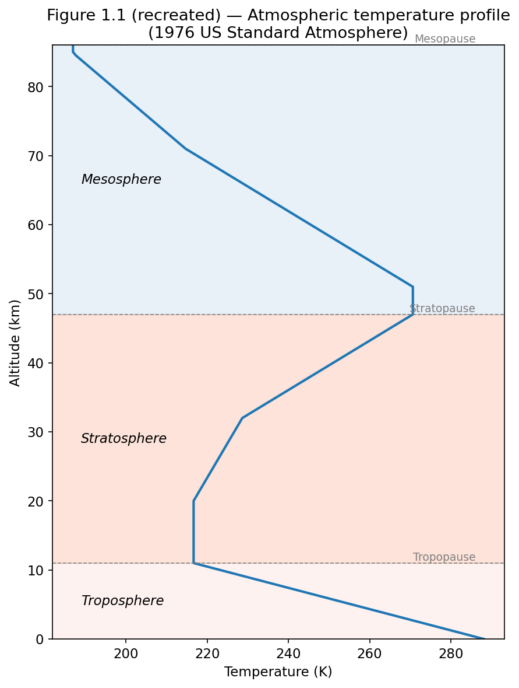
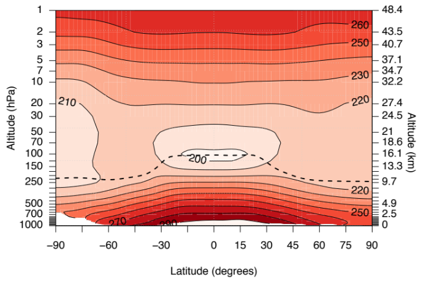
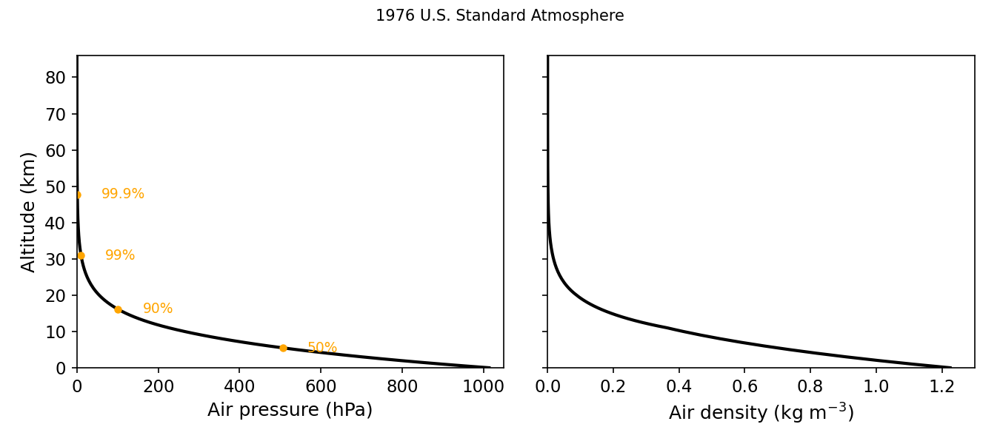
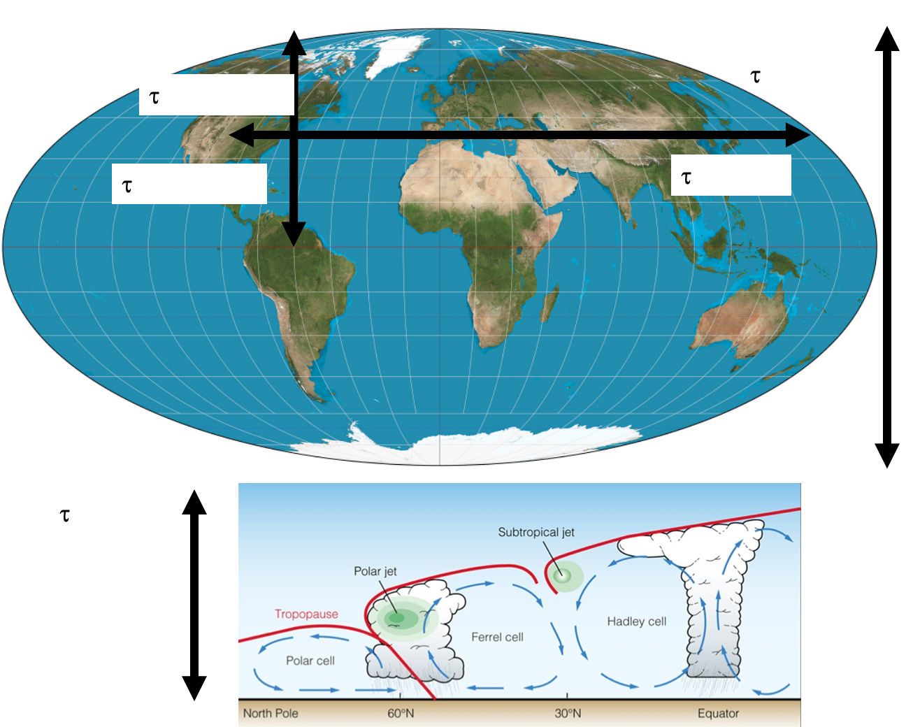
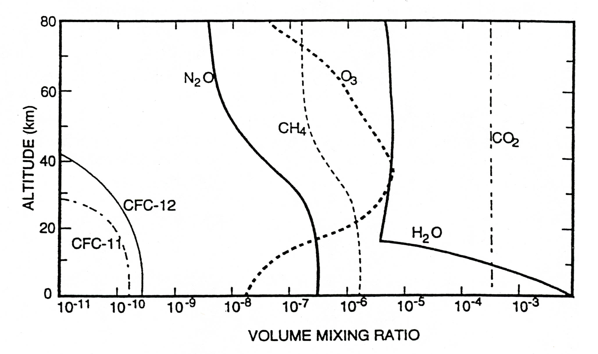
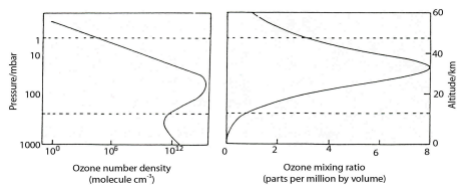

# Module 1 · Basic Physical and Chemical Structure of the Troposphere and Stratosphere

> **Learning aims**
> By the end of this module you should be able to:
> 1. Describe the temperature-based layering of the atmosphere and explain why the troposphere and stratosphere have such different mixing behaviour.
> 2. Derive and apply the hydrostatic equation and scale height to calculate pressure, density and number density at a given altitude.
> 3. Define and calculate the column amount (e.g. in Dobson Units) of an atmospheric constituent.
> 4. Outline the basic composition and role of the troposphere and stratosphere, including the importance of ozone in each.

## 1.0 Atmospheric layers — temperature, pressure and density

Most planetary atmospheres are heated by outgoing long wave radiation from the planetary surface, and so in general planetary atmospheres get cooler as one ascends through them. However, the atmosphere of our planet is different. Atmospheric temperature decreases with height initially, before undergoing a transition leading to increasing temperature with height. These changes in temperature gradient mean that the atmosphere can conveniently be divided into a number of layers (or **spheres**), depending on the temperature profile (Figure 1.1). The turning points in Figure 1.1 are known as "*pauses*" and are located at ~10–18 km (*tropopause*) and ~45–50 km (*stratopause*).

*Figure 1.1 — Atmospheric temperature profile, generated from the 1976 US Standard Atmosphere reference data (see `data/us_standard_atmosphere_1976.csv` and `notebooks/01-atmospheric-structure.ipynb`).*

In this course we will be primarily concerned with the lowermost layers, the stratosphere and troposphere, which make up approximately 99.9% of the atmospheric mass.

Figure 1.2 below shows that the **zonal** mean (latitude vs. altitude profile) atmospheric temperature profile is not only strongly altitude dependent (as depicted in Fig 1.1), but in the lower atmosphere also depends strongly on latitude. Two key features stick out in Fig 1.2: (i) the coldest part of the atmosphere is in the tropical upper troposphere; (ii) the height of the *tropopause* is latitude dependent (dashed line).

*Figure 1.2 — Zonally averaged annual mean temperature.*

In order to calculate how temperature varies with altitude a radiative transfer model is needed. These sorts of calculations are beyond the scope of this course. What is important to appreciate is the general structure of temperature in the atmosphere, noting the different temperature environments found in the different layers. Indeed, these different temperature environments allow air to be well vertically mixed in the troposphere but poorly so in the stratosphere. However, mixing in the stratosphere is very rapid zonally. The temperature inversions associated with the pauses give rise to the unique chemical environments found in the different layers of the atmosphere.

## 1.1 The hydrostatic equation

Figure 1.2 shows that as we go up in the atmosphere pressure decreases. The hydrostatic relation is used to relate ambient pressure to altitude. If $\rho$ is the ambient air density at altitude $z$ with pressure $p$, we can write, for an incremental change in $z$:

$$dp = -\rho g  dz$$

(assumes $g$ is constant — not a bad assumption)

For an ideal gas we can write:

$$\rho = \frac{Mp}{RT} = \frac{mp}{kT}$$

where $M$ and $m$ are the relative molar mass and molecular mass respectively. Thus,

$$dp = -\frac{Mpg}{RT}  dz$$

Defining $H = \dfrac{RT}{Mg}$ as the **scale height** (approximately constant with altitude) we can re-write the above expression to give:

$$\frac{dp}{p} = -\frac{dz}{H}$$

and integrate, setting the surface pressure as $p = p_0$, to yield:

$$p = p_0  e^{-z/H}$$

This equation describes the fall-off of pressure with altitude.

The pressure drops by $1/e$ over the scale height, $H$. In the Earth's atmosphere the average $M \approx 28.9$ g mol⁻¹, and so the scale height varies between 6 and 7.5 km, depending on atmospheric temperature.

Making use of the ideal gas equation, it is also possible to define an approximate relationship for **number density** ($n = n_0 e^{-z/H}$, where $n$ often has units molecules cm⁻³). In the rest of this course we will refer to number density as **[M]**.

So, with increasing altitude above the Earth's surface, the density (and pressure) of the air falls by about a factor of 10 for approximately each 16 km (10 miles) of altitude (Figure 1.3).

*Figure 1.3 — Variation of pressure and density with altitude.*

This has important consequences for the rate of some atmospheric reactions — especially termolecular reactions, but note that some bimolecular reactions are also pressure dependent. Up to an altitude of 80–90 km (the *mesopause*) the bulk composition is essentially N₂ : O₂ = 4 : 1.

Above this height atomic oxygen becomes the dominant oxygen species, the concentrations of ions and free electrons become significant and ion–molecule reactions are important.

At still higher altitudes, above 100 km, diffusive separation can occur, with light molecules such as hydrogen reaching higher altitudes (and even leaving the atmosphere altogether).

We should finally consider the timescales of mixing air across the atmosphere. The general circulation of the atmosphere is complex, but the key points to note are the different $\tau$ for mixing north–south, east–west and vertically.

*Figure 1.4 — Some typical mixing timescales ($\tau$) in the horizontal and vertical across the atmosphere.*

> **Exercise 1 — Calculation of the number density at different altitudes**
>
> The number density is another word for concentration, in molecules cm⁻³.
>
> We can make use of the ideal gas equation to calculate the concentration of a gas:
>
> $$pV = nRT \quad\Rightarrow\quad \frac{n}{V} = \frac{p}{RT} \ \text{(moles per volume)}$$
>
> To get into molecules, use $k_B$ rather than $R$ (writing $N$ for number of molecules):
>
> $$\frac{N}{V} = \frac{p}{k_B T}$$
>
> At 298 K and 1 bar pressure:
>
> $$\frac{N}{V} = \frac{100{,}000}{1.38\times10^{-23} \times 298} = 2.43\times10^{25}\ \text{molecules m}^{-3} = 2.43\times10^{19}\ \text{molecules cm}^{-3}$$

## 1.2 The Troposphere — basic role and composition

As we've seen, the troposphere is that part of the atmosphere which lies between the surface of the Earth and about 10 to 15 km, depending on latitude (see Fig 1.2). While air in the troposphere is reasonably well mixed, it is inhibited from rapid exchange with the stratosphere because the tropopause is a relatively impermeable barrier to transport. The troposphere is also the region where most of what we regard as weather (clouds, precipitation, etc.) occurs. Radiative processes in the troposphere are the dominant processes affecting surface climate and climate change.

Chemically, the troposphere serves some very important functions. Chemical destruction (by OH (day) and NO₃ (night)) in the troposphere is the main mechanism preventing many gases emitted at the surface of the Earth from accumulating to amounts that are toxic to life or ultimately damaging to the stratospheric ozone layer or the climate system. This destruction (or usually the concentration of the oxidants) is an expression of the **'oxidizing capacity'**. The troposphere provides a system of transport and chemical transformation for the natural biogeochemical cycles.

Table 1.1 shows the principal gaseous constituents of the troposphere, their mixing ratios and their atmospheric lifetimes. Disregarding the highly variable amounts of water, 99.9% of the atmosphere is composed of N₂, O₂ and the noble gases, principally Ar. These gases have been present at constant levels over geological timescales (although there is some debate over the fluctuations in O₂).

**Table 1.1 — Composition of the Troposphere**

| Constituent | Mole fraction | Lifetime (yr) |
|---|---|---|
| N₂ | 0.781 | 1.6 × 10⁷ |
| O₂ | 0.209 | 9000 |
| Ar | 0.0093 | 4.5 × 10⁹ |
| CO₂ | 0.000416 | 50–150 |
| H₂O | 0–0.04 | 5 days |
| CH₄ | 2100 ppb | 10 |
| H₂ | 550 ppb | 4 |
| N₂O | 320 ppb | 150 |
| CO | 50–200 ppb | 0.2 |
| O₃ | 20–80 ppb | 20 days |
| C₂H₆ | 1 ppb | 0.2 |
| SO₂ | 0.1 ppb | 5 days |
| NO₂ | 0.1 ppb | 2 days |
| OH | 0.1 ppt | 0.1 s |

The remaining gases, representing less than 0.1% of the atmosphere, are diverse but have an important influence on a number of atmospheric processes. The gases with long lifetimes (CH₄, N₂O, etc.) are fairly uniformly distributed in the troposphere. The minor trace species, e.g. SO₂, NO₂, organic gases, all have abundances of ≤1 ppb (parts per billion by volume, or nano moles/mole, e.g. 10⁻⁹), at the global average scale, but are very variable in space and time (NB on Lensfield Road the NO₂ mixing ratio is probably 20 ppb). O₃ has a concentration usually in the range 20–80 ppb with some variability.

Figure 1.5 shows the mixing ratios of a range of important gases in the atmosphere. **This is a key figure we will come back to.**

*Figure 1.5 — Some typical mixing ratio profiles of a range of species.*

> **Key points in Figure 1.5**
> - Mixing ratios tell us how [X] varies with [M] (NB [M] decreases exponentially with increasing height).
> - Long-lived gases have nearly constant mixing ratios (e.g. CO₂, N₂, O₂, He).
> - Increases in mixing ratio of a compound reveal to us that it is undergoing chemical production.
> - Decreases in mixing ratio denote chemical destruction (or loss).

## 1.4 The Stratosphere — basic structure and composition

The stratosphere lies above the troposphere, bounded by the tropopause and the stratopause at about 50 km. Temperature increases with altitude in the stratosphere — a *stable* situation which leads to a long removal time for pollution reaching the stratosphere.

Ozone is perhaps the most important stratospheric constituent. O₃ absorbs ultraviolet radiation, which leads to the observed stratospheric temperature structure and also protects life at the surface from harmful radiation at $\lambda < 300$ nm. Ozone is also an important infrared absorber — it's a greenhouse gas involved in climate change.

Stratospheric chemistry is mainly concerned with the sources and sinks of ozone. Ozone has a peak stratospheric mixing ratio of about 10 ppm. Its local abundance is determined by a balance between photochemical production following photolysis of molecular oxygen and **catalytic** destruction by a variety of radical species (e.g. OH, HO₂, NO, NO₂, Cl, ClO, etc.), which are present at much lower concentration (usually ppb or less). (In those regions where the chemical lifetime of ozone becomes long, transport will also be important in determining the local concentration.) The radicals are produced following the breakdown of **source gases** (source gases shown in Fig 1.5) including H₂O, CH₄, N₂O and the CFCs (CFCl₃, etc.).

Throughout the bulk of the stratosphere gas phase reactions dominate. However, ozone loss in polar latitudes is initiated by reactions on the surface of particles or droplets — polar stratospheric clouds — in the lower stratosphere. Reactions on aerosol droplets (mainly sulphuric acid) are also now known to be important in the middle latitude lower stratosphere.

*Figure 1.6 — Variation of ozone concentration with altitude, expressed as an absolute number density ($n_{O_3}$, with peak just above 10¹² cm⁻³) and as a mixing ratio (mole fraction, $n_{O_3}/n_{air}$).*

We will see later that it is also possible to measure the amount of a species integrated between the earth's surface and the top of the atmosphere. This integral, e.g. $\int [O_3]  dz$, is loosely called the **column amount**, the **column density** or the **total column**. It commonly has units of molecules cm⁻². For the special case of ozone, the unit is named after Dobson, an early measurement pioneer.

1 Dobson Unit (DU) = 2.69×10¹⁶ molec cm⁻². A typical column density for ozone is about 300 DU — i.e. an ozone column that would be 3 mm thick when shrunk down to the surface.

> **Exercise 2 — Calculation of the column of a well-mixed gas**
>
> Definition of the column:
>
> $$\text{Column} = \int [x]  dz$$ &nbsp;&nbsp;(Eq 1)
>
> For a well-mixed gas the concentration decreases exponentially with altitude following the barometric equation:
>
> $$p = p_0 e^{-z/H} \quad \text{(just replace } p \text{ for } [x] \text{)}$$
>
> Thus, we can re-write Eq 1 as:
>
> $$\text{Column} = [x]_0 \int e^{-z/H}  dz$$ &nbsp;&nbsp;(Eq 2)
>
> where $[x]_0$ is the concentration at a fixed point in the atmosphere. We then integrate Eq 2 between $z$ and infinity (the top of the atmosphere) to get:
>
> $$\text{Column} = [x]_0 \cdot H$$ &nbsp;&nbsp;(Eq 3)
>
> From *Exercise 1* we can work out $[x]_0$ as being the number density at the surface multiplied by the mixing ratio (which will be constant over all altitudes).

---

## Try it yourself

Open **[`notebooks/01-atmospheric-structure.ipynb`](../notebooks/01-atmospheric-structure.ipynb)** to:

- Compute number density at any altitude/temperature/pressure (Exercise 1), and plot the barometric fall-off of pressure, density and [M] with height.
- Fit a scale height to a modelled or real pressure profile, and compare it to $H = RT/Mg$.
- Compute the column amount of a well-mixed gas (Exercise 2), reproduce the ~300 DU ozone column, and see how mixing ratio vs. number-density profiles (Fig 1.5/1.6) relate to the column integral.

---

*Next: [Module 2 — Chemical Kinetics in the Atmosphere](02-chemical-kinetics.md)*
