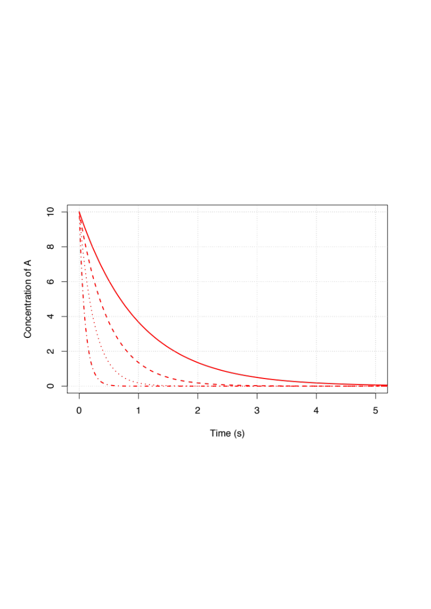
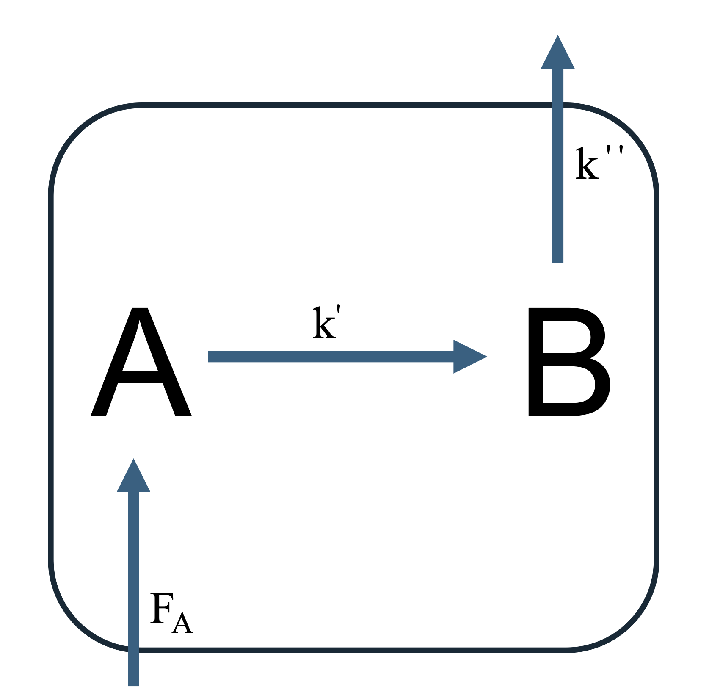
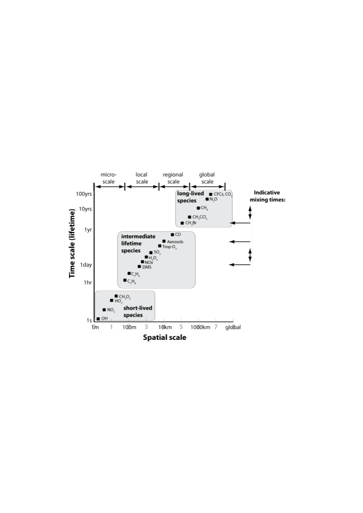
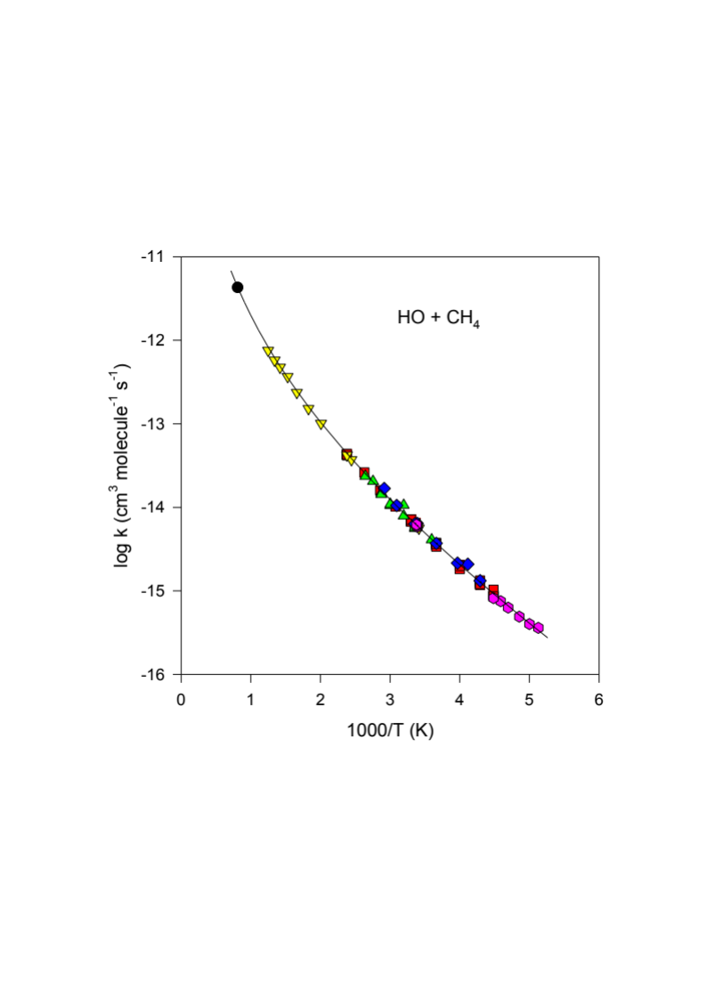

# Module 2 · Chemical Kinetics in the Atmosphere

> **Learning aims**
> By the end of this module you should be able to:
> 1. Apply first-order and pseudo-first-order kinetics to atmospheric decay problems, and define the associated time constant.
> 2. Apply the steady-state approximation to a simple reaction chain, and judge when it is (and isn't) valid.
> 3. Use Arrhenius parameters to describe the temperature dependence of a bi-molecular rate coefficient.
> 4. Explain why most apparently bi-molecular association reactions are actually ter-molecular, and describe the low-/high-pressure limiting behaviour.

## 2.1 Time scales and lifetimes

As atmospheric chemists we are fundamentally interested in understanding how the constituents of the atmosphere (the gases and particles that make it up) change with time. For example, the questions of how the concentration of O₃ will change in the future and how it has changed in the past are crucial to the science of the Antarctic ozone hole and air pollution. In order to understand these types of questions we rely on a solid knowledge of (i) what the constituents (chemical and **aerosol** species) are in the atmosphere and (ii) how the constituents in the atmosphere react over time. Hence, it's fair to say that chemical kinetics is at the heart of atmospheric chemistry!

For simple chemical systems, we can write out differential equations that describe how the components of the system will change over time. Let's start with a trivial example. Suppose that we study, in a closed constant-volume system, a reaction whose rate depends on the concentration of one reacting substance, $A$, only. We can write:

$$\frac{d[A]}{dt} = -k[A]^n$$

where in this case $n = 1$ and this reaction is said to be **first order** with respect to $A$ (molecules cm⁻³). Plots of the change in concentration of $A$ with time are shown in [Fig 2.1](#fig-2-1) for different values of rate coefficient, $k$ (s⁻¹). [Fig 2.1](#fig-2-1) highlights that the larger the value of the rate coefficient (sometimes called rate constant, and erroneously "the rate" — naughty!) the faster the loss of $A$ with time.


[]{#fig-2-1}*Figure 2.1 — Plots of the first-order decay of A with respect to time.*

We can define a new expression by integrating our rate equation for $A$ and noting that our initial conditions are $A = A_0$ at $t = 0$:

$$\int_{0}^{t} k  dt = -\int_{0}^{A} [A]^{-n}  dA$$

<details>
<summary><strong>Integrating the rate equation</strong></summary>

Given that $k$ and $n$ are constants we can then write:

$$[A]_t = [A]_0 \exp(-kt)$$

</details>


As [Fig 2.1](#fig-2-1) highlights, the decay of $A$ with time can be described as a simple exponential process. We can use this graph and the equations above to define the **time constant - or lifetime - ** ($\tau$) as the time taken for the concentration of $A$ to be reduced by $1/e^{\text{th}}$ of its value:

$$\tau = 1/k$$

The smaller this time constant, the greater the loss of $A$ with time and hence the shorter its **lifetime**.

### Pseudo first-order kinetics

In the atmosphere there are several very important reactions that are first order and, fortunately, many that can be described as **pseudo first order**. For example, consider the slightly more complex reaction:

$$A + B \xrightarrow{k_2} C$$

On first glance we *expect* this to be a second-order process (first order in $A$ and first order in $B$, so second order overall). However, if the concentration of $[B]$ doesn't change much over time (for example because $B$ is present in large excess) then we can make the approximation that $d[B]/dt \simeq 0$, which allows us to consider $A$ as undergoing pseudo-first-order kinetics ($[B] \sim$ constant, so it can be folded into our second-order rate constant $k_2$ to yield a pseudo-first-order rate constant, $k_2' = k_2[B]$). The time constant for $A$ is now given by:

$$\tau = \frac{1}{k_2[B]} = \frac{1}{k_2'}$$

### A chain reaction: $A \to B \to C$

We will now consider a slightly more complex example but one which you may be familiar with. Let's consider the chain reaction:

$$A \xrightarrow{k_1} B \xrightarrow{k_2} C$$

where $A$ is our initial reactant, $B$ an intermediate product and $C$ the final product of the reaction. Following the same procedure as above we can write:

$$\frac{d[A]}{dt} = -k_1[A]$$

$$\frac{d[B]}{dt} = k_1[A] - k_2[B]$$

$$\frac{d[C]}{dt} = k_2[B]$$

Solutions to these equations for $k_1 = 1$ s⁻¹, $k_2 = 2$ s⁻¹, and (separately) $k_1 = 1$ s⁻¹, $k_2 = 10$ s⁻¹, are worth plotting side by side (see the notebook for details).

![A -> B -> C chain reaction: exact [B] vs the steady-state approximation, for two (k1, k2) pairs](../assets/figures/m2-fig-abc-chain.png)
[]{#fig-2-1a}*Figure 2.1a — The A → B → C chain reaction for $(k_1,k_2) = (1,2)$ s⁻¹ (left) and $(1,10)$ s⁻¹ (right), comparing the exact $[B]$ (solid) against the steady-state approximation $[B]_{ss} = k_1[A]/k_2$ (dashed).*

What you will notice is that the intermediate $B$ is short-lived relative to $C$, and that as the value of $k_2$ increases, the peak concentration of $B$ decreases. The time it takes for $B$ to reach an almost-steady concentration is $\sim 1/k_2$. In the limit where $k_2 \gg k_1$ we can make the approximation:

$$\frac{d[B]_{ss}}{dt} \simeq 0$$

where the subscript $ss$ denotes that we are treating the intermediate $B$ as being in **steady state**.

Following this through, we can re-write the remaining equations describing our reaction (substituting $[B]_{ss} = k_1[A]/k_2$):

$$\frac{d[A]}{dt} = -k_1[A]$$

$$\frac{d[C]}{dt} \simeq k_2 \cdot \frac{k_1[A]}{k_2} \simeq k_1[A]$$

In doing so, we have greatly reduced the complexity of this reaction system.

In the atmosphere there are many examples of compounds that can be considered to be in steady state. For the steady-state assumption to apply, it is necessary that the rate constants for destruction of the intermediate greatly exceed those for its formation, so that its concentration remains low and (quasi-)constant.

<details>
<summary><strong>More on the steady state</strong></summary>

In the chain reaction example it is clear that the steady-state approximation (**SSA**) will work when $k_2 \gg k_1$.

But when can we use the SSA, and when does it not work?

We need to consider several factors. First, the SSA will only work for an **intermediate** — in this course we can read that as meaning a radical species. So your first task is to identify the radicals and consider putting them into the SSA. Next, we need to examine the relative rates of formation and destruction. This is where things get tricky: the rate of destruction depends on the concentration of the species we are putting into steady state, so we probably don't know it in advance. However, we can get a sense of the numbers involved in the rate of production, and start to gauge whether the **source** of our intermediate is tiny, small, medium, large or massive. Our **loss** rates will need to balance these for the SSA to be valid. For example, the SSA will fail when we have a really large source of our intermediate but only a small amount of loss.

Finally, we can put some quantitative bounds on this — for example, by calculating the timescale over which the SSA starts to break down.

Consider the following reaction scheme:

$$O_2 + h\nu \xrightarrow{J_1} O(^{3}P) + O(^{1}D)$$

$$O(^{1}D) + M \xrightarrow{k_q} O(^{3}P) + M$$

$$\frac{d[O(^1D)]}{dt} = J_1[O_2] - k_q[M][O(^1D)]$$

Let's assume $[O(^1D)]$ is in steady state:

$$[O(^1D)]_{ss} = \frac{J_1[O_2]}{k_q[M]}$$

Compare that to the full solution of the ODE:

$$[O(^1D)]_t = \frac{J_1[O_2]}{k_q[M]}\left(1 - \exp(-k_q[M]t)\right)$$

We note that the timescale for the system ($[O(^1D)]$) is given by $1/(k_q[M])$, and that the full solution and the steady-state solution only differ by an exponential term. This is useful because we can appeal to the graph of $y = \exp(-x)$ to gain some insight into the problem: $\exp(-4.6) \simeq 0.01$ — in other words, once $k_q[M]t = 4.6$, our SSA solution is within 1% of the full ODE solution. Rearranging, the time for the SSA to be within 1% of the full solution is:

$$t = \frac{4.6}{k_q[M]}$$

For $k_q = 3\times10^{-11}\ \text{molecule}^{-1}\ \text{cm}^3\ \text{s}^{-1}$ and $[M] = 3\times10^{14}\ \text{molecule cm}^{-3}$, this gives $t = 5\times10^{-4}$ s — i.e. very short, so it is very likely that the SSA is valid.

</details>


[]{#fig-2-2}*Figure 2.2 — Schematic of an air parcel containing two species, A and B.*

Often we will consider the concept of an **air parcel** throughout this course (schematically shown in [Figure 2.2](#fig-2-2)). An air parcel can be thought of as a "box of air." Suppose there are two species in the box, A and B. There are emissions of A, $F_A$, and A can undergo reactions (conversion) to form B, which subsequently is lost via other processes. We can consider what the inputs into the box are, and what the outputs are — and appeal to steady state to write down steady-state solutions for $[A]$ and $[B]$, and hence an expression for the ratio $[B]_{ss}/[A]_{ss}$.

<details>
<summary><strong>Worked derivation: steady-state ratio [B]<sub>ss</sub>/[A]<sub>ss</sub> for a source of A feeding into B</strong></summary>

Consider the box model described above: A is emitted at a constant rate $F_A$ and is lost with pseudo-first-order rate constant $k'$ (converting it to B); B is in turn lost with pseudo-first-order rate constant $k''$.

$$\frac{d[A]}{dt} = F_A - k'[A]$$

$$\frac{d[B]}{dt} = k'[A] - k''[B]$$

**Step 1 — steady state for A.** Setting $d[A]/dt = 0$:

$$0 = F_A - k'[A]_{ss} \quad\Longrightarrow\quad [A]_{ss} = \frac{F_A}{k'}$$

**Step 2 — steady state for B.** Setting $d[B]/dt = 0$ and substituting $[A]_{ss}$:

$$0 = k'[A]_{ss} - k''[B]_{ss} \quad\Longrightarrow\quad [B]_{ss} = \frac{k'[A]_{ss}}{k''}$$

**Step 3 — take the ratio.** Dividing $[B]_{ss}$ by $[A]_{ss}$, the $[A]_{ss}$ cancels:

$$\frac{[B]_{ss}}{[A]_{ss}} = \frac{k'[A]_{ss}/k''}{[A]_{ss}} = \frac{k'}{k''}$$

**Step 4 — rewrite in terms of lifetimes.** Since $k'$ and $k''$ are just the pseudo-first-order loss rate constants for A and B respectively, they define the corresponding lifetimes $\tau_A = 1/k'$ and $\tau_B = 1/k''$ (Section 2.1). Substituting:

$$\frac{[B]_{ss}}{[A]_{ss}} = \frac{k'}{k''} = \frac{1/\tau_A}{1/\tau_B} = \frac{\tau_B}{\tau_A}$$

So the steady-state concentration ratio of a product to its precursor is simply the ratio of their lifetimes: a short-lived product (small $\tau_B$) sits at a low steady-state concentration relative to its precursor, regardless of the details of $F_A$ — this is the same intuition as the A → B → C chain above, just recast for a species with continuous emission rather than a fixed initial concentration.

</details>

Integrating $d[A]/dt$ with the boundary condition $[A]_0$ at $t_0 = 0$ shows that, for a species with constant production $F_A$ and pseudo-first-order loss $k'$:

$$[A]_t = \frac{F_A}{k'}\left(1 - \exp(-k't)\right)$$

Note that for a system of two first-order (or pseudo-first-order) reactions,

$$A \underset{k_{-1}}{\overset{k_1}{\rightleftharpoons}} B$$

the system approaches equilibrium with a time constant of $(k_1 + k_{-1})^{-1}$ (s). So we only need $k_1$ **or** $k_{-1}$ to be large for $\tau$ to be small — which is what lets us apply the steady-state approximation.

```{=latex}
\color{blue}
```
<details style="color: blue;">
<summary><strong>Exercise 3 — Derivation of the timescale for equilibrium</strong></summary>

Consider a very simple reversible system $A \rightleftharpoons B$, with forward rate constant $k_f$ and backward rate constant $k_b$:

$$\frac{d[B]}{dt} = k_f[A] - k_b[B]$$ &nbsp;&nbsp;(Eq 1)

Let $x$ denote the amount of $A$ molecules present as $B$ molecules, and $a = [A]_0$. Then:

$$\frac{dx}{dt} = k_f(a - x) - k_b x$$ &nbsp;&nbsp;(Eq 2)

Setting $y \equiv dx/dt$:

$$y = k_f a - (k_f + k_b) x$$ &nbsp;&nbsp;(Eq 4)

By the chain rule, $\dfrac{dy}{dt} = \dfrac{dy}{dx}\cdot\dfrac{dx}{dt}$. From Eq 2, $dx/dt = y$; from Eq 4, $dy/dx = -(k_f+k_b)$. So:

$$\frac{dy}{dt} = -(k_f+k_b)  y \quad\Rightarrow\quad \frac{dy}{y} = -(k_f+k_b) dt$$ &nbsp;&nbsp;(Eq 7)

Integrating:

$$y = k_f a \cdot \exp\big(-(k_f+k_b)t\big)$$ &nbsp;&nbsp;(Eq 8)

and, since $y$ relates to $x$ through Eq 4, combining Eq 4 and Eq 8 gives the **exact** solution:

$$x = \frac{k_f a}{k_f + k_b}\Big[1 - \exp\big(-(k_f+k_b)t\big)\Big]$$ &nbsp;&nbsp;(Eq 9)

From this we see the timescale for the system to reach equilibrium is exactly $\dfrac{1}{k_f+k_b}$ — compare this exact result against the steady-state approximation numerically in the notebook.

</details>
```{=latex}
\color{black}
```


We will consider many examples of using steady state in the supervision questions, but in general a good opening argument for whether or not to put something into steady state is to consider whether or not it is a **radical**.

### Chemistry vs. transport timescales

So far we have considered some very trivial examples. Whilst these have been trivial, they are still very useful for our studies of atmospheric chemistry. But an important complication for us as atmospheric chemists is that the reaction vessel we use in our studies is the atmosphere itself! You only need to venture outdoors to note that the reactions taking place in the atmosphere are doing so under far-from-controlled conditions. The gases and particles we are interested in are affected not only by chemical change but also by transport — for example through the wind. In this course we won't dwell much on atmospheric transport (that's covered in greater detail in the Part III course). What is important, however, is to have a feel for the **relative** time scales of chemistry and transport.

The time constants (**lifetimes**) of a range of constituents of interest to the atmospheric chemist are presented in [Fig 2.3](#fig-2-3). As we've seen, compounds with very short time constants change in concentration very rapidly with time — so one would expect that their concentrations will be very different over short spatial scales.


[]{#fig-2-3}*Figure 2.3 — Comparison of spatial and chemical scales of selected gases in the atmosphere.*

## 2.2 Bi-molecular rate coefficients

Elementary reactions that involve two constituents can be written as:

$$A + B \xrightarrow{k_{obs(T)}} \text{products}$$

Often it's found that the rate coefficients for these types of reactions show temperature dependence. Whilst we can use tools like quantum mechanics and statistical thermodynamics to predict rate constants and their temperature dependence, in this course we will just make use of experimentally observed data.

Second-order, or bi-molecular, rate coefficients are usually expressed using the following form in atmospheric chemistry:

$$k_{obs(T)} = A \exp\left(-\frac{E_a}{RT}\right) \quad \text{(molecules}^{-1}\text{ cm}^3\text{ s}^{-1}\text{)}$$

where $A$ is often referred to as the Arrhenius pre-exponential factor, $E_a$ the reaction activation energy (J mol⁻¹), $R$ the gas constant (J K⁻¹ mol⁻¹) and $T$ temperature (K). Many bi-molecular reactions in the atmosphere show temperature dependence in their kinetics. A good example is the reaction of OH with methane (one of the most temperature-dependent reactions known).


[]{#fig-2-4}*Figure 2.4 — Arrhenius plot for the reaction between methane and the hydroxyl radical in the gas phase.*

[Fig 2.4](#fig-2-4) demonstrates that the reaction OH + CH₄ proceeds with a significant activation energy barrier. As temperature is decreased there will be a lower fraction of reactants that can overcome this barrier, and hence the observed rate of reaction will decrease.

## 2.3 Ter-molecular rate coefficients

A more complex but fairly common type of reaction of interest in the atmosphere is the reaction between two compounds in the presence of a third body:

$$A + B + M \xrightarrow{k_{obs(T)}} \text{products}$$

Strictly speaking, most reactions require a third body (often referred to as $M$) to remove excess energy from the initial reaction. Consider the reaction between two iodine atoms. When the two atoms come together to form an iodine molecule, energy equal to the bond dissociation energy of I₂ is released into the nascent molecule. This is enough energy to then rupture the I–I bond and reform the iodine atoms. However, if the nascent I₂ molecule (I₂\*) collides with a third body, the encounter can transfer some of the vibrational and rotational energy of the I₂ molecule to translational (and other) excitation of the third body:

$$I + I \underset{k_b}{\overset{k_f}{\rightleftharpoons}} I_{2}^{\ast} \xrightarrow{M} I_2$$

Under atmospheric conditions, $M$ is usually N₂ or O₂, and to a first approximation can be considered as the sum of their concentrations ($[M] = [N_2]+[O_2]$). The rate coefficients for ter-molecular reactions can be experimentally determined as a function of temperature and pressure to derive the **low-pressure limit** ($k_{0,T}$), which shows pressure dependence, and the **high-pressure limit** ($k_{\infty,T}$), which doesn't. To predict the observed rate constant as a function of temperature and pressure, we combine these two limits using the **Troe equation** (a modification of the Lindemann–Hinshelwood expressions), which yields a pseudo-bi-molecular rate coefficient (units molecules⁻¹ cm³ s⁻¹): 

$k_{obs(M,T)} = \left( \frac{k_{0,T}[M]}{1 + \frac{k_{0,T}[M]}{k_{\infty,T}}} \right) F \left\{ 1 + \left[ \log_{10} \left( \frac{k_{0,T}[M]}{k_{\infty,T}} \right) \right]^2 \right\}^{-1}$

```{=latex}
\color{blue}
```
<details style="color: blue;">
<summary><strong>Exercise 4 — Relating the bi-molecular and ter-molecular reactions</strong></summary>

In *Kinetics of Chemical Reactions* at 1A, we were told that whenever two molecules collide they bring with them enough energy to break the chemical bond that they try to form. This somewhat strange fact can be seen here in more detail.

Consider two iodine atoms colliding:

$$I + I \xrightarrow{k_1} I_{2}^{\ast}$$ &nbsp;&nbsp;(Eq 1)

$$I_{2}^{\ast} \xrightarrow{k_d} I + I$$ &nbsp;&nbsp;(Eq 2)

$$I_{2}^{\ast} + M \xrightarrow{k_{col}} I_2 + M^{\ast}$$ &nbsp;&nbsp;(Eq 3)

The only reaction producing our product ($I_2$) is Eq 3, so:

$$\frac{d[I_2]}{dt} = k_{col}[I_{2}^{\ast}][M]$$ &nbsp;&nbsp;(Eq 4)

$I_{2}^{\ast}$ is an excited-state form of $I_2$, so it's logical that it should be short-lived — put it into steady state:

$$\frac{d[I_{2}^{\ast}]}{dt} = 0 = k_1[I]^2 - k_{col}[I_{2}^{\ast}][M] - k_d[I_{2}^{\ast}]$$

$$[I_{2}^{\ast}] = \frac{k_1[I]^2}{k_{col}[M] + k_d}$$ &nbsp;&nbsp;(Eq 5)

Substituting Eq 5 into Eq 4:

$$\frac{d[I_2]}{dt} = k_{col}[M]\cdot\frac{k_1[I]^2}{k_{col}[M]+k_d}$$ &nbsp;&nbsp;(Eq 6)

Eq 6 shows the formation of $I_2$ behaving as a third-order (ter-molecular) process (second order in $I$, first order in $M$), whereas Eq 4 shows it as a second-order (bi-molecular) process (first order in $M$ and $I_{2}^{\ast}$). In general, most (all) reactions that appear bi-molecular are formally ter-molecular, and this example extends to practically every association reaction (two species reacting by colliding together).

**At low pressure** ($[M]$ small, so $k_{col}[M] < k_d$):
$$\frac{d[I_2]}{dt} \cong [M][I]^2 \frac{k_1 k_{col}}{k_d}$$ &nbsp;&nbsp;(Eq 7)

**At high pressure** ($[M]$ large, so $k_{col}[M] > k_d$):
$$\frac{d[I_2]}{dt} \cong k_1[I]^2$$ &nbsp;&nbsp;(Eq 8)

</details>
```{=latex}
\color{black}
```

---

## Try it yourself

Open **[`notebooks/02-chemical-kinetics.ipynb`](../notebooks/02-chemical-kinetics.ipynb)** to:

- Reproduce [Fig 2.1](#fig-2-1) (first-order decay for a range of $k$) and confirm $\tau = 1/k$.
- Solve the $A \to B \to C$ chain reaction numerically for both $(k_1,k_2)=(1,2)$ and $(1,10)$ s⁻¹, and check the steady-state approximation for $[B]$ against the full numerical solution.
- Solve Exercise 3 (the $A \rightleftharpoons B$ system) both analytically (Eq 9) and numerically, and quantify how the error in the steady-state approximation depends on $k_f/k_b$.
- Plot an Arrhenius line from $A$ and $E_a$, and fit $A$/$E_a$ back out from a synthetic $k(T)$ dataset — the same exercise you'd do with real IUPAC/JPL kinetics data.
- Explore the low-/high-pressure limits of a ter-molecular reaction using the Lindemann–Hinshelwood form, and see where the Troe falloff curve sits between Eq 7 and Eq 8.

---

*Next: [Module 3 — Atmospheric Photochemistry](03-atmospheric-photochemistry.md)*
