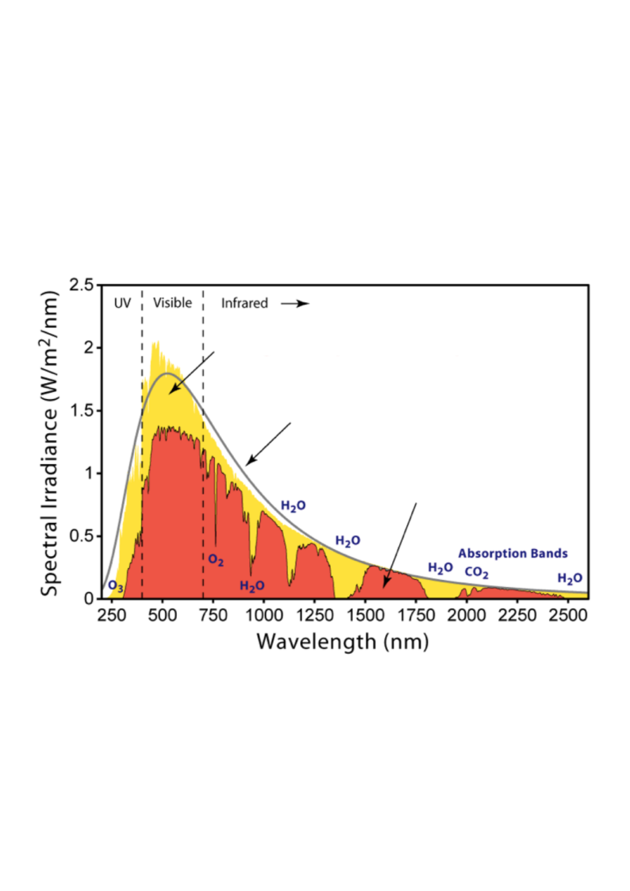
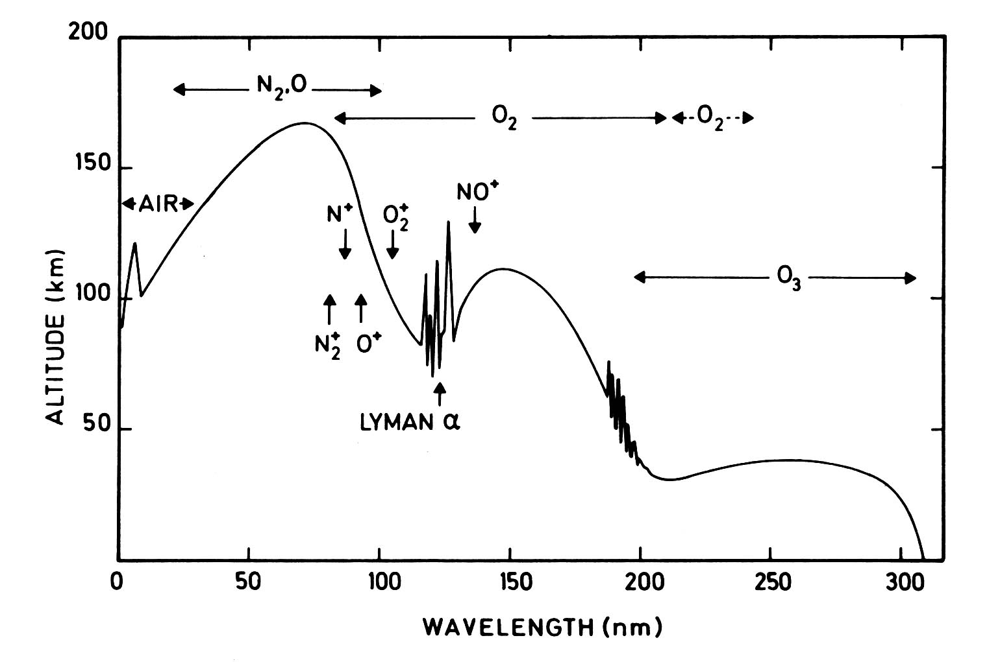
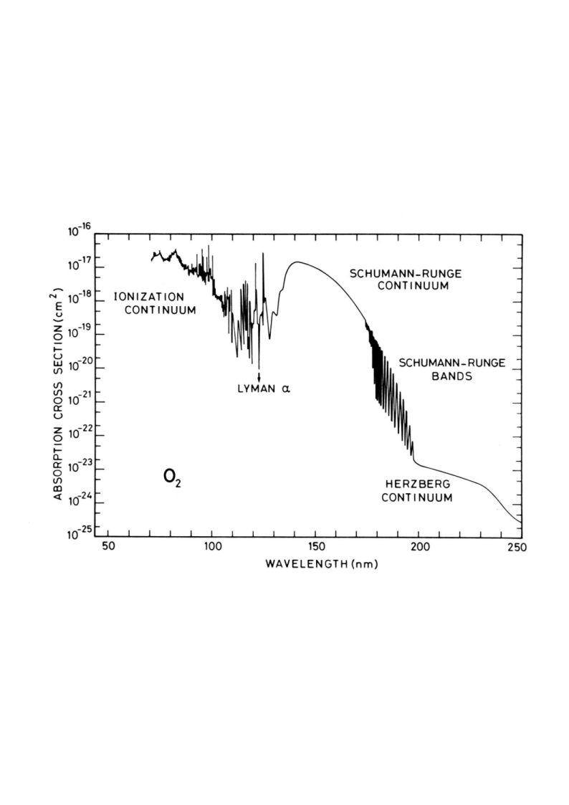
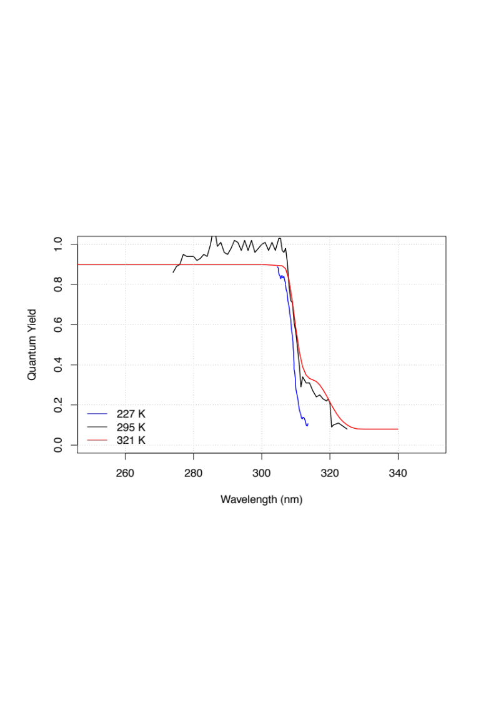
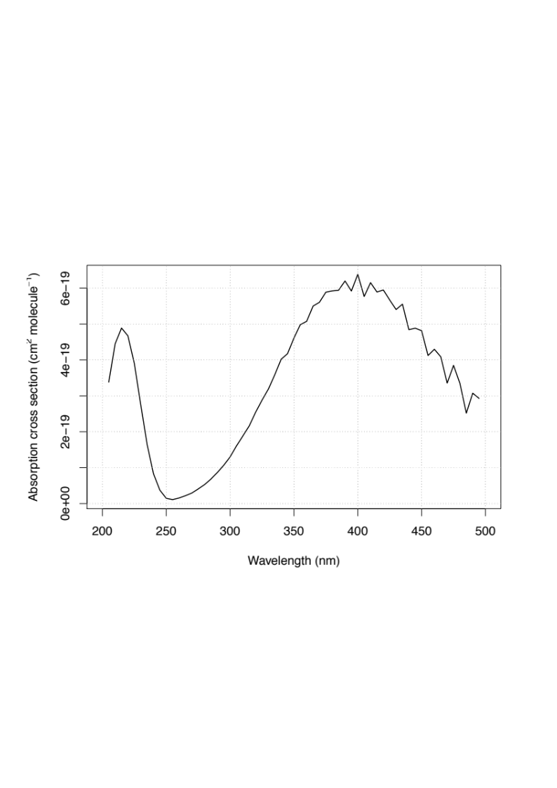
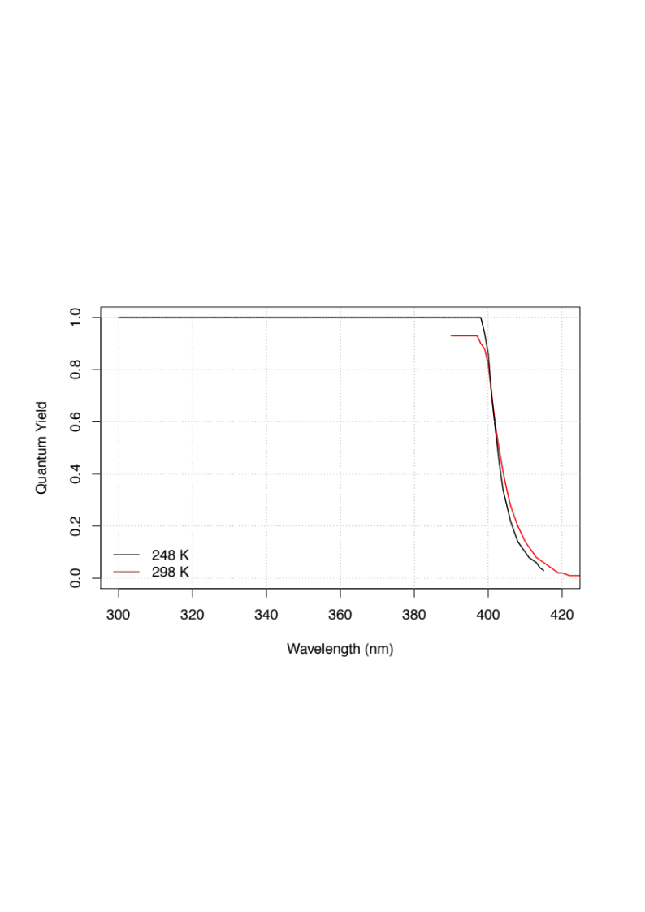
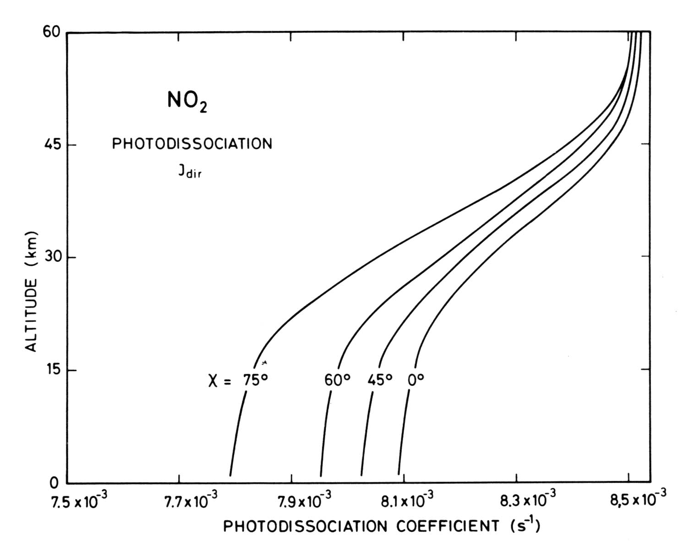

# Module 3 · Atmospheric Photochemistry

> **Learning aims**
> By the end of this module you should be able to:
> 1. Write down and explain each term in the photolysis rate coefficient integral, $J = \int \phi\, F\, \sigma\, d\lambda$.
> 2. Use the Beer–Lambert law and optical depth to describe how photon flux and photolysis rates vary with altitude and solar zenith angle.
> 3. Describe the absorption and photolysis behaviour of O₂, O₃, NO₂ and N₂O/CFCs, and explain why the troposphere and stratosphere have such different photochemical environments.

The sun's energy drives atmospheric chemistry. Assuming that the Sun can be represented as a blackbody emitter, Wien's displacement law ($\lambda_{max} = b/T$) can be used to predict the peak wavelength of solar radiation reaching the top of the atmosphere (TOA). Figure 3.1 shows a profile of solar radiation at the TOA and at the Earth's surface. Strong absorption occurs in a number of wavelength intervals. Whilst significant amounts of the Sun's energy are absorbed in the IR bands of H₂O and CO₂, Fig 3.1 shows that it is absorption by O₃ and O₂ that dominate in the visible and near-UV regions. It is the absorption of radiation by these gases that triggers the cascade of reactions we will focus on in this course. One of the most important quantities we will derive is the **photolysis coefficient** — a first-order rate constant — which can be used to determine the effective lifetime of a gas in the atmosphere with respect to the Sun's energy.

*Figure 3.1 — Solar spectral irradiance as a function of wavelength at the TOA and at the surface.*

## 3.1 Calculation of photolysis rate coefficients

Atmospheric chemists commonly use the symbol $k$ for a reaction rate coefficient involving molecular "collisions," and the symbol $J$ for a reaction rate coefficient for a reaction involving the absorption of photons resulting in molecular dissociation. We call this process **photolysis** (or **photodecomposition**). The rate coefficient of photolysis of a constituent $i$ ($J_i$, units s⁻¹) can be written:

$$J_{(i)} = \int_{\lambda=0}^{\infty} \phi_{(i,\lambda)}\, F_{(\lambda)}\, \sigma_{(i,\lambda)}\, d\lambda$$

where $\phi_{(i,\lambda)}$ is the **quantum yield** (molecule photon⁻¹) for photolysis (the number of reactant molecules decomposed per quantum of radiation absorbed; sometimes defined per reaction pathway), $\sigma_{(i,\lambda)}$ is the wavelength-dependent **absorption cross-section** (usually cm² molecule⁻¹) of species $i$, and $F_{(\lambda)}$ is the incident **photon intensity** at a given wavelength (photons cm⁻² s⁻¹ nm⁻¹).

The absorption cross-section is defined by the Beer–Lambert law, which describes the attenuation of light by a homogeneous absorbing system:

$$I = I_0 \exp(-\sigma n l)$$

where $I_0$ and $I$ are the incident and transmitted light intensities, $l$ is the absorption path length (cm), $n$ is the concentration of absorber (molecule cm⁻³), and $\sigma$ is the absorption cross-section (cm² per molecule).

Given that the source of radiation of interest to us is the sun, we can use the Beer–Lambert law to determine the flux of photons at a specific wavelength as a function of altitude ($z$):

$$F_\lambda(z) = F_\lambda(\text{TOA})\, \exp(-\text{O.D.})$$

where $F_\lambda(\text{TOA})$ is the intensity of radiation (flux of photons) at the top of the atmosphere. The **optical depth** (O.D.) can be calculated as:

$$\text{O.D.}(\lambda) = \sum_i \sigma_{i,\lambda} \times \text{column}_i$$

— where we saw in Exercise 2 (Module 1) how to calculate the column of a well-mixed gas. In the cases we will consider, the relevant distance for the column is from the TOA to our point of interest.

If the sun is at zenith angle $\theta$, the path length is increased by a factor $\sec(\theta)$. The optical depth thus increases rapidly as the zenith angle approaches 90°. This may be important near sunrise or sunset, or at high latitudes, and can result in a marked reduction in photolysis $J$ values.

In principle the O.D. depends on all absorbing species at the wavelength of interest. In practice, for this course most of the time we will need only consider that **O₂ (λ < 240 nm) and O₃ absorb solar radiation significantly**, and only these two need be considered when calculating $F_\lambda(z)$.

## 3.2 Altitude dependence of photolysis

Figure 3.2 shows the altitude at which the intensity of solar radiation is reduced by $1/e$ from its TOA value, as a function of wavelength. There is a lot of variation in this plot, but in general we can note: (i) as we move to longer $\lambda$, radiation penetrates closer to the surface before being attenuated; (ii) beyond 320 nm, there is no difference between the photon flux at the TOA and at the surface.

*Figure 3.2 — Altitude at which attenuation reaches 1/e. Shows how the depth of penetration of radiation varies with wavelength.*

The fine structure in Fig 3.2 comes from the fine structure in the absorption cross-sections of the atmospheric absorbers. Briefly: Fig 3.2 shows that little radiation of $\lambda < 300$ nm penetrates below the tropopause. This means the photochemistry of the troposphere is very different from that of the stratosphere.

These altitude dependencies of photon fluxes matter when we come to calculate photolysis rates in different parts of the atmosphere — at 290 nm there is a factor-of-100 difference in photon flux between 40 km and 15 km, so processes requiring this wavelength proceed much more slowly at 15 km than at 40 km.

$J$ for O₂ ($\lambda < 250$ nm) varies strongly with altitude, as the relevant photons are absorbed and removed on the way down. In contrast, $J$ for NO₂ + hν → NO + O ($\lambda < 400$ nm) varies little with altitude, and it is this photolysis reaction that leads to ozone production in the troposphere (covered in more detail later).

## 3.3 Photolysis of O₂

The presence of O₂ has a profound effect on the photochemistry of the atmosphere. O₂ has likely been present in our atmosphere for the last 2 billion years, with its current mixing ratio roughly constant over the last 500 million years. O₂ is produced through photosynthesis and is involved in a number of biogeochemical cycles giving rise to long lifetimes in the lower atmosphere (thousands of years). However, in the stratosphere O₂ can absorb short-$\lambda$ radiation and photo-dissociate. The absorption cross-section for O₂ consists of characteristic features, many named after the scientists who discovered them. The cross-section at $\lambda < 150$ nm is large but not important to O₂ photolysis in the stratosphere owing to a lack of photons at these wavelengths. The major absorption in the stratosphere is in the **Herzberg continuum** (220–260 nm), $A^3\Sigma_u^+ \leftarrow X^3\Sigma_g^-$.

*Figure 3.4 — Molecular oxygen absorption cross-sections.*

Assuming unit quantum yield for photolysis of O₂ (O₂ + hν → O(³P) + O(³P)), we can combine the wavelength-dependent flux profile with the absorption cross-section to calculate the photolysis frequency $J_{O_2}$; the reciprocal gives the lifetime/timescale for photolysis. The lifetime of O₂ with respect to photolysis varies over 5 orders of magnitude across the altitude range 20–100 km. The longer-wavelength Herzberg absorption is relatively more important at low altitudes, while the shorter wavelengths (Schumann–Runge Bands, Schumann–Runge Continuum) are only important at high altitudes (photons at these wavelengths are absorbed high up).

## 3.4 O₃ photolysis

Ozone is central to the chemistry of the atmosphere! The presence of ozone in a layer in the stratosphere (the ozone layer) has helped provide an environment suitable for the evolution of life at the Earth's surface. Yet ozone itself is toxic to most plants and animal life. Hence the phrase "**good up high, bad nearby**" is apt for ozone.

O₃ is relatively weakly bound compared to O₂ and can be photolysed over a wide range of wavelengths, with a theoretical threshold at 1180 nm. Absorption occurs in the so-called **Hartley, Huggins and Chappuis bands**. The precise photolysis products depend on the photon energy. The most important processes are photolysis to yield electronically excited oxygen atoms (rate constant $J_{O(^1D)}$) and photolysis to ground-state atomic oxygen ($J_{O(^3P)}$):

$$O_3 + h\nu \xrightarrow{J_{O(^1D)}} O_2(^1\Delta) + O(^1D) \qquad \lambda < 310\ \text{nm (actually longer!)}$$
$$O_3 + h\nu \xrightarrow{J_{O(^3P)}} O_2(^3\Sigma) + O(^3P) \qquad \lambda < 1180\ \text{nm}$$

Using the absorption cross-section data together with the altitude-dependent spectral irradiance, we can calculate photolysis frequencies for O₃, just as for O₂. Photolysis of O₃ is much more rapid than photolysis of O₂: lifetimes of O₃ with respect to photolysis vary from ~8 hours to ~3 minutes over the altitude range 10–50 km.

Of more interest to our understanding of atmospheric chemistry is the reaction channel producing excited oxygen atoms, $J_{O(^1D)}$. Here we must follow the same approach as before, but rather than assuming unit quantum yield we need the wavelength (and possibly temperature) dependence of $\phi_{(\lambda)}$: at small $\lambda$ the quantum yield is $\sim 1.0$, whilst at $\lambda > 310$ nm it drops to $\sim 0.0$.

*Figure 3.8 — Wavelength dependence of the O(¹D) quantum yield.*

We will see later that O(¹D), while present in very low concentrations, is extremely important for atmospheric chemistry. It can actually be produced at somewhat longer wavelengths than 310 nm, possible explanations being: 'hot band' absorption by O₃, or possibly O₃ → O(¹D) + O₂(³Σ) (spin-forbidden).

The very low concentrations of O(¹D) (order 1–100 molecules cm⁻³) occur because it is collisionally quenched back to the ground electronic state very rapidly:

$$O(^1D) + O_2 \to O_2 + O(^3P) \qquad k_1 = 4.2\times10^{-11}\ \text{molecules}^{-1}\,\text{cm}^3\,\text{s}^{-1}$$
$$O(^1D) + N_2 \to N_2 + O(^3P) \qquad k_2 = 2.8\times10^{-11}\ \text{molecules}^{-1}\,\text{cm}^3\,\text{s}^{-1}$$

## 3.5 Photolysis of NO₂

Nitrogen dioxide was likely first discovered by Priestley in the late 18th century. At room temperature it's a brownish gas, and — as you might imagine — this means it has a stonking great absorption cross-section in the visible spectrum.

Photolysis of NO₂ proceeds as:

$$NO_2 + h\nu \xrightarrow{J_{NO_2}} NO(^2\Pi) + O(^3P)$$

The photolysis products can go on to form O₃ (through reaction with O₂ in a ter-molecular process). Indeed, photolysis of NO₂ is the main source of O₃ production in the troposphere (where O₂ cannot be photolysed).

*Figure 3.9 — NO₂ absorption cross-section and quantum yield.*

As Fig 3.9 shows, the cross-section remains relatively large even at long wavelengths (where the atmosphere is otherwise practically transparent), resulting in large photolysis frequencies even near the surface:

*Figure 3.10 — NO₂ photolysis rates as a function of solar zenith angle.*

NO₂ photolysis happens so rapidly that NO₂ can usually be thought of as being in steady state (i.e. the first-order rate of loss — photolysis — is large enough to keep its concentration low and steady) during daylight hours. Fig 3.10 shows that even at high solar zenith angles photolysis remains rapid (Δτ ~ 5% between midday and 6 am). This is an important aspect of NO₂ chemistry, and one that will let us simplify complex reaction chains later in the course.

## 3.6 Photolysis of N₂O and other compounds

Photolysis of N₂O almost exclusively proceeds as:

$$N_2O + h\nu \xrightarrow{J_{N_2O}} N_2 + O(^1D)$$

N₂O absorbs strongly at short $\lambda$ ($< 220$ nm). The main things to note: at the longer wavelengths available in the troposphere there is no photolysis of N₂O, and N₂O **can** contribute significantly to the optical depth at low wavelengths.

CFCs (chlorofluorocarbons) contain carbon, fluorine and chlorine and are entirely man-made. PFCs (perfluorinated carbons) are largely man-made, but the simplest PFC (CF₄) has a natural source from the oxidation of certain volcanic rocks. PFCs are very stable — in fact the absorption cross-section of CF₄ is so small that under most stratospheric conditions its lifetime is millions of years, so we won't worry about PFCs for now (although they are strong greenhouse gases, so don't think they aren't important!).

The naming convention for CFCs: the rightmost digit in the name gives the number of fluorine atoms ($n_F$); the next digit to the left gives the number of hydrogen atoms **plus 1** ($n_H+1$); and the next gives the number of carbon atoms **minus 1** ($n_C-1$), with zero values omitted. For example, CFC-11 has $n_F=1$, $n_H=0$ (so digit = 1), $n_C=1$ (so digit = 0), giving CFC-11 = CCl₃F.

CFC absorption cross-sections are fairly large at very short $\lambda$ and almost completely featureless (compare O₃ and NO₂). There is a huge range in CFC lifetimes as a function of altitude — tropospheric lifetimes are many thousands of years, but upper-stratospheric lifetimes are only a few days.

Important breakdown products from the photolysis of Cl- and Br-containing compounds in the stratosphere are the **halogen nitrates**. Their absorption cross-sections differ greatly at $\lambda > 260$ nm, with BrONO₂ having a sufficiently large cross-section at $\lambda > 320$ nm that its lifetime is very short.

---

## Try it yourself

Open **[`notebooks/03-photolysis-rates.ipynb`](../notebooks/03-photolysis-rates.ipynb)** to:

- Implement the Beer–Lambert / optical-depth calculation and reproduce the qualitative shape of Fig 3.2 (attenuation depth vs. wavelength) for a simplified O₂/O₃ atmosphere.
- Compute a toy photolysis coefficient $J_i = \int \phi\, F\, \sigma\, d\lambda$ numerically given synthetic $\sigma(\lambda)$, $\phi(\lambda)$ and $F(\lambda)$ data, and convert to a photolysis lifetime.
- Explore how $J$ scales with solar zenith angle via the $\sec(\theta)$ airmass factor, and reproduce the qualitative NO₂ vs. O₂ altitude-dependence contrast described in §3.2.
- Plot the O(¹D) quantum-yield step function (Fig 3.8) and see how a sharp cutoff wavelength propagates into a photolysis rate integral.

---

*Next: [Module 4 — Stratospheric Ozone Chemistry: the Chapman Mechanism](04-stratospheric-ozone-chapman.md)*
