# Module 4 · Stratospheric Ozone Chemistry

> **Learning aims**
> By the end of this module you should be able to:
> 1. Write down the Chapman reactions and derive the steady-state Chapman ozone concentration.
> 2. Explain why the Chapman mechanism alone overestimates stratospheric ozone, and what this implies about additional loss processes.
> 3. Describe the general form of a catalytic ozone-destruction cycle and derive the odd-oxygen loss rate for the NOx, HOx, ClOx and BrOx families.
> 4. Explain the role of reservoir species in moderating the efficiency of each catalytic family.

## 4.1 The Chapman Reactions

The discovery of O₃ in the atmosphere is usually attributed to Christian Friedrich Schönbein (1799–1868). Schönbein noticed a strange odour associated with electrical discharges — for those of you who have ever operated an "old" photocopier, you may recognize this odour.

Schönbein quantified the presence of O₃ in air using pieces of parchment soaked in a solution of KI, which would change colour on exposure to O₃. These early measurements are our only record of O₃ levels in the atmosphere at the time, and as you can imagine represent far-from-ideal data sets. Interestingly, Schönbein's method has continued to this day, albeit with modifications, in the form of the KI electrochemical cell.

It wasn't until the work of Gordon Dobson (1889–1975), who pioneered spectroscopic measurements of O₃ using the Dobson spectrophotometer during the 1920s, that we had a good picture of the distribution and abundance of O₃ in the upper atmosphere.

These early observations provided the first challenge for atmospheric chemists: to explain the occurrence of a thick layer of O₃ in the stratosphere. In 1930, Sidney Chapman (1888–1970) proposed a series of reactions to explain this distribution of stratospheric ozone.

| Reaction | | Rate coefficient | Eq. |
|---|---|---|---|
| O₂ + hν → O + O | | $J_2 \sim 5\times10^{-10}$ s⁻¹ | 4.1 |
| O + O₂ + M → O₃ + M | | $k_3 = 6\times10^{-34}(300/T)^2$ cm⁶ s⁻¹ | 4.2 |
| O₃ + hν → O + O₂ | | $J_3 \sim 2\times10^{-3}$ s⁻¹ | 4.3 |
| O + O₃ → O₂ + O₂ | | $k_4 = 1.0\times10^{-11}\exp(-2100/T)$ cm³ s⁻¹ | 4.4 |

Notice that the photolysis of oxygen is much slower than the photolysis of ozone ($J_2 \ll J_3$; values given are for ~40 km). Reactions 4.2 and 4.3 have very short time constants for the conversion of O to O₃ and vice versa, and establish a **steady state** much more rapidly than reactions 4.1 and 4.4.

<strong>Exercise 5 — Time constants for inter-conversion of O and O₃</strong>

As in Exercise 3, we found that the time scale for interconversion of two species is $(k_f+k_b)^{-1}$ (both must be first-order or pseudo-first-order rate constants).

O and O₃ are linked by interconversion reactions:
$$O\ (+O_2+M) \xrightarrow{k_f} O_3 \qquad O_3\ (+h\nu) \xrightarrow{k_b} O\ (+O_2)$$

Here $k_f = k_{O+O_2}[M][O_2]$ (pseudo-first-order for reaction 4.2) and $k_b = J_3$.

Focusing on the upper/middle stratosphere (40 km, $T=225$ K), from Module 1's Exercise 1 we have $[M]_{40\text{km}} = 2.4\times10^{19}\exp(-40/7) = 7.9\times10^{16}$ cm⁻³ ($[O_2] = 0.2[M]$). The interconversion timescale is:

$$\big(7.9\times10^{16}\times0.2\times7.9\times10^{16}\times6\times10^{-34}(300/225)^2 + 2\times10^{-3}\big)^{-1} = 0.75\ \text{seconds!} \quad \text{i.e. fast!}$$

Reactions 4.2 and 4.3 only interconvert the "odd oxygen" species O and O₃ — i.e. they **conserve odd oxygen** ($[O_x] = [O]+[O_3]$). In defining $O_x$ we've invoked the idea of a **chemical family**: a collection of compounds connected via fast interconversion reactions, in steady state with each other. Since odd oxygen is only formed by reaction 4.1 and only removed by reaction 4.4:

$$\frac{d[O_x]}{dt} = 2J_2[O_2] - 2k_4[O][O_3]$$

Without invoking the O↔O₃ steady state we'd instead have the more complex system:

$$\frac{d[O]}{dt} = 2J_2[O_2] - k_3[O][O_2][M] + J_3[O_3] - k_4[O][O_3]$$

$$\frac{d[O_3]}{dt} = k_3[O][O_2][M] - J_3[O_3] - k_4[O][O_3]$$

$$\frac{d([O]+[O_3])}{dt} = 2J_2[O_2] - 2k_4[O][O_3]$$

The use of odd oxygen thus leads, as we'll see again later, to both conceptual and mathematical simplification.

<strong>Note on oxygen</strong>

Note that we will always consider $[O_2]$ to be unaffected by this chemistry ($d[O_2]/dt = 0$ and $[O_2] \approx 0.2[M]$) unless otherwise stated.

The timescale for steady state between reactions 4.1 and 4.4 varies strongly with altitude: ~hours at 40 km, but many years at 20 km. Invoking steady state in the upper stratosphere is a good approximation; in the lower stratosphere it would be poor, since solar intensity, temperature, and atmospheric transport all vary too rapidly to allow steady state to be established.

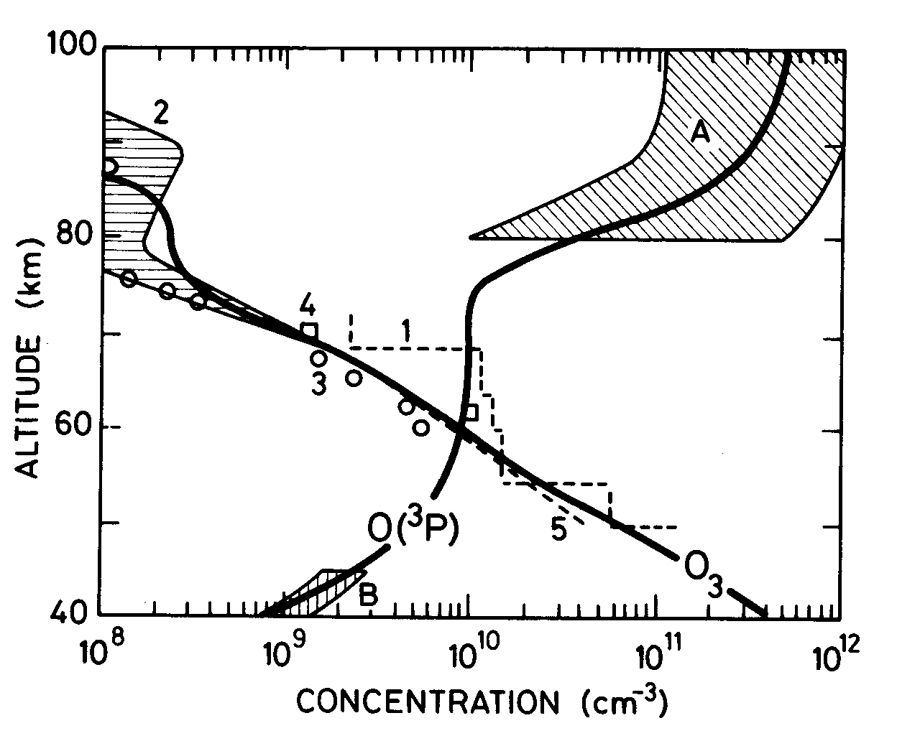
[]{#fig-4-1}*Figure 4.1 — Observed and calculated altitude profiles of O(³P) and O₃.*

From the steady state between O and O₃, [O] decreases very rapidly with decreasing altitude (both [M] and [O₂] are proportional to pressure), so reaction cycles involving O become very inefficient at low altitudes ([Fig 4.1](#fig-4-1)).

<strong>Exercise 6 — Steady-state distribution of ozone</strong>

This calculation only works where chemical production and loss rates balance. At steady state:

$$\frac{d[O_x]}{dt} = 2J_2[O_2] - 2k_4[O][O_3] = 0 \quad\Rightarrow\quad [O_3] = \frac{2J_2[O_2]}{2k_4[O]}$$ &nbsp;&nbsp;(Eq 2)

The problem is we don't yet know [O]. Using the O↔O₃ interconversion (reactions 4.2/4.3):

$$\frac{[O_3]}{[O]} = \frac{k_3[O_2][M]}{J_3}$$ &nbsp;&nbsp;(Eq 3)

Rearranging Eq 3 for [O] and substituting into Eq 2:

$$[O_3]^2 = \frac{2J_2[O_2]  k_3[O_2][M]}{2k_4 J_3} \quad\Rightarrow\quad [O_3] = \sqrt{\frac{J_2[O_2] k_3[O_2][M]}{k_4 J_3}}$$ &nbsp;&nbsp;(Eq 5)

Now [O₃] can be calculated purely from rate constants and altitude (via [O₂] and [M]).

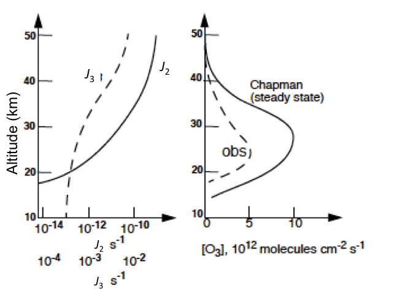
[]{#fig-4-2}*Figure 4.2 — Measured and calculated (Chapman mechanism) distributions of O₃ mixing ratios vs. altitude.*

For many years it was thought that Chapman's model could adequately explain the distribution of stratospheric ozone. However, with improved laboratory and atmospheric measurements, it became apparent that reaction 4.4 only removes about **25%** of the odd oxygen produced by oxygen photolysis. Calculations based on just the Chapman reactions seriously overestimate stratospheric ozone concentrations ([Fig 4.2](#fig-4-2)).

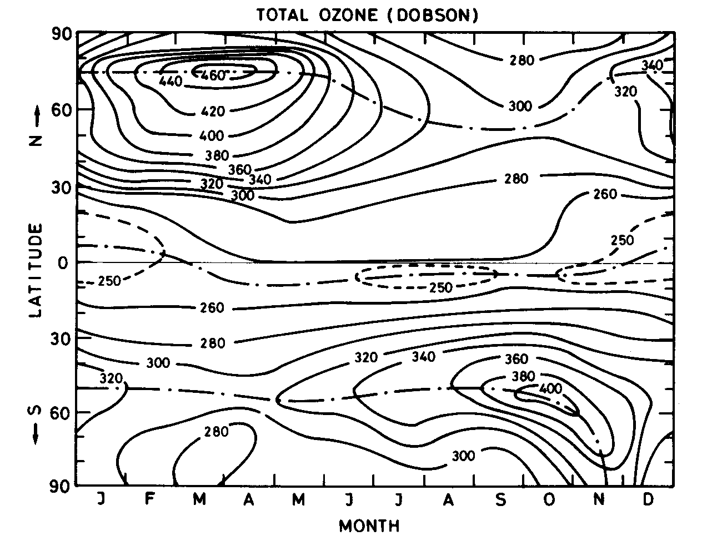
[]{#fig-4-3}*Figure 4.3 — Variation of total ozone as a function of latitude and season, showing highest values at high latitudes just after the polar night. Photochemical theory alone would predict highest ozone over the tropics; the observed distribution is strong evidence for the role of large-scale **transport** (the winds) in shaping the ozone distribution.*

Observations of the total ozone column helped meteorologists and atmospheric physicists show there is a global overturning circulation, known after its discoverers as the **Brewer–Dobson Circulation (BDC)**, which takes air from the tropics and redistributes it poleward.

## 4.2 Catalytic cycles

Reaction 4.4 has an unexpectedly high activation energy ($E_a \sim 17.5$ kJ mol⁻¹) for such an exothermic reaction ($\Delta H \sim -390$ kJ mol⁻¹). It was realised that, at stratospheric temperatures (200–290 K), odd oxygen could be removed efficiently by **catalytic cycles** which achieve the same net result as reaction 4.4, without net loss of the catalytic species X or XO:

$$X + O_3 \to XO + O_2$$

$$XO + O \to X + O_2$$

$$\textbf{net: } O + O_3 \to O_2 + O_2 \quad \text{(i.e. reaction 4.4)}$$

The rate-determining step is usually the reaction involving O. For efficiency we assume each step must be exothermic, which constrains the X–O bond energy to lie in the range $107 < D(X\text{–}O) < 498$ kJ mol⁻¹. Suitable candidates for X present in the stratosphere include **H, OH, NO, Cl and Br**.

## 4.3 The oxides of nitrogen, NOx

### 4.3.1 Sources

NO and NO₂ (NO+NO₂ = NOx) are present in the stratosphere at ~10 ppb (compare ~10 ppm of O₃). The main source of NOx in the stratosphere is nitrous oxide (N₂O), produced at the Earth's surface by denitrifying bacteria. N₂O is well mixed in the troposphere (~335 ppb), has a very long tropospheric lifetime, and is transported to the stratosphere where its main fate is photolysis (λ < ~220 nm):

$$N_2O + h\nu \to N_2 + O(^{1}D)$$

About 1% is instead converted to NO via reaction with electronically excited oxygen atoms:

$$O_3 + h\nu \to O_2(^1\Delta) + O(^{1}D) \qquad \lambda < 310\ \text{nm}$$

$$N_2O + O(^{1}D) \to NO + NO \qquad k \sim 10^{-10}\ \text{cm}^3 \text{s}^{-1}$$

$$\to N_2 + O_2$$

N₂O mixing ratios are increasing at ~0.8 ppb per year. Nitrogen oxides are also emitted *directly* into the stratosphere by high-flying aircraft.

> **Key point:** Emissions of NOx into the troposphere from power stations, motor vehicles, etc. are very large and important for the **troposphere**, but little of this reaches the stratosphere, since conversion to HNO₃ and rainout is rapid.

The stratospheric residence time is sufficiently long that NOx from aviation is calculated to cause a significant reduction of stratospheric ozone, especially from a hypothetical fleet of advanced supersonic aircraft projected to fly even higher in the stratosphere.

### 4.3.2 Catalytic cycle

With X = NO:

$$
\begin{aligned}
NO + O_3 &\to NO_2 + O_2 \quad (k_a) \\
NO_2 + O &\to NO + O_2 \quad (k_b)
\end{aligned}
$$

This cycle is responsible for about **50%** of odd oxygen removal from the stratosphere, despite competing reactions — the most important being NO₂ photolysis, which is very rapid even at low altitudes (Module 3). NO₂ photolysis produces a ***null cycle*** in which odd oxygen is conserved:

$$
\begin{aligned}
NO_2 + h\nu &\to NO + O \quad (J_c) \\
O + O_2 + M &\to O_3 + M \\
NO + O_3 &\to NO_2 + O_2
\end{aligned}
$$

Steady state between NO and NO₂ is rapidly established (~100 s). Taking the rate of change of NO:

$$\frac{d[NO]}{dt} = -k_a[NO][O_3] + k_b[NO_2][O] + J_c[NO_2] = 0$$

$$\Rightarrow\quad [NO] = \frac{k_b[NO_2][O] + J_c[NO_2]}{k_a[O_3]}$$ &nbsp;&nbsp;(I)

The rate of odd oxygen destruction by NOx:

$$\frac{d[O_x]}{dt} = -k_a[NO][O_3] - k_b[NO_2][O] + J_c[NO_2]$$ &nbsp;&nbsp;(II)

Substituting [NO] from (I) into (II):

$$\left.\frac{d[O_x]}{dt}\right|_{NO_x} = -2k_b[NO_2][O]$$

### 4.3.3 Reservoirs and sinks

A more comprehensive picture of stratospheric NOy chemistry (NOy = sum of all nitrogen oxides excluding N₂O) also involves NO₃, N₂O₅, HNO₄, HNO₃ (and ClONO₂ — §4.5). 

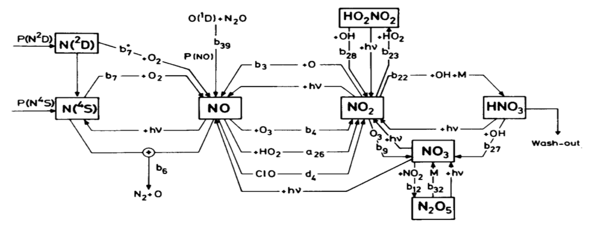
[]{#fig-4-4}*Figure 4.4 — Key sources, sinks and species involved in the chemistry of NOy in the stratosphere.*

N₂O₅, HNO₃ and ClONO₂ are important **reservoirs** for NOx (and HOx, ClOx) — states where otherwise-reactive O₃-destroying radicals are held in less reactive form. For example, HNO₃ is formed by:

$$
\begin{align}
OH + NO_2 + M &\to HNO_3 + M \tag{4.5}
\end{align}
$$

and destroyed by

$$
\begin{align}
HNO_3 + h\nu &\to OH + NO_2 \\
HNO_3 + OH &\to H_2O + NO_3 \tag{4.6}
\end{align}
$$

At higher latitudes HNO₃ can become the major nitrogen oxide species. HNO₃ is transported from the stratosphere into the troposphere, where it is efficiently rained out — the major **sink** of stratospheric nitrogen oxides.

Typical (modelled) distributions of NOy species are shown in ([Fig 4.5](#fig-4-5)). 

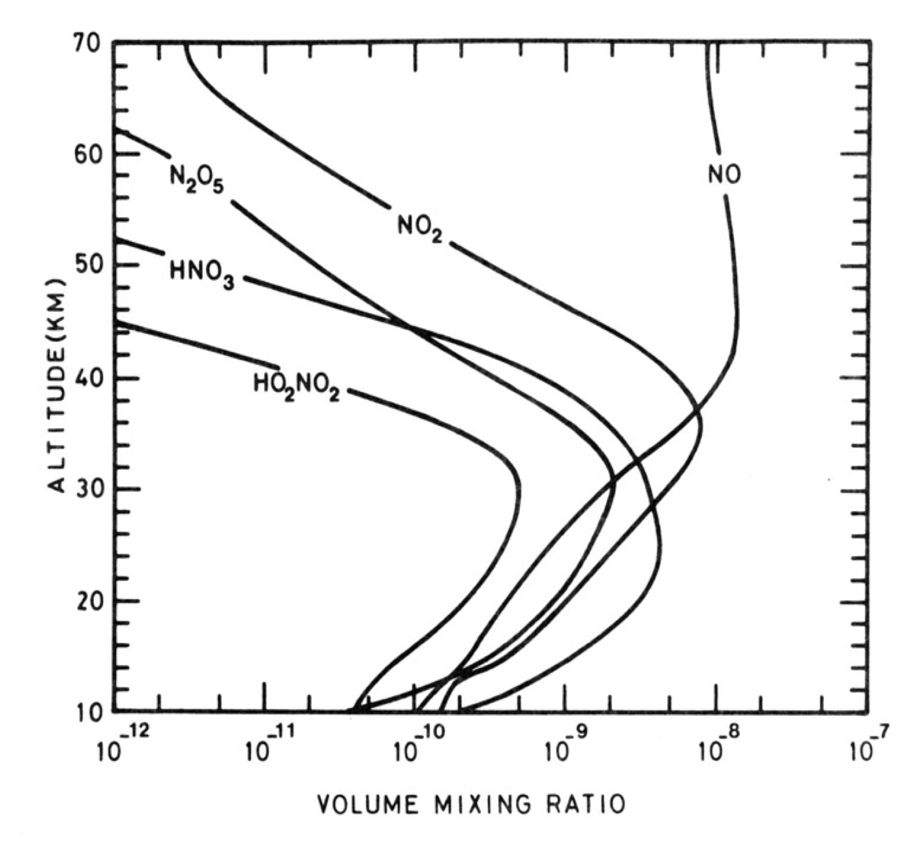
[]{#fig-4-5}*Figure 4.5 — Vertical profile of key NOy species in the stratosphere.*

Reactions 4.5 and 4.6 are both favoured by low temperatures. For the termolecular reaction 4.5, this is obvious; the temperature (and pressure!) dependence for HNO₃ + OH (4.6) is more surprising — it clearly doesn't proceed by simple H-abstraction, but instead via a short-lived intermediate. Both reactions are very important in the very low stratosphere.

Climate change predictions indicate the troposphere will warm ('global warming') while the stratosphere cools. A cooler lower stratosphere would favour formation of the reservoir species (reaction 4.5) and water vapour from HOx (reaction 4.6). The resulting reduction in HOx radicals is predicted to lead to an **increase** in lower-stratospheric ozone later this century (with consequences also for the troposphere, since the stratosphere is a source of ozone to it).

### 4.3.4 Diurnal variation of the nitrogen oxides

Balloon-borne tunable diode laser spectroscopy (TDLS) measurements have confirmed the basic chemistry above, including the night-time decay of NO₂.

During sunlight hours, NO and NO₂ are in rapid equilibrium via:

$$
\begin{align}
NO + O_3 &\to NO_2 + O_2 \\
O + NO_2 &\to NO + O_2 \\
NO_2 + h\nu &\to NO + O
\end{align}
$$

At sunset, photolysis ceases and [O] decreases rapidly, so [NO₂] rises rapidly. Thereafter [NO₂] falls via:

$$NO_2 + O_3 \to NO_3 + O_2 \qquad k = 8.5\times10^{-13}\exp(-2450/T)\ \text{cm}^3\text{s}^{-1}$$

During the day NO₃ is photolysed very rapidly (~seconds), but at night it's removed by the fast termolecular reaction:

$$NO_2 + NO_3 + M \to N_2O_5 + M$$

The slope of the night-time NO₂ decay ([Fig 4.6](#fig-4-6)) is thus set by [O₃] and temperature (since at high temperatures $N_2O_5 \to NO_2 + NO_3$).

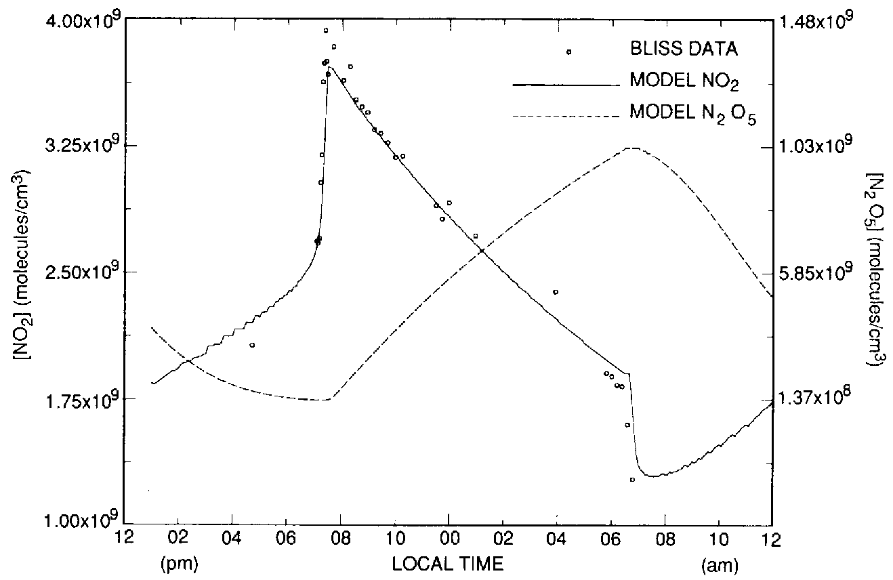
[]{#fig-4-6}*Figure 4.6 — Measured and modelled diurnal variation of NO₂.*

[Fig 4.6](#fig-4-6) shows [NO₂] falling at dawn with the onset of photolysis; the daytime increase in [NO₂] reflects the slow (~hours) photolysis of N₂O₅. Global measurements of NO₂, N₂O and HNO₃ have also been obtained from satellite instruments working in the infrared.

## 4.4 The oxides of hydrogen, HOx

### 4.4.1 Sources

The hydroxyl radical is one of the most important atmospheric species, in both the troposphere and the middle atmosphere. As in the troposphere, the main middle-atmosphere source of OH is:

$$O(^{1}D) + H_2O \to OH + OH$$

Because air enters the stratosphere at the cold equatorial tropopause, the stratosphere is extremely dry (H₂O mixing ratios 2–6 ppm). CH₄ is also transported to the stratosphere, where it is destroyed by reaction with OH and O(¹D):

$$O(^{1}D) + CH_4 \to OH + CH_3 \qquad OH + CH_4 \to H_2O + CH_3$$

— followed by oxidation of CH₃ to H₂O and hydrogen radicals. In the upper stratosphere CH₄ mixing ratios are low and hydrogen is present mainly as H₂O, with the relationship $\Delta H_2O \sim 2 \Delta CH_4$ holding. CH₄ is thus an additional source of H₂O and hence HOx, as well as playing other roles.

Major CH₄ sources are anaerobic fermentation in wetlands and paddy fields, ruminants, termites and biomass burning. Atmospheric CH₄ has been increasing (~1% yr⁻¹, followed by a period of little change during the 2000s, then a significant increase in recent years — poorly understood), leading to the expectation that stratospheric HOx concentrations will increase.

### 4.4.2 Catalytic cycles

H, OH and HO₂ (collectively HOx) are closely coupled on a timescale of seconds by interconversion reactions. The three-body reaction

$$H + O_2 + M \to HO_2 + M \qquad (k = 6\times10^{-32}(300/T)^2\ \text{cm}^6 \text{s}^{-1})$$

is 100 times faster than O + O₂ + M (4.2), keeping the HO₂:H ratio very high in the stratosphere. At lower pressures in the upper stratosphere/mesosphere, H atom concentrations can rise, enabling:

$$
\begin{aligned}
H + O_3 &\to OH + O_2 \\
OH + O &\to H + O_2
\end{aligned}
$$

More important in the stratosphere itself:

$$
\begin{aligned}
OH + O_3 &\to HO_2 + O_2 \quad (k_a) \\
HO_2 + O &\to OH + O_2 \quad (k_b)
\end{aligned}
$$

with, as for NOx, a null cycle:

$$
\begin{aligned}
OH + O_3 &\to HO_2 + O_2 \\
HO_2 + NO &\to NO_2 + OH \quad (k_c) \\
NO_2 + h\nu &\to NO + O \\
O + O_2 + M &\to O_3 + M
\end{aligned}
$$

The steady state between OH and HO₂ is rapidly established. By the same procedure as §4.3.2:

$$\left.\frac{d[O_x]}{dt}\right|_{HO_x} = -2k_b[HO_2][O]$$

In the lower stratosphere, as [O] falls, this cycle becomes inefficient and an alternative cycle not involving O becomes important:

$$
\begin{aligned}
OH + O_3 &\to HO_2 + O_2 \\
HO_2 + O_3 &\to OH + O_2 + O_2 \\
\textbf{net: } 2O_3 &\to 3O_2
\end{aligned}
$$

### 4.4.3 Reservoirs and sinks

A comprehensive description of stratospheric HOx chemistry is shown below: 

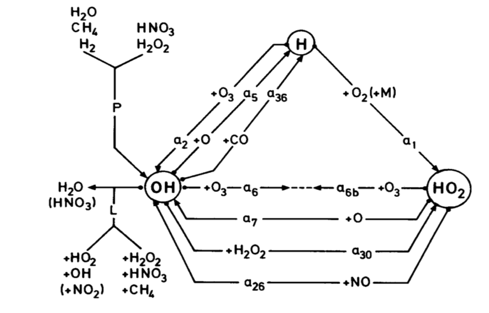
[]{#fig-4-7}*Figure 4.7 — Reaction fluxes of HOx species.*

Hydrogen radicals are removed from the stratosphere by reformation of H₂O and reactions producing the temporary reservoirs HNO₃ and H₂O₂:

$$
\begin{align}
OH + NO_2 + M &\to HNO_3 + M \\
HO_2 + OH &\to H_2O + O_2 \\
HO_2 + HO_2 &\to H_2O_2 + O_2
\end{align}
$$

Typical modelled distributions of HOx species in the stratosphere are shown in [Fig 4.8](#fig-4-8). 

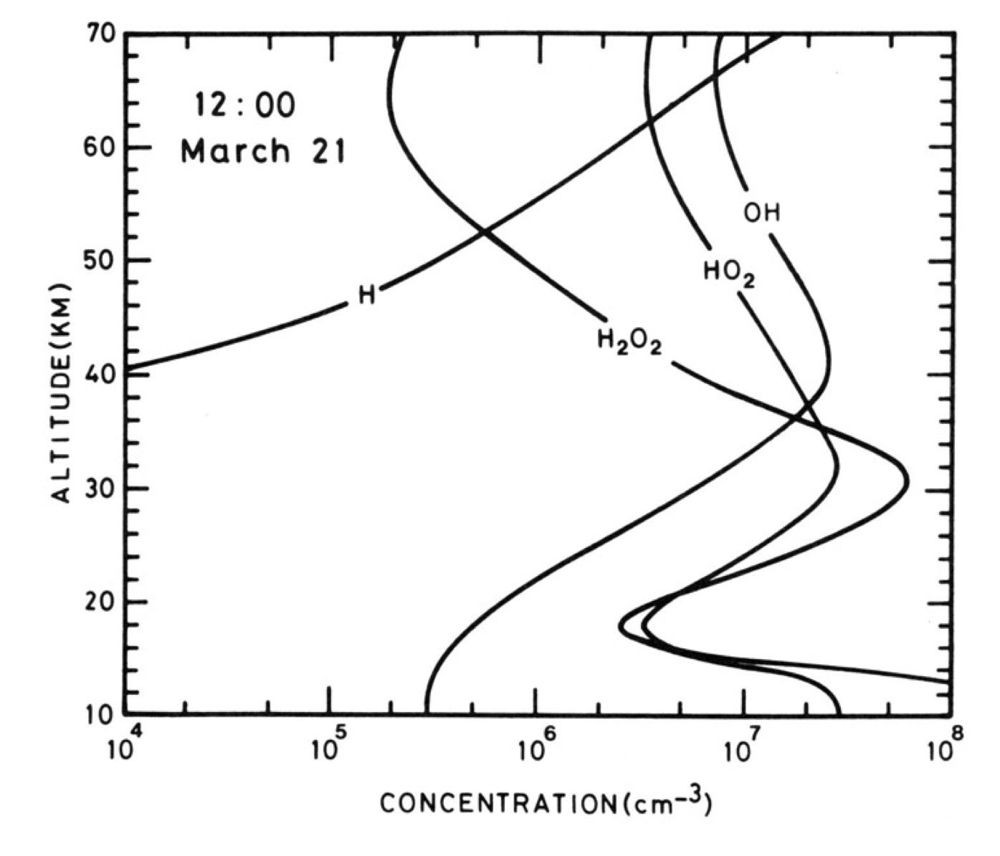
[]{#fig-4-8}*Figure 4.8 — Vertical profile of HOx species in the stratosphere.*

## 4.5 The oxides of chlorine, ClOx

### 4.5.1 Sources

The major *natural* source of chlorine to the stratosphere is CH₃Cl (~0.6 ppb). Stratospheric chlorine is currently over 3 ppb, with the increase due largely to manmade CF₂Cl₂ and CFCl₃, used as aerosol propellants, refrigerants and foam-blowing agents since the 1960s. Chemically inert in the troposphere, these CFCs are transported effectively to the stratosphere, where they are broken down by photolysis and reaction with O(¹D), releasing chlorine atoms. The troposphere acts as a reservoir for these species, giving them lifetimes of 50–100 years (the long atmospheric lifetime reflects the time needed to cycle up to the very low pressures where local loss is more rapid). Other species contribute to the total chlorine budget (e.g. CCl₄, CH₃CCl₃).

As a consequence of the large stratospheric O₃ losses observed in polar regions, driven by Cl-compounds (see Part III), the use and release of all these compounds is now regulated by the **Montreal Protocol**.

The historic and predicted future evolution of these source gases are shown in [Fig 4.9](#fig-4-9).

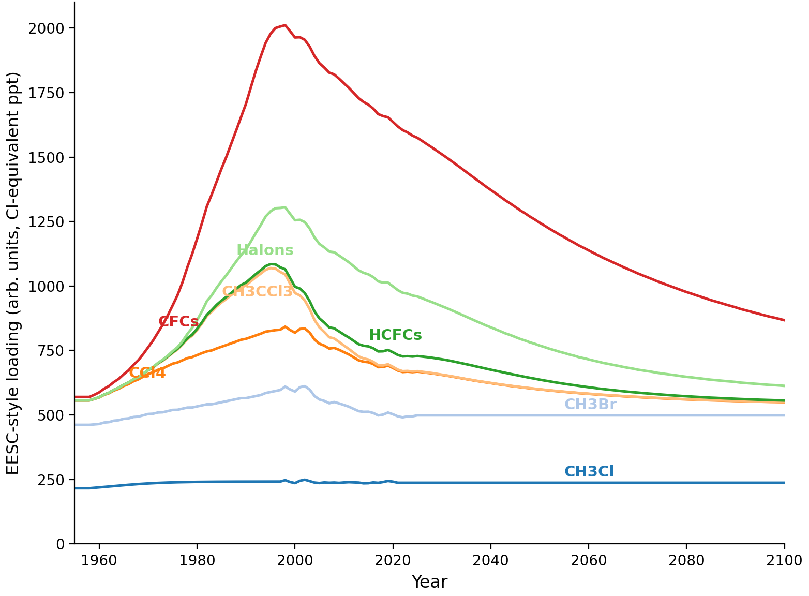
[]{#fig-4-9}*Figure 4.9 — Historic and expected future mixing ratios of ODS shown in effective equivalent stratospheric chlorine (EESC).*

Because of their long lifetimes, these species will continue to play an important, if diminishing, role in ozone chemistry for at least the next 100 years. A group of substitute compounds, the HCFCs, are also regulated — being shorter-lived (they have a C–H bond, so react with OH in the troposphere), meaning the chlorine they carry is less likely to reach the stratosphere. However, many are potent greenhouse gases, as are some of the chlorine- and bromine-free replacements, the HFCs. Because of the long CFC lifetimes, there is little scope for more rapid reduction in total stratospheric chlorine.

### 4.5.2 Catalytic cycle

With X = Cl:

$$
\begin{align}
Cl + O_3 &\to ClO + O_2 & (k_a) \\
ClO + O &\to Cl + O_2 & (k_b)
\end{align}
$$

with, again, a null cycle:

$$
\begin{align}
Cl + O_3 &\to ClO + O_2 \\
ClO + NO &\to NO_2 + Cl & (k_c) \\
NO_2 + h\nu &\to NO + O \\
O + O_2 + M &\to O_3 + M
\end{align}
$$

By the same steady-state procedure as before:

$$\left.\frac{d[O_x]}{dt}\right|_{ClO_x} = -2k_b[ClO][O]$$

### 4.5.3 Reservoirs and sinks

A more comprehensive description of stratospheric ClOx chemistry is shown below. 

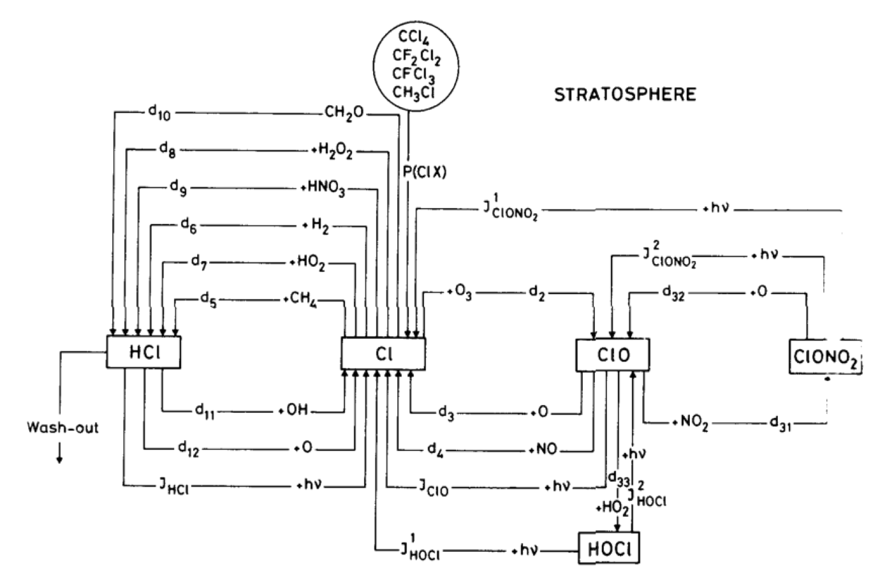
[]{#fig-4-10}*Figure 4.10 — Sources, sinks and reservoirs involved in stratospheric Cly chemistry.*

Two important reservoirs for ClOx are HCl and ClONO₂, formed by:

$$
\begin{align}
Cl + CH_4 &\to HCl + CH_3 \\
ClO + NO_2 + M &\to ClONO_2 + M
\end{align}
$$

and removed by:

$$
\begin{align}
OH + HCl &\to H_2O + Cl \\
ClONO_2 + h\nu &\to Cl + NO_3
\end{align}
$$

Note the contrast with NOx: whereas OH forms the NOx reservoir HNO₃, here OH acts to *release* Cl from the reservoir HCl. Typical distributions of reactive chlorine species are shown in [Fig 4.11](#fig-4-11).

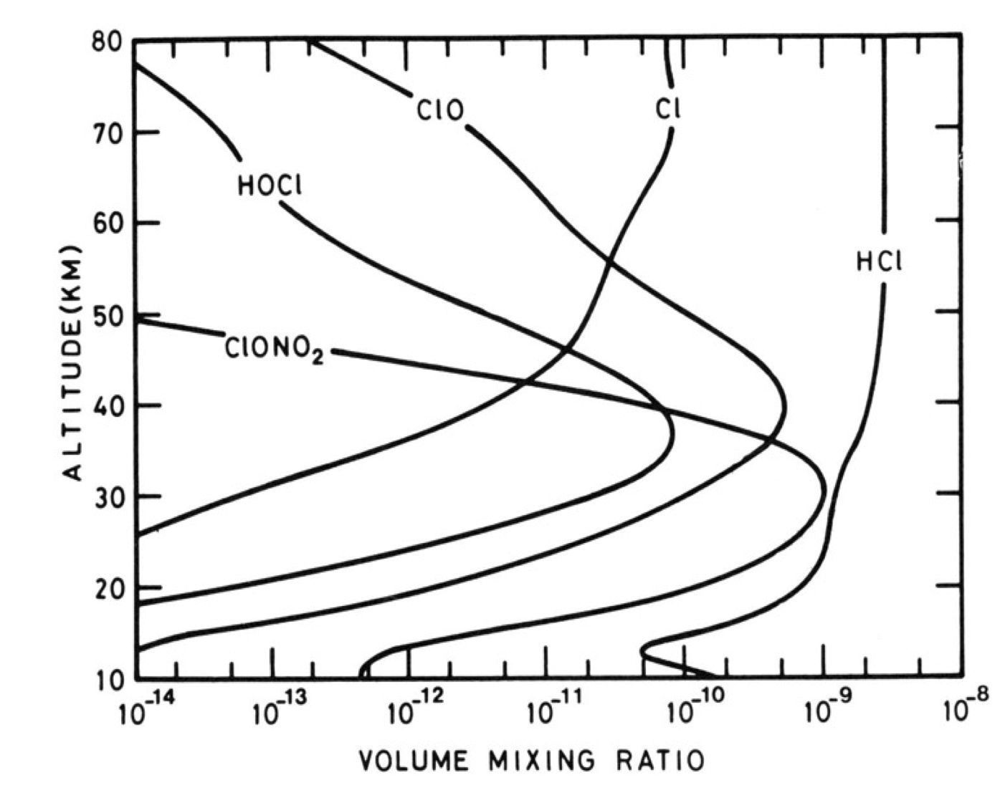
[]{#fig-4-11}*Figure 4.11 — The vertical distribution of main stratospheric Cly species.*

## 4.6 Other halogens

### 4.6.1 Sources

Catalytic destruction cycles could in principle also involve F, Br and I. The F cycle is unimportant because of the high stability of the HF bond (565 kJ mol⁻¹), and there are probably insufficient I-containing species for I to be a significant O₃ destroyer.

Atmospheric bromine levels are very low (~20 ppt), with the major natural source CH₃Br, and major man-made sources CH₃Br (soil fumigation), CF₃Br, CF₂BrCl and C₂F₄Br₂ (fire retardants) — but Br can nonetheless be important.

### 4.6.2 Catalytic cycle

As with chlorine:

$$
\begin{align}
Br + O_3 &\to BrO + O_2 \\
BrO + O &\to Br + O_2
\end{align}
$$

### 4.6.3 Reservoirs and sinks

Bromine differs from chlorine in that Br + CH₄ → HBr + CH₃ is 74 kJ mol⁻¹ endothermic, making the slower reaction with HO₂ the main source of HBr instead:

$$HO_2+Br\to HBr+O_2$$

Analogously to chlorine, BrONO₂ is formed and destroyed via:

$$
\begin{align}
BrO + NO_2 + M &\to BrONO_2 + M \\
BrONO_2 + h\nu &\to Br + NO_3
\end{align}
$$

However, BrONO₂ photolysis occurs at longer wavelengths than for ClONO₂, with a larger $\sigma$, making it ~20 times faster than for chlorine. The net effect: active BrO, rather than reservoirs, are favoured for BrOx — increasing its O₃ destruction efficiency per atom relative to chlorine.

Typical distributions of reactive bromine species are shown in [Fig 4.12](#fig-4-12).

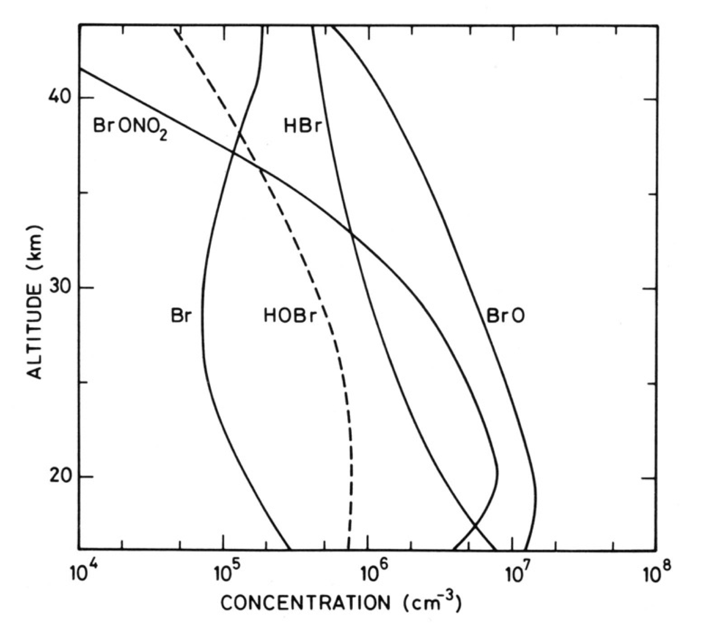
[]{#fig-4-12}*Figure 4.12 — The vertical distribution of main stratospheric Bry species.*

## 4.7 Relative importance of the Ox, NOx, HOx, ClOx and BrOx cycles

The relative importance of the different catalytic destruction cycles is set by: the reaction rates of the different cycles; the stratospheric lifetimes of the various source gases (a longer lifetime implies release of the catalysts at a higher altitude, and further poleward); and the partitioning between reactive and reservoir species. The different chemical cycles contribute to odd oxygen loss in different proportions as a function of altitude — HOx and NOx cycles tend to dominate in different altitude bands, with ClOx/BrOx becoming disproportionately important in the polar lower stratosphere where heterogeneous chemistry (Part III) activates them from their reservoirs.

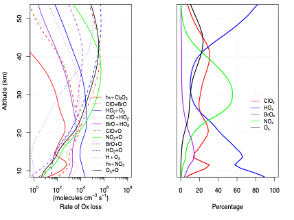
[]{#fig-4-13}*Figure 4.13 — The vertical distribution of the main stratospheric Ox destruction fluxes. On the right the relative role of each family is shown.*

---

## Try it yourself

Open **[`notebooks/04-chapman-mechanism.ipynb`](../notebooks/04-chapman-mechanism.ipynb)** to:

- Solve Exercise 5 (O↔O₃ interconversion timescale) as a function of altitude, and confirm it becomes "fast" only in the upper stratosphere.
- Implement Exercise 6's steady-state Chapman [O₃] formula (Eq 5) and reproduce the qualitative shape of [Fig 4.2](#fig-4-2) — including the ~overestimate relative to the real atmosphere once you compare against a fixed "observed" profile.
- Build a generic catalytic-cycle odd-oxygen-loss calculator, $d[O_x]/dt|_X = -2k_b[XO][O]$, and compare the relative importance of NOx-, HOx- and ClOx-driven loss for representative concentrations at a chosen altitude.
- Explore how reservoir partitioning (e.g. the HNO₃ ⇌ NOx or HCl ⇌ ClOx balance) changes the *effective* catalytic efficiency of a family, even when the intrinsic $k_a$, $k_b$ are fixed.

---

*Next: [Module 5 — Model Predictions of Changes in Global O₃](05-model-predictions-global-o3.md)*
