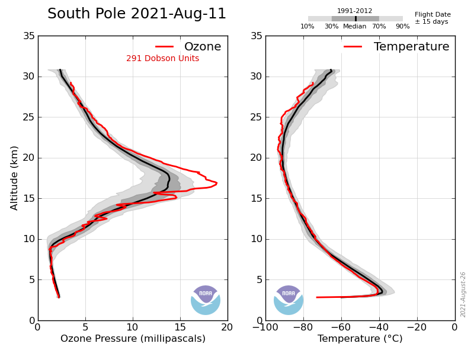
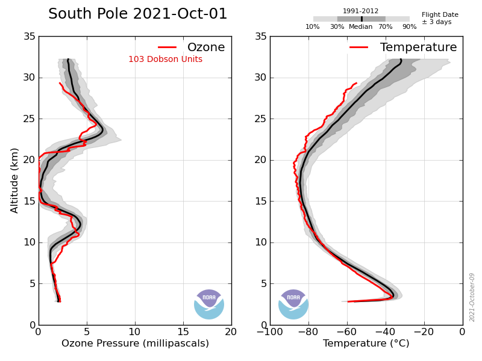

# Module 5 · Model Predictions of Changes in Global O₃

On the basis of the previous discussion, the rate of change of ozone (odd oxygen) can be written as:

$$\frac{d([O]+[O_3])}{dt} = 2J_a[O_2] - 2k_a[O][O_3] - 2k_b[O][NO_2] - 2k_c[O][HO_2] - 2k_d[O][ClO] - 2k_e[O][BrO] - \text{etc.}$$

It was realised in the 1970s that an increase in the concentration of the radical catalysts (e.g. NOx emitted directly into the stratosphere by aircraft; ClOx following degradation of CFCs; HOx either directly from aviation or through a changing climate) would change the balance in this equation, leading to lower ozone. Fig 4.11 (Module 4) showed a simplified version of the relative importance of the various catalytic Ox destruction cycles as a function of altitude.

In the case of the CFCs, peak depletion was predicted at about 40 km — the altitude at which ClO was predicted to peak. Chlorine-driven loss was predicted to be small in the low stratosphere, where [O] is low and ClOx was thought to be mostly locked up in the reservoirs ClONO₂ and HCl. Model calculations of the change in O₃ for a change in ClOx from around 1 ppb to 3 ppb (somewhat below present-day values) show reductions of greater than **20%** at ~40 km at high latitudes.

Why the high-latitude enhancement? As CH₄ mixing ratios fall toward high latitudes (because the source of methane is the tropical troposphere), the reaction converting ClOx to HCl slows:

$$Cl + CH_4 \to HCl + CH_3$$

allowing more ClOx to remain in active form — leading to greater O₃ loss.

Ozone depletion has indeed been detected in the upper stratosphere in line with this picture. But do these calculations also explain the observed loss of ozone in Antarctica, first reported in 1985, where the total ozone column falls from >300 DU to ~100 DU in a six-week period each springtime?

**The answer is 'No!'** Despite the large *percentage* change in *local* O₃ calculated above, the change in the *total column* O₃ from upper-stratospheric loss alone is small.

*Figure 5.2 — Observed (ozone-sonde) vertical profiles of temperature and ozone. Note the difference between the two panels after 6 weeks — the springtime Antarctic ozone hole is a *lower*-stratospheric phenomenon, not the upper-stratospheric signature predicted by gas-phase catalytic cycles alone.*

So the large observed change in the Antarctic is **not** explained by the upper-stratospheric losses calculated from gas-phase catalytic cycles. Our theory of catalytic cycles is correct — it explains ozone behaviour away from polar regions (e.g. the observed loss in the upper stratosphere) — but it is **incomplete**. Explaining the Antarctic ozone hole requires additional chemistry (heterogeneous reactions on polar stratospheric cloud surfaces, which activate ClOx from its reservoirs far more efficiently at low temperatures) — the subject of further courses.

One of the key questions current research aims to answer is how changes in stratospheric ozone are affected by, and will in turn affect, climate change.

---

## Try it yourself

Open **[`notebooks/05-ozone-loss-antarctic.ipynb`](../notebooks/05-ozone-loss-antarctic.ipynb)** to:

- Build the multi-family odd-oxygen budget equation from this module as a simple weighted-sum model, and explore how sensitive total loss is to each catalytic term.
- Reproduce, schematically, why a large *local* percentage change at 40 km barely moves the *total column* — by integrating a percentage perturbation applied only above some altitude against a realistic ozone profile, versus the same perturbation applied throughout the whole column.
- Compare that column-integral behaviour to what a *lower-stratospheric* perturbation (like the real ozone hole) would do to the total column, to see why the altitude at which loss occurs matters so much.

---

*This concludes the Michaelmas term (Lectures 1–6). Next: [Module 6 — Atmospheric Composition: Sources, Sinks and Lifetimes](06-atmospheric-composition-sources-sinks-lifetimes.md), opening the Lent term (Lectures 7–12).*
