# Module 5b · Measurement Techniques for Stratospheric Composition

> **Learning aims** By the end of this module you should be able to:
>
> 1. Explain the principle behind Dobson-spectrophotometer ozone measurements and derive the two-wavelength ratio method.
> 2. Distinguish *in situ* from remote measurement strategies, and nadir from limb-sounding satellite geometries, in terms of their spatial/temporal coverage trade-offs.
> 3. Describe the physical basis of absorption and emission spectroscopy for atmospheric composition, including how pressure broadening enables vertical-profile retrieval.
> 4. Outline the operating principles of the main *in situ* techniques used for O₃, H₂O, ClO/BrO and OH, and explain why each technique suits its target species.

## 5b.1 Measurement strategies: *in situ* vs remote

A variety of methods are used to measure atmospheric composition. These divide into two broad categories.

**In situ (local)** measurements are obtained only in the vicinity of the sampling instrument, from a variety of platforms — aircraft, balloons, the ground.

- *Advantages:* high spatial/temporal resolution.
- *Disadvantages:* limited coverage (altitude, latitude, longitude).
- *Methods include:* grab sampling of long-lived species for later analysis; gas chromatography; mass spectrometry; electrochemical methods; chemiluminescence; and spectroscopic techniques including resonance fluorescence and tunable diode laser spectroscopy (TDLS).

**Remote (non-local)** measurements can be made some distance from the sampling instrument, from satellites, aircraft, balloons or the ground.

- *Advantages:* good spatial and temporal coverage (satellites).
- *Disadvantages:* poor spatial resolution.
- *Methods:* spectroscopic, spanning microwave to UV, using either emission or absorption.

## 5b.2 Remote measurement: principles and geometries

Remote measurements rely on the fact that many molecules of interest have absorption (and thus emission) features in the earth's atmosphere. Measurements are made over a wide range of wavelengths, from microwave through to the ultraviolet; the technique used depends on the wavelength of the spectral feature of the molecule of interest.

Solar energy input at the top of the earth's atmosphere is characteristic of that from a black body at ~6000 K, while outgoing infrared emission from the atmosphere is broadly characteristic of a black body at 245 K. Over this wavelength range, a wide range of atmospheric constituents have absorption features.

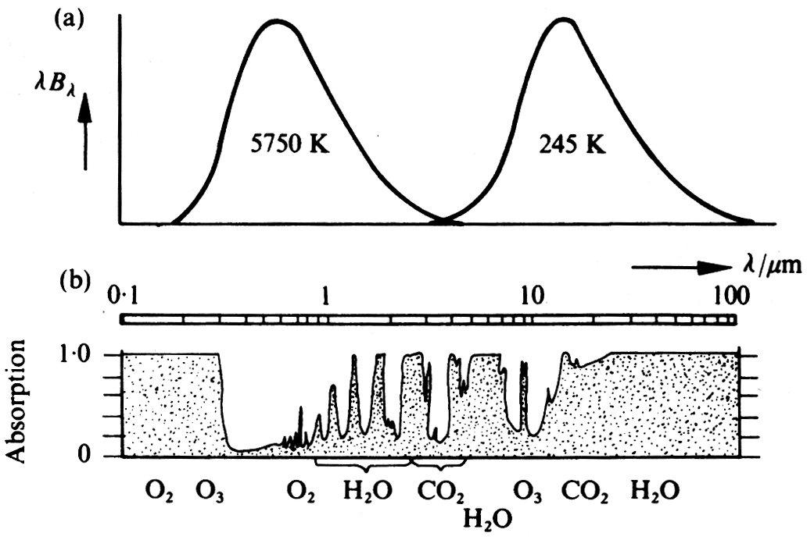
[]{#fig-5b-1}*Figure 5b.1 — Black-body curves corresponding to solar and mean atmospheric temperatures (top) and absorption by atmospheric gases (bottom) as a function of wavelength. (Houghton)*

Although, particularly in the IR, the absorption spectrum of the atmosphere is very complex — with overlapping absorption features due to the vibration–rotation bands of many molecules — given sufficient spectral resolution, transitions of individual molecules can be resolved.

The spectroscopic signal **detected** by an instrument, $I_{\nu,o}$, depends on two broad factors, depending on the observational geometry, as seen in the basic radiative transfer equation. One term depends on the (external) source, $I_{\nu,s}$, and the transmission of radiation from the source through the atmosphere. A further term describes the contribution from emission (and subsequent absorption) along the atmospheric path to the instrument:

$$I_{\nu,o} = I_{\nu,s}\exp(-\tau') + \int B_\nu(T(\tau))\exp(-\tau)\,d\tau \tag{5b.1}$$

where $d\tau = \sum_i n_i \sigma_i\, dz$ is the optical depth at $\nu$.

Usually only one of these terms is important. In UV spectroscopy, the sun is usually the source: there is **absorption** by atmospheric constituents, but no emission in the UV along the atmospheric path, so only the first term matters. Measurements of atmospheric **emission** are often made in the infrared or microwave, where the radiance measured depends on the emission and subsequent absorption along the path.

For composition measurements in emission, satellite measurements usually view the limb (with "cold space" as the source, which is negligible) rather than the nadir (downward-looking, with the earth's surface as the source).

**Absorption spectroscopy.** In the ultraviolet and visible, absorption methods are generally used, in which the *absorption by* the atmosphere of radiation from a distant source (usually the sun) is detected. Knowledge of the absorption characteristics of the species of interest allows the quantity of absorber between source and detector to be deduced. Measurements using this technique can be made from satellites, balloons, and the ground.

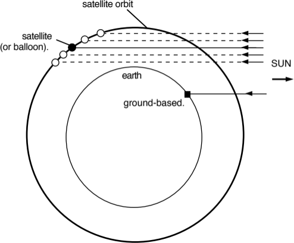
[]{#fig-5b-2}*Figure 5b.2 — Schematic of absorption measurements.*

**Emission spectroscopy.** In the atmosphere, peak energy is in the infrared. In this region, emission methods — in which *emission from* molecules of interest is detected — can be employed. As the energy emitted from a region depends on both the absorption properties of the gas and the temperature, the latter must also be measured. Using interferometry, simultaneous measurements of a wide range of constituents are possible.

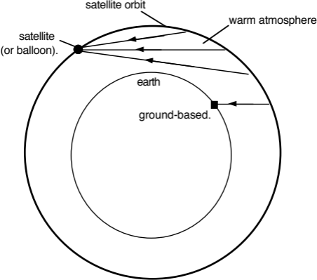
[]{#fig-5b-3}*Figure 5b.3 — Schematic of emission measurements.*

Different signals — reflecting the relative importance of the terms in Eq. 5b.1, and the different viewing geometries — are shown below.

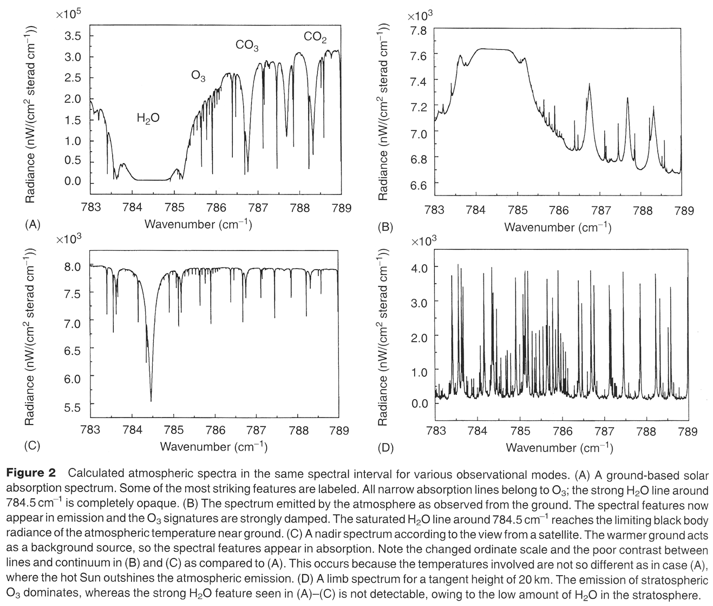
[]{#fig-5b-4}*Figure 5b.4 — Calculated spectra for different observational modes.*

## 5b.3 Specific examples of remote sensing

### Dobson spectrophotometer 
As we've seen, ozone absorbs strongly at wavelengths shorter than ~310 nm (the Hartley band, see [Fig 3.5](03-atmospheric-photochemistry.md#fig-3-5)), preventing it reaching the earth's surface. However, at longer wavelengths (in the Huggins band) ozone absorption is much weaker, and at these wavelengths a significant amount of solar radiation does reach the earth's surface. Dobson exploited the fact that if you know the absorption cross-section of ozone in the Huggins band, and measure the attenuation of the atmosphere, the total number of molecules of ozone between the measuring instrument and the top of the atmosphere can be determined.

The Beer–Lambert law states that the attenuation of an absorbing path with absorption cross-section $\sigma_1$ (cm²) and absorber amount $U$ (cm⁻²) is given by:

$$\text{attenuation} = \exp\{-\sigma_1 U\}$$

Thus if $T_1$ is the solar intensity at the top of the atmosphere, the irradiance reaching the surface, $S_1$, will be:

$$S_1 = T_1 \exp\{-\sigma_1 U\}$$

In practice, Dobson found it much easier to measure the *relative* intensity at two nearby wavelengths. To do this he inserted a mechanical attenuator at one wavelength, adjusting the attenuation until the intensity at the two wavelengths was identical. Pairs of wavelengths were typically ~20 nm apart (e.g. 305 nm and 325 nm), with an order of magnitude difference in cross-section (see Huggins band, [Fig 3.5](03-atmospheric-photochemistry.md#fig-3-5)). The relative intensity at the two wavelengths is thus:

$$S_1/S_2 = (T_1/T_2)\exp\{-(\sigma_1-\sigma_2)U\}$$

The ratio of solar flux at the top of the atmosphere $T_1/T_2$ is known to be constant and can be measured, allowing $U$ to be deduced. Of course, $U$ is the ozone amount in the slant line of sight between the observer and the sun. To deduce the vertical column of ozone, account has to be made of the solar zenith angle, $\theta$. In a horizontally stratified atmosphere the vertical column is related to that observed at an angle $\theta$ by:

$$U_{\text{vert}} = U_{\text{slant}}\cos(\theta)$$

In fact there is additional attenuation in the atmosphere due both to Rayleigh scattering and scattering and absorption by cloud particles. The derivation can be modified to account for these, and once the difference at two wavelengths is taken, the residual effect of scattering is small and fairly easily accounted for.

The Dobson measurement uses pairs of wavelengths. For other species, measurements often match absorption features over a broader spectral range — e.g. Differential Optical Absorption Spectroscopy (DOAS), a fitting procedure that nevertheless gives excellent selectivity for species with banded structure similar to the ozone Huggins bands (NO₂, NO₃, OClO, BrO, etc.).

### Ground-based methods: microwave emission spectrometry

In the IR and microwave, the absorption cross-section $\sigma$ cannot be assumed independent of pressure and temperature (i.e. altitude), because transitions are pressure- and Doppler-broadened. The absorption of an atmospheric path then depends on the distribution of the absorbing gas along that path. For emission (rather than absorption) there is an additional factor: the radiant energy emitted from a layer depends on temperature via the Planck function, so the emitted energy depends on both the absorber distribution and the temperature profile.

Several ground-based techniques exploit these facts to obtain the vertical profile of constituents. In the microwave, transitions are usually pure rotational, and their shape is dominated by pressure broadening:

$$\sigma_L = \frac{S\,\alpha\,P\,U}{\pi\left[(\nu-\nu_0)^2 + (\alpha P)^2\right]}$$

where $\nu$ is frequency ($\nu_0$ the line centre), $S$ is the transition strength, $\alpha$ is the Lorentz width at atmospheric pressure, $P$ is the ambient pressure (bar), and $U$ is the absorber amount. The width at half height is thus $\alpha P$ — proportional to pressure — while the area under the line equals the transition strength $S$ times the absorber amount $U$.

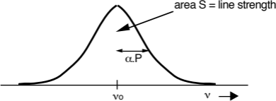
[]{#fig-5b-5}*Figure 5b.5 — Pressure-broadened line shape.*

Atmospheric pressure falls approximately exponentially with altitude, so an emission line's width at high altitude is much narrower than one from low altitude. When atmospheric absorption is weak, the energy reaching the surface closely approximates the sum of that emitted from all altitudes.

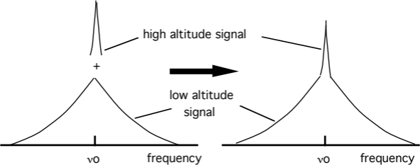
[]{#fig-5b-6}*Figure 5b.6 — Schematic of the signal seen by a microwave radiometer.*

This effect is clearly visible in data showing the normalised emission spectrum of the $J = 15/2 \rightarrow 13/2$ rotational transition of ClO at 278 GHz, measured with a ground-based heterodyne microwave receiver in Antarctica.

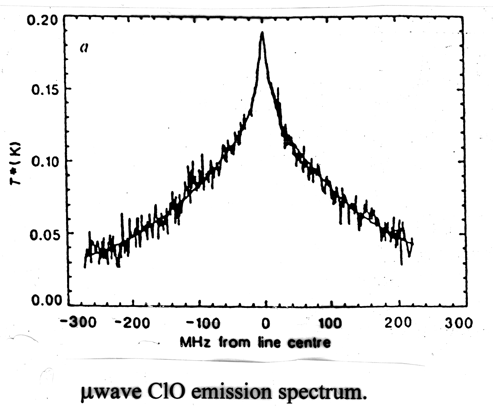
[]{#fig-5b-7}*Figure 5b.7 — Ground-based microwave emission spectrum of the ClO 278 GHz transition.*

The spectrum consists of a broad feature (~200 MHz wide) plus a narrow feature (~20 MHz wide), corresponding to atmospheric pressures of ~80 mbar and ~8 mbar — i.e. ~18 km and ~35 km respectively. The relative sizes of the two peaks show that a relatively larger proportion of the ClO resides at the lower altitude. A least-squares fit to the data produces the vertical profile below.

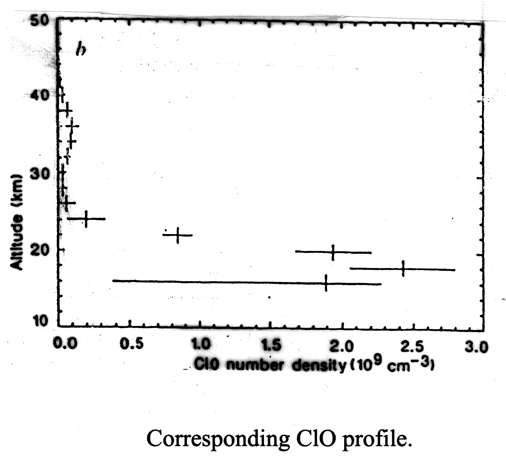
[]{#fig-5b-8}*Figure 5b.8 — Retrieved vertical profile of ClO.*

This measurement was particularly important because it demonstrated that high concentrations of ClO existed in the low Antarctic stratosphere, linking chlorine to the ozone loss found there. A very important series of ClO measurements has also been made using a satellite-borne microwave emission spectrometer, MLS.

### Satellite measurements of vertical profiles

Satellites fall into two classes defined by their orbits: geostationary (geosynchronous) orbiters, and polar (low Earth) orbiters (LEO). Although costly to develop and launch, satellite measurements have advantages over ground-based techniques — most obviously, for satellites orbiting pole to pole, near-global coverage is obtained relatively quickly.

Two basic viewing geometries are used:

- **Nadir (vertical) sounding** — the instrument views the atmosphere vertically. This gives good horizontal resolution (a few km) but generally poor vertical resolution. Nadir sounding has been used very successfully for temperature sounding (using CO₂ emission), but is less suitable for measuring minor constituents.
- **Limb sounding** — the instrument views the limb of the earth. This improves vertical resolution at the expense of horizontal resolution.

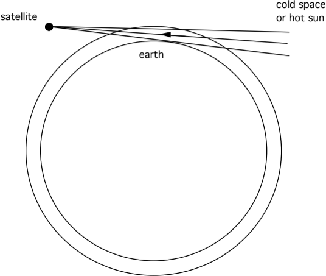
[]{#fig-5b-9}*Figure 5b.9 — Schematic of limb sounding.*

An important advantage of limb sounding is that the absorbing path sampled is ~70 times the vertical path. The extra path length increases the absorption of more weakly absorbing or less abundant species, permitting their detection. Using limb sounding, observations are possible by measuring thermal emission from the atmosphere (IR and microwave), or by measuring the absorption of solar radiation by the atmosphere (solar occultation).

Profile measurements are made by scanning the instrument field of view across the limb of the earth; for occultation this is done during sunrise and sunset. The profile is built up as follows: the concentration in the topmost shell (shell 1) is determined first, with the line of sight at viewing angle 1. The scan then steps down to viewing angle 2 (following the sun, for solar occultation); the line of sight now passes through shells 1 and 2, but since the concentration in shell 1 is already known, that in shell 2 can be determined. Successive steps to lower altitudes build up a full profile.

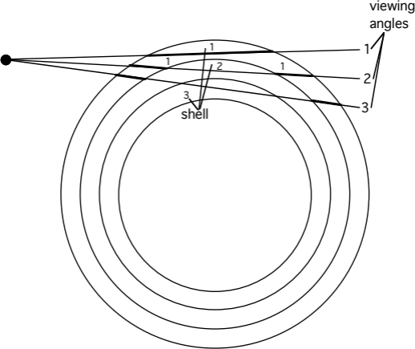
[]{#fig-5b-10}*Figure 5b.10 — Schematic of the limb-sounding retrieval.*

## 5b.4 *In situ* measurements

### Ozone measurements: UV absorption

O₃ is routinely measured using its absorption in the Hartley band (see [Fig 3.5](03-atmospheric-photochemistry.md#fig-3-5)) around 250 nm (a Hg resonance lamp provides a source at 253.7 nm), where ozone absorbs strongly. The absorption occurs in a cell in which the light path is folded many times. The light beam is split (to allow measurement of $I_0$ and $I_{tr}$), and the Beer–Lambert law is used to determine absolute concentrations of ozone (down to ~1 ppbv).

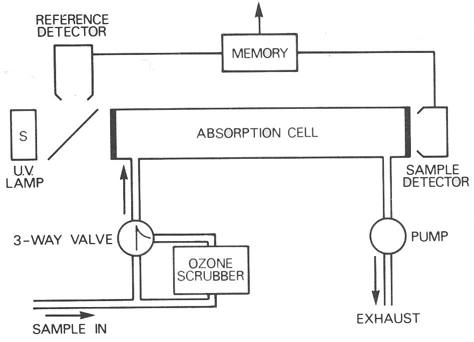
[]{#fig-5b-11}*Figure 5b.11 — Schematic of a UV absorption ozone measurement.*

**Ozone electrochemical concentration cell (ECC) sonde.** A very widely used method for O₃ is the ECC sonde — a simple, compact, inexpensive device for measuring O₃ profiles with good vertical resolution up to about 30 km. The throw-away sonde, weighing a few kg, is carried by a small balloon. It consists of an electrochemical cell containing potassium iodide in solution; ozone reacts with the KI, forming iodine:

$$2\text{KI} + \text{O}_3 + \text{H}_2\text{O} \rightarrow 2\text{KOH} + \text{I}_2 + \text{O}_2$$

This simple device has been used to show the extent of ozone losses in the Antarctic.

**Chemiluminescence.** A variety of measurements are possible by the chemiluminescence technique: a known amount of chemical is injected into the air sample, reacting with the species of interest to produce an excited product; photons emitted as the excited product de-excites are then detected. Two commonly made measurements are O₃ (reacting it with ethylene, C₂H₄) and NO (by reaction with injected O₃). An extension passes the sample over a heated gold catalyst in the presence of added CO, reducing all available reactive nitrogen compounds to NO, which is then measured as before — giving a measurement of total reactive nitrogen in the air sample.

### H₂O measurements by fluorescence

Knowledge of water concentrations is crucial, since reaction of H₂O with excited atomic oxygen (O¹D) is the major stratospheric source of the hydroxyl radical OH. Very sensitive measurements of H₂O have been made with the Lyman-α fluorescence hygrometer, which uses a Lyman-α light source at 121.6 nm to dissociate H₂O and form an excited OH molecule:

$$\text{H}_2\text{O} + h\nu \rightarrow \text{OH}^* + \text{O} \qquad k_1\ (\lambda = 121.6\text{ nm}) \tag{5b.2}$$

The excited OH molecule can then radiate:

$$\text{OH}^* \rightarrow \text{OH} + h\nu \qquad A\ (\lambda = 309\text{ nm}) \tag{5b.3}$$

or be quenched by collision:

$$\text{OH}^* + M \rightarrow \text{OH} + M \qquad k_q[M] \tag{5b.4}$$

The rate of fluorescence from the sampled air is then proportional to:

$$RF = \frac{[\text{H}_2\text{O}]}{A + k_q[M]} \tag{5b.5}$$

A photomultiplier detects the resonantly scattered photons; calibration is necessary to determine various instrumental factors. Equation 5b.5 can be approximated as:

$$RF \approx \frac{[\text{H}_2\text{O}]}{[M]\,k_q} \tag{5b.6}$$

showing that the measurement is, in principle, one of mixing ratio, not concentration. This makes the instrument sufficiently sensitive to measure in the upper stratosphere, where — although the absolute water concentration is much lower — $[M]$, and hence the quenching, is also much reduced.

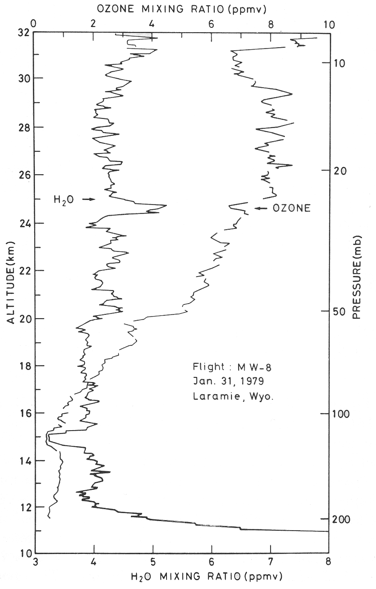
[]{#fig-5b-12}*Figure 5b.12 — H₂O profile measured using a Lyman-α fluorescence hygrometer.*

The measurements above were made on a balloon-borne instrument. The structure in the H₂O profile is consistent with the long lifetime of H₂O in the upper stratosphere and can be used to identify how long air has spent there; the gradual increase with altitude is due to methane oxidation.

### Tunable diode laser spectroscopy (TDLS)

TDLS is used for absorption measurements in the infrared. It employs a laser light source of very narrow wavelength, tunable over a small range — narrow enough to resolve weak absorptions lying between, e.g., H₂O and CO₂ lines, so that small absorptions due to specific rotational lines in a rovibrational spectrum can be measured with high selectivity. Conversely, it is difficult to measure many species simultaneously (unlike conventional FTIR spectroscopy). Lead-salt lasers have often been used, with tuning usually accomplished by varying the temperature (~3 cm⁻¹ per K); folded cells are usually used to increase the absorption path. Successful measurements include NO₂, CH₄, HNO₃, HCHO and SO₂ — for example, the diurnal-cycle measurements of NO₂ discussed in **section 4.3** were made by TDLS.

### ClO (and other radicals) by resonance fluorescence

Radical concentrations determine the partitioning between different species in the atmosphere and thus control the ozone photochemical balance. However, because of their small concentrations and high reactivities, few measurements of important atmospheric radicals have been made. One successful technique is resonance fluorescence — sometimes preceded by chemical conversion — which, by its nature, is limited to *in situ* approaches. It involves exciting an allowed electronic transition of the species of interest and detecting any resonantly scattered photons; the number of scattered photons is related to the concentration of scattering molecules by laboratory calibration.

Anderson made measurements of the hydroxyl radical by direct fluorescence using the $A^2\Sigma \leftarrow X^2\Pi$ transition of OH at 308 nm, with a balloon-borne instrument providing profiles up to 40 km.

For ClO, resonance fluorescence cannot be applied directly, since ClO pre-dissociates on a time-scale shorter than that for re-emission of a photon. Instead, ClO is converted to chlorine atoms by injecting nitric oxide:

$$\text{ClO} + \text{NO} \rightarrow \text{Cl} + \text{NO}_2$$

Using the apparatus described, the conversion efficiency to chlorine atoms is around 95%. Resonant scattering from the $^2P_{3/2} - {}^2D_{5/2}$ Cl transition at 118.9 nm is then detected in the normal way; BrO is detected similarly.

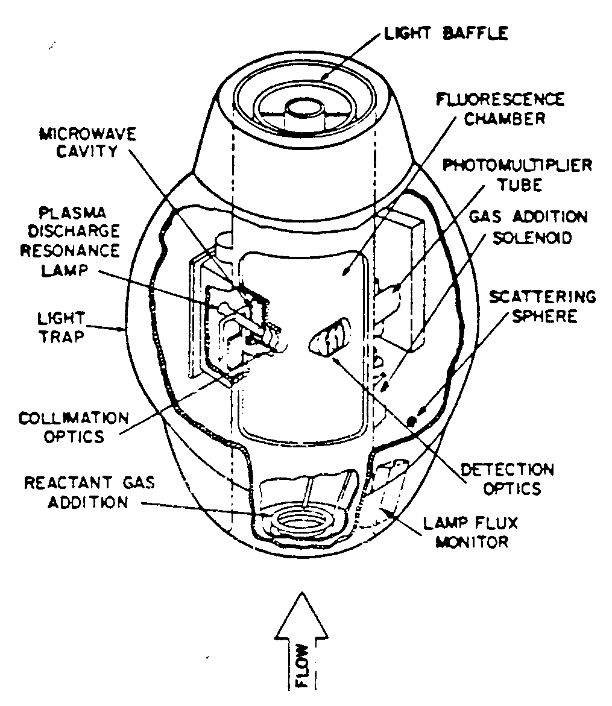
[]{#fig-5b-13}*Figure 5b.13 — The balloon-borne ClO/BrO resonance fluorescence detector (Anderson). An aircraft version also exists.*

### Measurement of OH

OH is a vital atmospheric species: it "cleanses" the troposphere as the main daytime oxidant (see Dr Kalberer's lectures), and plays a major role in stratospheric chemistry. It is very short-lived and difficult to measure.

**Resonance fluorescence.** Techniques similar to the stratospheric OH measurements described above have been employed in the troposphere, exploiting the $A^2\Sigma^+ \leftarrow X^2\Pi$ transition around 308 nm. A complication is that this radiation can itself produce OH, via photolysis of O₃ in the presence of water vapour; this contamination can be reduced by measuring at low pressure.

**Differential optical absorption spectroscopy.** The strongly banded structure of the $A^2\Sigma^+ \leftarrow X^2\Pi$ transition makes it an excellent candidate for DOAS measurements. OH has been measured this way using multipass cells (total path ~2 km) or open double-pass instruments with a source and retro-reflector some kilometres apart. Sensitivity tends to be moderate (~10⁶ cm⁻³), owing to reflective losses and the "averaging" of concentration along long paths — but this is adequate for daytime measurements in the presence of significant OH sources.

**Global inferral.** OH concentrations have also been derived by estimating the lifetimes of species — such as CH₃CCl₃ — whose only sink is reaction with OH. A key question here is exactly what a "global" OH concentration means, since OH is very short-lived and expected to show significant spatial and temporal variability.

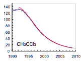
[]{#fig-5b-14}*Figure 5b.14 — Observed decline in atmospheric CH₃CCl₃ (methyl chloroform) mixing ratio (ppt).*

The figure shows the observed decline in atmospheric CH₃CCl₃ mixing ratios, reflecting the impact of controls under the Montreal Protocol. Emissions into the atmosphere are now essentially zero, so the observed change is entirely due to chemical loss by reaction with OH — making the decay rate itself a global-average OH "clock".

---

*This concludes the Michaelmas term (Lectures 1–5, 5b). Next: [Module 6 — Atmospheric Composition: Sources, Sinks and Lifetimes](06-atmospheric-composition-sources-sinks-lifetimes.md), opening the Lent term (Lectures 7–12).*
