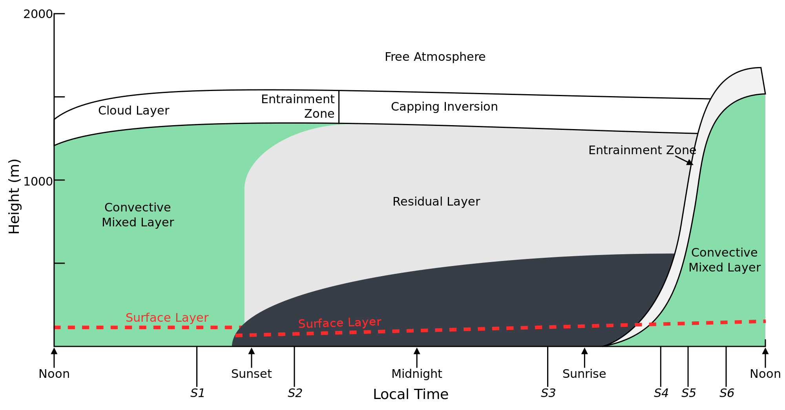
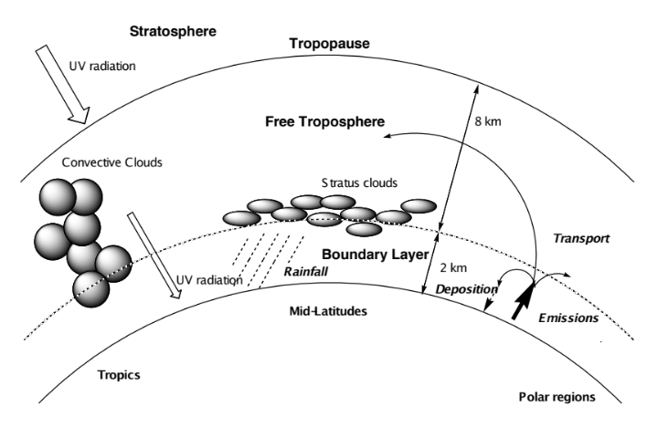
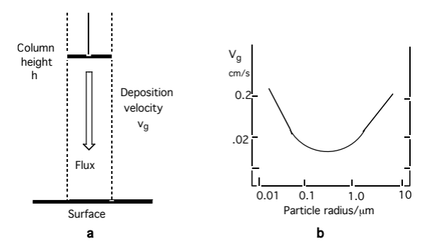

# Module 6 · Atmospheric Composition: Sources, Sinks and Lifetimes

> **Learning objectives**
> By the end of this module you should be able to:
> 1. Outline the basic processes controlling trace gas and particle concentrations in the troposphere.
> 2. List the main natural and anthropogenic sources of tropospheric trace gases.
> 3. Describe the physical and chemical processes that remove trace constituents from the atmosphere.
> 4. Explain acid deposition and its effects on ecosystems.
> 5. Define and calculate the **lifetime** of an atmospheric trace gas.

---

## 1.1 Introduction

Chemistry in the Atmosphere is a two-part story. The first part of this course covered the stratosphere; this module opens the second part, which deals with the **troposphere** — the lowest part of the atmosphere, extending from the surface up to roughly 8–18 km depending on latitude.

Two regions matter here:

- **Planetary boundary layer (PBL)** — the lowest ~1 km, into which almost all surface emissions are injected. Under still (anticyclonic) conditions, pollutants can build up in the PBL, producing air pollution episodes.
- **Free troposphere** — the region above the PBL, extending to the tropopause. Mixing within the troposphere is relatively fast, but the tropopause is a fairly effective barrier to exchange with the stratosphere.

The troposphere is also where weather happens (clouds, precipitation), and radiative processes here dominate surface climate.

[]{#fig-1-0}*Figure 1.0 — Schematic of the diurnal variation in the planetary boundary layer (after Stull et al., 1990).*

Historically, interest in tropospheric chemistry has been driven by air pollution — the effects of trace gases and particles on human health and ecosystems. Two classic pollution regimes are distinguished:

| | **Winter Smog** | **Photochemical (Summer) Smog** |
|---|---|---|
| First recognised | Late 18th century | Mid-1940s, Los Angeles basin |
| Conditions | Winter, often foggy | High temperature, strong sunlight |
| Cause | Local pollutant accumulation (topography, temperature inversions) | High NO and organic emissions |
| Key emissions | High SO₂ and soot (coal burning) | Organics + NOₓ + sunlight → O₃ + other products (Haagen-Smit, 1952) |
| Ozone formed? | No | Yes |

This module — and the rest of the course — develops a **quantitative** understanding of the chemistry behind photochemical smog, so that we can predict how to minimise human exposure to harmful pollutants.

---

## 1.2 Atmospheric Composition

The composition of the atmosphere at any point in time reflects a **balance between sources and sinks**:

- **Sources** — primary emissions from atmospheric, land, or ocean processes; natural or anthropogenic.
- **Sinks** — removal by chemical or physical processes, operating on a wide range of timescales.

Because sources and sinks are spatially non-uniform, the resulting balance is complex, coupling chemistry with atmospheric transport. Quantifying this coupled system is a central aim of atmospheric chemistry.

[]{#fig-1-1}*Figure 1.1 — Key features and processes in the troposphere.*

About 90% of the total atmospheric mass resides in the troposphere, and most trace-gas emission (and a good deal of trace-gas *formation*) happens here. Chemically, the troposphere performs two important jobs:

1. **Destruction** — preventing surface-emitted gases from accumulating to toxic levels or reaching the stratosphere and damaging the ozone layer.
2. **Transport and transformation** — acting as the conduit for natural biogeochemical cycles.

### Troposphere vs. stratosphere

| Property | Stratosphere | Troposphere |
|---|---|---|
| Temperature | 200–250 K | ~288 K ("room temperature") |
| Pressure | 1–100 mbar | ≥1000 mbar |
| UV reaching this altitude | < 200 nm | > 290 nm |
| Mixing time | Months–years | Seconds–days |
| Dynamics | Large-scale | Turbulent to large-scale |
| Number of compounds | Limited | > 10⁶ |
| Dominant chemistry | Mostly inorganic (HOₓ, NOₓ, …) | Inorganic **and** organic, roughly equal importance |
| Water abundance | Low | High — clouds, precipitation |

---

## 1.3 Sources of the Minor Constituents

Most trace gases in the troposphere originate as **surface emissions**.

| Compound | Main sources | Emission rate (Tg yr⁻¹) |
|---|---|---|
| CH₄ | Wetlands; natural gas leakage; combustion | 400–500 |
| CO | Atmospheric VOC oxidation; combustion | 800 |
| Isoprene | Natural vegetation | 500 |
| VOC* | Solvents; combustion; fermentation; vegetation | ≫100 |
| NO | Soil microorganisms; lightning; combustion | 40 |
| N₂O | Soil/marine microorganisms; industry; combustion | 4.4–10.5 |
| NH₃ | Animal waste breakdown; soil microorganisms | 82 |
| SO₂ | DMS** oxidation; volcanoes; combustion; smelting | 110 |
| DMS | Marine microorganisms | 40 |
| CH₃Cl | Marine/terrestrial microorganisms | 1.5 |
| CH₃Br | Marine microorganisms; agriculture | 0.1 |
| CFCs/HCFCs | Solvents and refrigerants | 1.1 |

*\* VOC = volatile organic compounds (hydrocarbons, halocarbons, oxygenated organics). \*\* DMS = dimethyl sulphide.*

Natural emissions are mostly biogenic, though volcanism contributes significantly to atmospheric sulphur. Anthropogenic emissions arise from energy production, industry, and agriculture.

Chemical transformation of these primary emissions generates secondary products that can themselves be important — notably H₂SO₄, HNO₃, HCl, and a wide range of organic products from the oxidation of S-, N-, Cl-containing, or organic trace gases. Ozone (O₃), formed photochemically in the troposphere, is a particularly important example — central to tropospheric chemistry as well as the stratosphere.

---

## 1.4 Sinks of the Minor Constituents

Removal processes fall into two broad classes:

| Sink process | Species removed |
|---|---|
| **Physical — dry deposition** to water/land | SO₂, O₃, HNO₃, CO₂, H₂O₂, aerosol particles |
| **Physical — wet deposition** in precipitation | HCl, H₂SO₄, NH₃, SO₂, HNO₃, H₂O₂, aerosol particles |
| **Chemical — oxidation by OH** | VOCs, CO, SO₂, NO₂, H₂O₂, H₂S, DMS |
| **Chemical — direct photolysis** | O₃, HCHO, CH₃I, H₂O₂, NO₂, NO₃ |
| **Chemical — cloud/aerosol reactions** | H₂SO₄, NH₃, SO₂, HNO₃, VOCs |

These sink strengths vary considerably with time of day, season, and geography.

### 1.4.1 Dry deposition

Removal at the Earth's surface (water, soil, vegetation) in the absence of precipitation. Governed by transport through the boundary layer and by uptake at the surface. The flux to the surface, $F$ (molecules cm⁻² s⁻¹), relates to the near-surface concentration $c$ (molecules cm⁻³) via the **deposition velocity** $v_g$ (cm s⁻¹):

$$F = v_g \cdot c$$ &nbsp;&nbsp;(1.1)

The **lifetime** of a species with respect to dry deposition depends on $v_g$ and the mixing height $h$:

$$\tau = \frac{h}{v_g}$$ &nbsp;&nbsp;(1.2)

**Worked comparison:**

- SO₂: $v_g \approx 0.8$ cm s⁻¹ over NW Europe, mixed through $h \approx 1$ km → $\tau \approx 1.4$ days.
- O₃: similar $v_g$ over land, but well-mixed up to the tropopause ($h \approx 12$ km) → $\tau \approx 17$ days.

The large difference is entirely down to the mixing height — the same deposition velocity gives a very different lifetime depending on how deep an atmospheric column the species is spread through.

[]{#fig-1-2}*Figure 1.2 — Schematic illustration of surface deposition.*

### 1.4.2 Wet deposition

Removal via precipitation (cloud, rain, snow):

- **Rain-out / in-cloud scavenging** — gases absorbed into droplets (possibly followed by reaction); particles act as condensation nuclei or are captured by coagulation.
- **Wash-out / below-cloud scavenging** — uptake into falling precipitation; removal times of order hours for soluble gases in moderate rain.

Most of these processes are **reversible** (e.g. droplet evaporation can release particles or gases back to the gas phase), and because precipitation is highly variable, quantitative estimates of wet deposition rates are difficult.

As an approximation, the wet deposition rate is taken as first-order in concentration:

$$\text{Rate} = \lambda c$$

where $\lambda$, the washout (scavenging) coefficient, scales with mean precipitation and is typically **0.12–0.5 day⁻¹** (lifetime 2–8 days).

### 1.4.3 Acid deposition (wet and dry)

Oxidising conditions in the atmosphere (Modules 2–3) generate inorganic acids (H₂SO₄, HNO₃, HCl) and organic acids (formic, acetic). These lower the pH of precipitation and are also removed by dry deposition.

"Acid rain" is not a modern discovery — Robert Boyle noted sulphur and acidity in rain in the 17th century — but it was only widely recognised as a fossil-fuel-driven pollution problem in the 1970s.

**Ecological effects:**

- Sulfate/nitrate deposition leaches nutrient cations (Ca, Mg, K) from foliage and soils, reducing buffering capacity and nutrient availability for trees.
- Mobilises soil aluminium, interfering with root nutrient uptake; combined with O₃ toxicity, this leaves trees more vulnerable to drought, temperature extremes and disease.
- Leached aluminium and low pH are toxic to fish and other aquatic species.
- SO₂/NOₓ oxidation products damage buildings and cultural heritage — here **dry** deposition is usually the dominant pathway.

Regulation has cut SO₂ and NOₓ emissions substantially in recent decades (SO₂ more than NOₓ), but both remain major anthropogenic air-quality pollutants.

---

## 1.5 Lifetimes — putting it together

The **atmospheric lifetime** (or residence time) $\tau$ of a species is the average time a molecule spends in the atmosphere before removal. For a species at steady state with a single first-order loss process of rate constant $k_{\text{loss}}$:

$$\tau = \frac{1}{k_{\text{loss}}}$$

More generally, for a reservoir of total burden $N$ (molecules) with a total removal rate $R$ (molecules s⁻¹):

$$\tau = \frac{N}{R}$$

When several independent loss processes act in parallel (e.g. OH oxidation *and* dry deposition), the loss rates add, so the lifetimes combine as **reciprocals**:

$$\frac{1}{\tau_{\text{total}}} = \frac{1}{\tau_1} + \frac{1}{\tau_2} + \cdots$$

— the fastest process dominates the overall lifetime.

> **Key points — Module 1**
> - Atmospheric composition is set by the **balance of sources and sinks**.
> - **Sources**: mainly surface emission, but some species (notably O₃) are produced photochemically in the atmosphere itself.
> - **Sinks**: physical (dry/wet deposition) and chemical (oxidation, photolysis) removal, with widely varying efficiency and timescale depending on the species.
> - **Lifetime** ties source/sink strength to the standing concentration, and is essential for comparing how "long-lived" different pollutants are.

---

## Worked Example 1 — Steady-state concentration of compound X

**Problem.** Compound X is emitted at the surface at a rate of 1 tonne yr⁻¹ (molar mass 44 g mol⁻¹). It is lost by reaction with OH, with rate constant $k = 1\times10^{-11}$ cm³ molecule⁻¹ s⁻¹, and by dry deposition with $v_g = 1$ cm s⁻¹. Assume $[\text{OH}] = 10^{6}$ cm⁻³ and a boundary-layer mixing height of $h = 1$ km.

**Method.**
1. Convert the emission rate to a molecular flux (molecules cm⁻² s⁻¹) using the molar mass and an assumed emission area, or work in a well-mixed box of height $h$ to get a volumetric production rate (molecules cm⁻³ s⁻¹).
2. Write the two loss rate constants: chemical, $k_{\text{OH}} = k[\text{OH}]$; physical, $k_{\text{dep}} = v_g / h$.
3. At steady state, production = total loss: $P = (k_{\text{OH}} + k_{\text{dep}})[\text{X}]_{ss}$.
4. Solve for $[\text{X}]_{ss}$, and use $\tau = 1/(k_{\text{OH}}+k_{\text{dep}})$ to sanity-check against the emission rate.

This is exactly the kind of steady-state / pseudo-first-order problem you'll meet repeatedly through the course — it's worth being fluent doing it both by hand and by setting up the balance numerically. **The companion notebook (`06-sources-sinks-lifetimes.ipynb`) walks through this example step by step, and lets you explore how $[\text{X}]_{ss}$ and $\tau$ respond to changing $k$, $[\text{OH}]$, $v_g$ and $h$.**

---

## Try it yourself

Open **[`notebooks/06-sources-sinks-lifetimes.ipynb`](../notebooks/06-sources-sinks-lifetimes.ipynb)** to:

- Solve Worked Example 1 numerically and check it against the by-hand answer.
- Build a simple one-box steady-state / time-dependent model with combined chemical + deposition loss.
- Explore how lifetime and steady-state concentration change as you vary $k_{\text{OH}}$, $[\text{OH}]$, $v_g$, and mixing height $h$.
- Reproduce the SO₂ vs. O₃ dry-deposition lifetime comparison from §1.4.1.

---

*Next: [Module 7 — Tropospheric Photochemistry and the Hydroxyl Radical](07-tropospheric-photochemistry-oh.md)*
