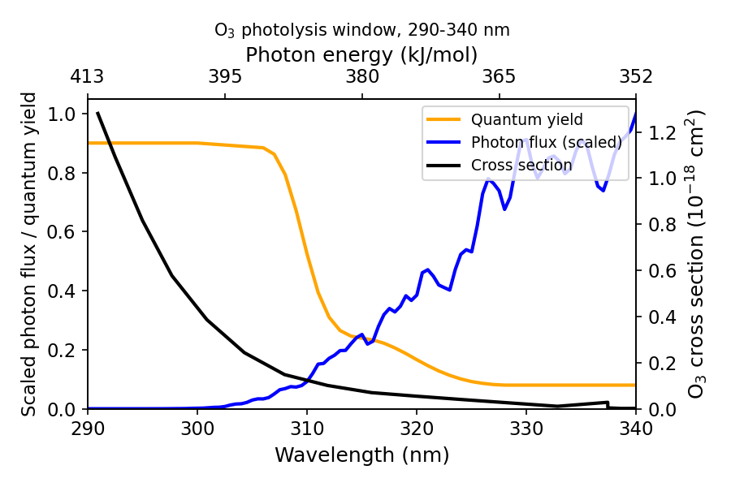
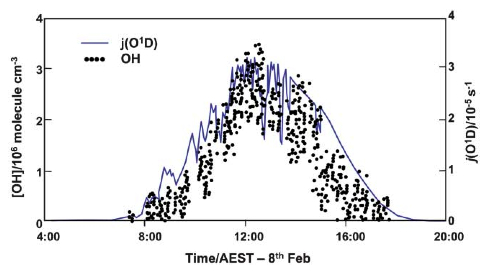
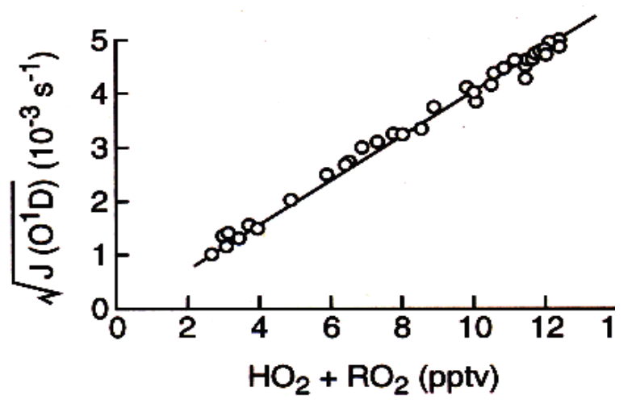

# Module 7 · Tropospheric Photochemistry and the Hydroxyl Radical

> **Aims of this module**
> 1. To describe the basic characteristics of photolysis in the troposphere.
> 2. To outline the processes that result in a steady-state concentration of OH.

## 2.1 Introduction

In this module we introduce the basic photochemistry of the troposphere and show how photochemical reactions are the main driver leading to oxidation of trace gases — preventing their accumulation and pollution of the atmosphere.

As discussed in the first part of the lecture course, the rate of photolysis is given by:

$$J_{(i)} = \int_{\lambda=0}^{\infty} \phi_{(i,\lambda)}  F_{(\lambda)}  \sigma_{(i,\lambda)}  d\lambda$$ &nbsp;&nbsp;(2.1)

where $J$ is the photolysis frequency (s⁻¹), obtained by integrating the product of the solar flux $F$, the absorption cross-section $\sigma$, and the quantum yield for dissociation $\phi$, over all wavelengths $\lambda$ where the molecule absorbs. Determination of the solar flux in the atmosphere requires either direct measurement, or a calculation including absorption, scattering and reflection of solar radiation entering the atmosphere.

## 2.2 Tropospheric Photolysis

The altitude dependence of photolysis rates was discussed in previous lectures. In spectral regions where atmospheric absorption by O₂ and O₃ is strong (λ shorter than ~290 nm), virtually no solar photons penetrate to the troposphere, while at longer (visible) wavelengths, where absorption is weak, the atmosphere is nearly transparent. The result: the photolysis environment in the troposphere differs dramatically from that of the stratosphere. Only molecules that absorb light in the near-UV/visible can be photo-dissociated in the troposphere — with important implications for tropospheric photochemistry.

One consequence: photolysis of O₂, which requires photons with wavelength below the threshold for breaking the O–O bond,

$$O_2 + h\nu\ (\lambda < 242\ \text{nm}) \to O + O$$ &nbsp;&nbsp;(R2.1)

*cannot* occur in the troposphere, so ozone cannot be produced there via the Chapman mechanism.

However, species such as O₃, NO₂, H₂O₂, HCHO (and other organic peroxides and aldehydes), which absorb at longer wavelengths, **can** be photo-dissociated in the troposphere — with important consequences.

For photolysis to occur there must be spectral overlap with the solar spectrum, and dissociation must occur with non-zero quantum yield — usually meaning the photon energy $h\nu$ must exceed the dissociation energy $\varepsilon_0$. Some important tropospheric photolysis processes are given in Table 2.1, with representative photolysis coefficients for the lower atmosphere. Ozone photolysis is particularly important and is considered in detail below.

**Table 2.1 — Important photolysis rates in the lower atmosphere**

| Photochemical process | $\varepsilon_0$/kJ mol⁻¹ | $\lambda_{threshold}$/nm | $J_x$ (Z=30°)*/s⁻¹ |
|---|---|---|---|
| O₂ → 2 O(³P) | 494 | 242 | 0 |
| O₃ → O(³P) + O₂(³Σ) | 101 | 1180 | 4.17 × 10⁻⁴ |
| O₃ → O(¹D) + O₂(¹Δ) | 386 | 310 | 2.73 × 10⁻⁵ |
| SO₂ → O(³P) + SO | 552 | 216 | 0 |
| NO₂ → O(³P) + NO | 300 | 398 | 1.6 × 10⁻² |
| H₂O₂ → 2 OH | 215 | 557 | 6.80 × 10⁻⁶ |
| HONO → NO + OH | 208 | 572 | 1.83 × 10⁻³ |
| HCHO → H + HCO | 364 | 329 | 2.77 × 10⁻⁵ |
| HCHO → H₂ + CO | −1.9 | – | 4.41 × 10⁻⁵ |
| CH₃CHO → HCO + CH₃ | 349 | 343 | 3.84 × 10⁻⁶ |
| CH₃COCHO → HCO + CH₃CO | 284 | 421 | 1.18 × 10⁻⁴ |
| CH₃OOH → OH + CH₃O | 188 | 637 | 5.02 × 10⁻⁶ |

*\*J values calculated for the Earth's surface, summer N. mid-latitude.*

## 2.3 Photolysis of ozone in the troposphere

Above 240 nm, O₂ photolysis is irrelevant, and in the 240–320 nm range O₃ is the dominant absorber. Absorption by ozone occurs in two spectral regions in the troposphere: the visible (450–600 nm) and the UV (290–330 nm). Photolysis of O₃ occurs by two pathways:

$$O_3 + h\nu \to O(^{3}P) + O_2 \qquad \lambda < 1150\ \text{nm}$$ &nbsp;&nbsp;(R2.2)

$$O_3 + h\nu \to O(^{1}D) + O_2 \qquad \lambda < 310\ \text{nm}$$ &nbsp;&nbsp;(R2.3)

Photolysis at the longer wavelengths (R2.2) occurs in the visible, yielding ground-state O(³P), followed by recombination with O₂ to reform O₃:

$$O(^{3}P) + O_2 + M \to O_3 + M$$ &nbsp;&nbsp;(R2.4)

— this process has **no net effect** on ozone concentration.

Photolysis process R2.3 yields excited oxygen atoms, O(¹D). The flux of photons in the troposphere at wavelengths shorter than 310 nm is rather low, due to attenuation of UV radiation by ozone absorption higher up — this decreases the photolysis rate and O(¹D) production.

At the high pressures found in the troposphere, O(¹D) is rapidly quenched to ground-state O(³P). If these were the only processes, there would be no net destruction of ozone by tropospheric photolysis, and the troposphere was initially thought to be rather chemically inert — with tropospheric ozone believed to result from direct transport from the stratosphere followed by dry deposition. Subsequent research showed this is incorrect.

***The photolysis process R2.3 is in fact central to the chemistry of the troposphere, as it is the primary step in generating OH radicals — which, as we shall see, initiate oxidative chemistry.***

*Figure 2.2a — Cross-section, quantum yield for reaction R2.3, and solar photon flux at the Earth's surface.*

### 2.3.1 Fate of O(¹D) in a dry atmosphere

A small amount of highly reactive excited atomic oxygen O(¹D) is produced in the troposphere by photolysis of O₃ at $\lambda \lesssim 310$ nm. The rate of photolysis of ozone to produce O(¹D) is typically written $J_{O(^{1}D)}$, incorporating the summation over all wavelengths and the wavelength dependence of quantum yield.

O(¹D) is quenched to the ground state by reaction with N₂ or O₂:

$$O_3 + h\nu \to O(^{1}D) + O_2 \qquad J_{2.3} = 2.5\times10^{-6}\ \text{s}^{-1}$$

$$O(^{1}D) + M \to O(^{3}P) + M \qquad k_{2.5} = 3\times10^{-11}\ \text{cm}^3 \text{s}^{-1}$$

where $M = [N_2]+[O_2] = 2.4\times10^{19}$ cm⁻³ at the Earth's surface.

Assuming steady state, $[O(^{1}D)] = \dfrac{J_{2.3}[O_3]}{k_{2.5}[M]}$.

## 2.4 Generation of OH radicals

Water vapour is abundant throughout most of the troposphere, its mixing ratio falling from ~1–4% at the surface to ~20 ppmv near the tropopause. H₂O competes effectively with quenching by M for reaction with O(¹D), giving a branching ratio, $f$, between quenching and OH formation of about 10%:

$$O_3 + h\nu \to O(^{1}D) + O_2$$ &nbsp;&nbsp;(R2.3)

$$O(^{1}D) + M \to O(^{3}P) + M$$ &nbsp;&nbsp;(R2.5)

$$O(^{1}D) + H_2O \to OH + OH$$ &nbsp;&nbsp;(R2.6)

Reaction R2.6 is exothermic ($\Delta H^0 = -119$ kJ/mol), while the corresponding reaction of H₂O with O(³P) does not proceed (it's endothermic). The difference in enthalpy is largely because the electronically excited state of atomic oxygen lies ~190 kJ/mol above the ground state.

R2.6 represents the principal (though not sole) mechanism for generating hydroxyl radicals in the troposphere, initiating further reaction and degradation of VOCs.

The diurnal behaviour of [OH] closely tracks $J_{O(^{1}D)}$ over the course of a day, measured in the unpolluted conditions typical of the Southern Hemisphere marine environment — demonstrating the fast conversion of O(¹D) into OH and the dominance of R2.3/R2.5–R2.6 in OH production. Under sunny conditions, $J_{O(^{1}D)}$ reaches a maximum of about $3\times10^{-5}$ s⁻¹.

*Figure 2.2b — Typical diurnal variation of [OH] and J(O¹D) in the clean marine atmosphere.*

### 2.4.1 Other sources of OH in the troposphere

Although O₃ photolysis is the main OH source during the day, other sources matter in the early morning and at night. Photolysis of HONO (which builds up overnight) is an important OH source in the early morning:

$$HONO + h\nu \to NO + OH \qquad (\lambda < 400\ \text{nm})$$

Photolysis of organic compounds such as formaldehyde, and reaction of alkenes with O₃ and NO₃, also contribute to overall OH production (covered in Module 9).

## 2.5 The HOx family

OH does not react with the major atmospheric components (N₂, O₂, CO₂) but reacts with most trace gases.

Following its formation from O(¹D), OH is rapidly converted into HO₂ — primarily (~70% of the time) by reaction with CO, followed by fast reaction of H with O₂:

$$OH + CO \to CO_2 + H$$ &nbsp;&nbsp;(R2.7)

$$H + O_2 + M \to HO_2 + M$$ &nbsp;&nbsp;(R2.8)

About 30% of OH is converted to HO₂ via a more complex chain of reactions initiated by:

$$OH + CH_4 \to CH_3 + H_2O$$ &nbsp;&nbsp;(R2.9)

(details in Module 9). The lifetime of OH is less than a second — R2.9 sets an upper limit, since methane is widespread and well-mixed in the troposphere.

In relatively unpolluted (low-NOx) regimes, HO₂ reacts slowly with ozone to regenerate OH:

$$HO_2 + O_3 \to 2O_2 + OH$$ &nbsp;&nbsp;(R2.10)

R2.10 is an interconversion reaction between the two HOx forms, letting us meaningfully define the odd-hydrogen family $HO_x = [OH]+[HO_2]$.

Alternatively, HO₂ can recombine to form hydrogen peroxide:

$$HO_2 + HO_2 \to H_2O_2 + O_2$$ &nbsp;&nbsp;(R2.11)

H₂O₂ is a reservoir and **sink** for HOx: being highly soluble, it's removed from the atmosphere fairly rapidly by absorption into cloud water and rainout. H₂O₂ can also be photolysed ($\lambda < 400$ nm), releasing HOx, though this is rather slow in the troposphere; alternatively it reacts (slowly) with OH to form HO₂ and water.

The lifetime of HO₂ is about a minute in clean air, depending on the rates of R2.10 and R2.11. HOx concentrations react very rapidly to changes in the ozone photolysis rate.

In summary, reactions R2.3–R2.11 (representing the unpolluted atmosphere) lead to loss of O₃ and formation of peroxides like H₂O₂.

### 2.5.1 Steady-state concentration of OH and HO₂

Approximate values for [OH], [HO₂] and total [HOx] can be derived from R2.3–R2.11 together with $J_{O(^{1}D)}$.

Globally, $J_{O(^{1}D)}$ has a rough average (over solar zenith angle etc.) of $2.5\times10^{-6}$ s⁻¹. With ozone at 40 ppbv, this gives an O(¹D) production rate from ozone photolysis such that O(¹D) is being formed at about $2.5\times10^6$ molecule cm⁻³ s⁻¹. As above, in the lower troposphere ~10% reacts with H₂O to form two OH (R2.6) — **please do not commit this figure to memory!** — giving an OH production rate of around $5\times10^5$ cm⁻³ s⁻¹.

OH is produced primarily from ozone photolysis, since the O₃ + HO₂ reaction (R2.10) is generally too slow to contribute significantly. OH is lost primarily by reaction with CO (R2.7). At steady state, production and destruction balance. Since $[CO] \sim 75$ ppbv on average and $k_{2.7} = 2.0\times10^{-13}$ at 1 atm, this leads to a steady-state OH concentration in the sunlit atmosphere of:

$$\mathbf{[OH] = 1.4 \times 10^6\ molecule\ cm^{-3}}$$

In the clean troposphere, where [NO₂] is very small, it's safe to assume R2.11 is the main HO₂ loss route, with $k_{2.11} = 6.0\times10^{-12}$ cm³ molecule⁻¹ s⁻¹. Putting HOx into steady state:

$$\frac{d[HO_x]}{dt}(\text{steady state}) = 0 = R_p(OH) - 2k_{2.11}[HO_2]^2$$

gives:

$$\mathbf{[HO_2] = 2 \times 10^8\ molecule\ cm^{-3}}$$

Thus HO₂ is the dominant component of HOx. The ratio $[HO_2]/[OH]$ can be found from the interconversion reactions, e.g.:

$$k_{2.10}[HO_2][O_3] = k_{2.7}[OH][CO]$$

In general, the precise ratio depends on the composition of the air parcel — [O₃], [CO], etc.

> **Example 2 — steady-state [OH] in the tropical atmospheric boundary layer**
>
> In the tropics, [H₂O] is much higher than at mid-latitudes. The reduced overhead ozone column (see Michaelmas Module 1) also leads to increased rates of ozone photolysis. Work through the same steady-state derivation as above, but substituting tropical values for [H₂O], the overhead O₃ column (and hence $J_{O(^{1}D)}$), and [CO]/[O₃] — see the companion notebook.

## 2.6 Trace gas oxidation

OH is highly reactive with respect to many species, and is responsible for oxidising a range of tropospheric gases including NO₂, SO₂, CH₄ and nearly all VOCs, as well as CO. Reactivity varies greatly by hydrocarbon (Table 2.2). Saturated molecules react by H-atom abstraction, while unsaturated molecules react via electrophilic addition at the double/triple bond.

Oxidation of halocarbons (CH₃Cl, CHCl₃, C₂Cl₄, CH₃CCl₃) also occurs by H-abstraction and addition; rate constants tend to be slower than the analogous hydrocarbons, but this remains an important removal process for these potentially ozone-depleting substances in the troposphere. Other H-containing molecules (H₂S, NH₃) are similarly removed by abstraction reactions with OH.

Fully halogenated hydrocarbons do not react with OH (the abstraction reaction to form HOX, X = Cl, F, is endothermic). These and other OH-resistant gases (e.g. N₂O, OCS) are, absent energetic short-wavelength photons, inert in the troposphere, and so pass unimpeded into the stratosphere, where they are destroyed by UV photolysis.

**Table 2.2 — Examples of trace gas reaction rates with OH**

| Molecule | Rate coefficient / cm³ molecule⁻¹ s⁻¹ | Atmospheric lifetime* |
|---|---|---|
| CH₄ | ~7 × 10⁻¹⁵ | ~4.5 years |
| CH₃Cl | ~4 × 10⁻¹⁴ | ~0.8 year |
| CO | ~2 × 10⁻¹³ | ~2 months |
| C₂H₆ | ~3 × 10⁻¹³ | ~1.5 months |
| C₃H₈ | ~1 × 10⁻¹² | ~11 days |
| C₂H₄ | ~8 × 10⁻¹² | ~1.5 days |
| C₅H₈ (isoprene) | ~7 × 10⁻¹¹ | ~4 hours |
| CH₃SCH₃ (DMS) | ~9 × 10⁻¹² | ~1.4 days |
| SO₂ | ~1 × 10⁻¹² | ~11 days |
| NO₂ | ~9 × 10⁻¹² | ~1.4 days |
| NH₃ | ~1.6 × 10⁻¹³ | ~3 months |
| CCl₄ | ~1 × 10⁻¹⁷ | ** |

*\* Based on mean [OH] of 1 × 10⁶ molecule cm⁻³. \*\* Destroyed in the stratosphere — lifetime set by transport.*

## 2.7 Observations of HOx radicals

Direct atmospheric measurements have convincingly confirmed the presence of OH in the daytime troposphere. Measurements in very clean atmospheres over the Southern Ocean confirm the basic mechanism, in which HOx radicals are predicted to have a **square-root dependence** on the ozone photolysis rate. The observations also show that ozone is slowly destroyed through photolysis, and that peroxides like H₂O₂ are formed.

*Figure 2.5 — Correlation plot of measured HO₂ (+RO₂) radical concentrations vs. calculated J(O¹D), showing the dependence of peroxy radical concentration on the square root of J(O¹D). Data from the Cape Grim observatory, Tasmania.*

> **Key points — Module 7**
> - Photolysis of trace gases in the troposphere occurs only at wavelengths longer than ~300 nm.
> - OH and HO₂ form the HOx family. Key formation/loss processes and steady-state conditions involve reactions with CO, CH₄, NO and NO₂.
> - OH reacts with many trace gases, driving their oxidation. Its presence provides the **oxidizing capacity** of the atmosphere, and is used to calculate lifetimes of tropospheric trace gases.

---

## Try it yourself

Open **[`notebooks/07-oh-steady-state.ipynb`](../notebooks/07-oh-steady-state.ipynb)** to:

- Reproduce the [OH] = 1.4 × 10⁶ cm⁻³ and [HO₂] = 2 × 10⁸ cm⁻³ steady-state results from §2.5.1 numerically.
- Solve Example 2 (tropical boundary layer OH) by adjusting [H₂O], the O₃ column/$J_{O(^{1}D)}$, and [CO] to tropical values, and compare the resulting [OH] to the mid-latitude case.
- Explore the predicted square-root dependence of [HOx] on $J_{O(^{1}D)}$ (Fig 2.5) from the steady-state equations, and check it against the observational correlation.
- Rank trace gases by OH-reaction lifetime using Table 2.2, and see how lifetime scales with rate coefficient for fixed [OH].

---

*Next: [Module 8 — Methane Oxidation and NOx-Driven Ozone Production](08-methane-oxidation-ozone-production.md)*
