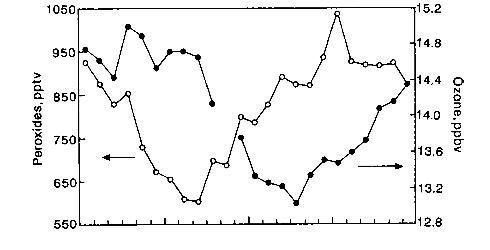
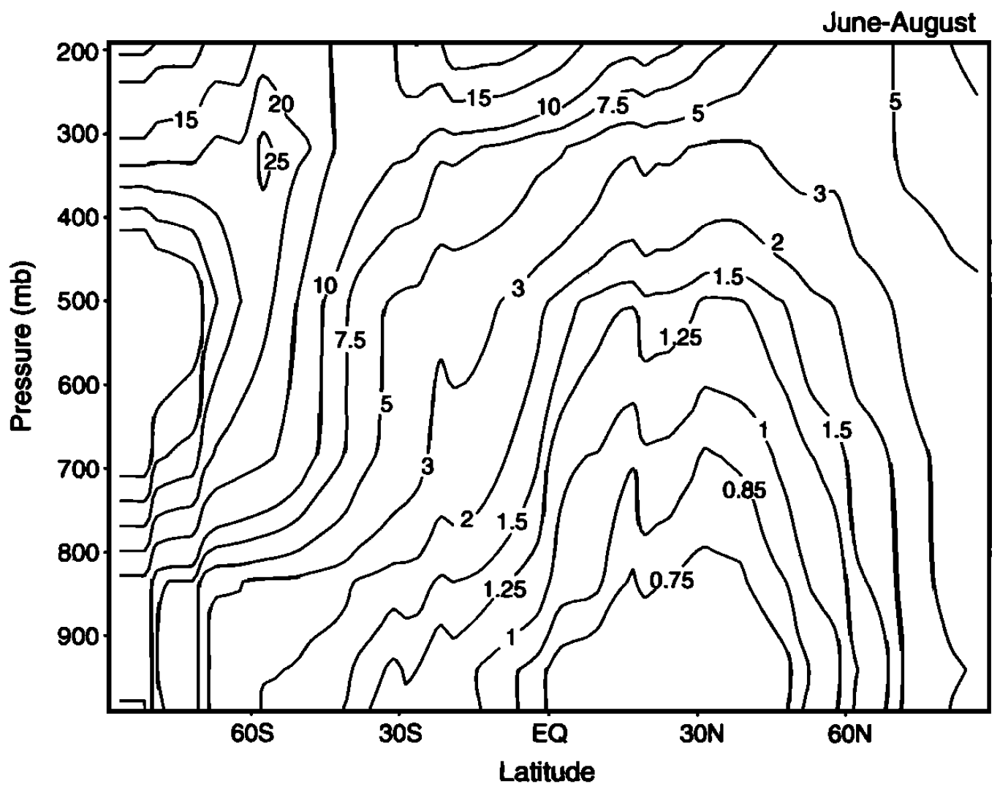
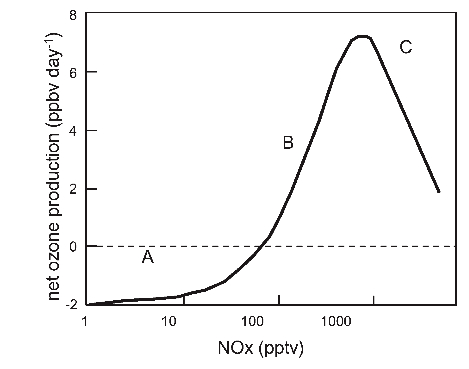
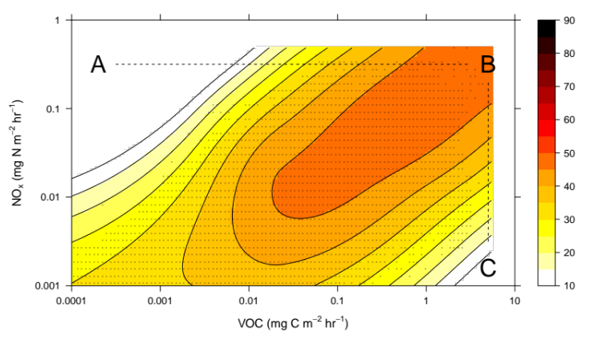

# Module 8 · Methane Oxidation and NOx-Driven Ozone Production

> **Aims of this module**
> 1. To describe the oxidation of atmospheric methane.
> 2. To understand, qualitatively, the effect of methane on tropospheric ozone.
> 3. To describe the role of NOx in production of tropospheric ozone.
> 4. To describe the processes controlling the concentration of nitrogen oxides in the troposphere.

## 3.1 Methane oxidation in the troposphere

Hydroxyl radicals react with methane, constituting the major removal process for atmospheric methane:

$$OH + CH_4 \to H_2O + CH_3$$ &nbsp;&nbsp;(R3.1)

The lifetime of CH₄, based on the R3.1 rate coefficient of $6\times10^{-15}$ cm³ molecule⁻¹ s⁻¹ at 288 K and the average tropospheric [OH], is approximately **7 years**. This means methane is well mixed in the troposphere, and its oxidation occurs wherever OH is present. Indeed, the concentration of methane sets an upper limit on the lifetime of OH in the troposphere of about one second.

**In clean, unpolluted air**, about 30% of OH is removed by reaction with CH₄ (the remainder reacts with CO). The methyl radical formed reacts instantly with O₂ to form the **methyl peroxy** radical, CH₃O₂:

$$CH_3 + O_2 + M \to CH_3O_2 + M$$ &nbsp;&nbsp;(R3.2)

In a low-NOx environment (unpolluted air), the principal fate of CH₃O₂ is reaction with HO₂ to produce methyl hydroperoxide, CH₃OOH:

$$HO_2 + CH_3O_2 \to CH_3OOH + O_2$$ &nbsp;&nbsp;(R3.3)

As in Module 7, peroxides are reservoirs for radicals, and methyl hydroperoxide — like H₂O₂ — is soluble and readily washed out, acting as a sink for HOx. Since HOx is formed from ozone photolysis, this washout makes the overall conversion of O₃ to peroxides (via reaction with methane) into a **sink for O₃**.

Photolysis of methyl hydroperoxide is also possible, releasing **methoxy**, CH₃O, and OH:

$$CH_3OOH + h\nu \to CH_3O + OH$$ &nbsp;&nbsp;(R3.4)

CH₃O reacts with O₂ to form formaldehyde plus HO₂:

$$CH_3O + O_2 \to HCHO + HO_2$$ &nbsp;&nbsp;(R3.5)

and formaldehyde is itself photolysed to produce more HO₂:

$$HCHO + h\nu \to HCO + H$$ &nbsp;&nbsp;(R3.6)
$$HCO + O_2 \to CO + HO_2$$ &nbsp;&nbsp;(R3.7)

This recycles, and in certain circumstances (such as the dry upper troposphere) may even amplify [HOx].

Recall HO₂ converts back to OH by reaction with ozone:

$$HO_2 + O_3 \to OH + 2O_2$$ &nbsp;&nbsp;(R3.8 / R2.10)

However, the efficiency of this OH recycling is rather low in the clean lower troposphere: both CH₃OOH and HCHO are soluble in water droplets, leading to a net loss of HOx through rainout. R3.8 is competitive with the HO₂ self-reaction at ozone concentrations typical of the clean troposphere, and will also contribute to O₃ removal.

**To recap:** R3.3, together with loss of peroxides (or HCHO) in rain, leads to a net loss of HOx radicals. **As ozone is lost in the process of generating HOx from O(¹D), there is a net loss of ozone overall** — in the *unpolluted* (low-NOx) troposphere.

*Figure 3.2 — Diurnal variation of peroxides ROOH (open symbols) and ozone (filled symbols) in the clean marine troposphere, showing production of peroxides and destruction of ozone during daytime (highlighted region).*

## 3.2 Nitrogen oxides and production of tropospheric ozone

Much of the troposphere contains traces of NO and NO₂, which play an important role in tropospheric photochemistry. We've seen that in the unpolluted troposphere, oxidation of CO and CH₄ to CO₂ leads to a loss of both ozone and OH. **The presence of nitrogen oxides changes this picture dramatically.** In a polluted atmosphere, additional reactions must be considered to determine the overall oxidant budget.

NOx is emitted/generated from a number of surface and tropospheric processes. Major anthropogenic sources: fossil fuel combustion (mostly ground-level, with a small aviation contribution) and agricultural activities. Dominant natural sources: biomass burning (though much is human-caused, especially in the tropics) and lightning (associated with deep convection, largest sources in the tropics). Only lightning and aircraft are non-surface sources.

NOx is removed from the atmosphere through dry and wet deposition, with wet deposition of nitrate (nitric acid) the dominant process.

### 3.2.1 Photostationary state in the absence of peroxy radicals

Consider first the reactions of NO, NO₂ and O₃ in isolation. NO₂ is photolysed to O(³P), which reacts almost exclusively with O₂ to form O₃ (O-atom reactions with other pollutants don't compete under normal tropospheric conditions). O₃ then reacts with NO, reforming NO₂:

$$NO_2 + h\nu \to NO + O$$ &nbsp;&nbsp;(R3.10)
$$O + O_2 + M \to O_3 + M$$ &nbsp;&nbsp;(R3.11, very fast)
$$NO + O_3 \to NO_2 + O_2$$ &nbsp;&nbsp;(R3.12)

This coupled cycle establishes a **photostationary state**, with [O₃] set by the NO₂/NO ratio via the **Leighton relationship**:

$$\frac{d[O_3]}{dt} = J_{3.10}[NO_2] - k_{3.12}[NO][O_3]$$

At steady state:

$$[O_3]_{ss} = \frac{J_{3.10}[NO_2]}{k_{3.12}[NO]}$$

> **Example 3 — timescale for establishment of the photostationary state**
>
> As in Modules 2 and 4, the timescale to reach photostationary state between NO, NO₂ and O₃ is set by the sum of the pseudo-first-order forward and backward rates linking the species — here approximately $(J_{3.10} + k_{3.12}[O_3])^{-1}$. Work through this calculation with typical boundary-layer $J_{3.10}$ and [O₃] in the notebook: the PSS is normally established on a timescale of order 100 seconds — fast compared to the hours/days over which NOx and O₃ budgets otherwise evolve.

### 3.2.2 Reaction of peroxy radicals with NO leads to O₃ production

In the real atmosphere, the NO:NO₂ ratio is perturbed by other oxidants — mostly hydroperoxyl and organic peroxide radicals — **which also convert NO to NO₂ and lead to net ozone production.**

In the daytime, NO reacts with HO₂, regenerating OH (R3.13) and producing NO₂:

$$HO_2 + NO \to OH + NO_2$$ &nbsp;&nbsp;(R3.13)

$$k_{3.13} = 8\times10^{-12}\ \text{cm}^3 \text{molec}^{-1} \text{s}^{-1}$$

NO also reacts with CH₃O₂, leading to HO₂ formation:

$$CH_3O_2 + NO \to CH_3O + NO_2$$ &nbsp;&nbsp;(R3.14)
$$CH_3O + O_2 \to HCHO + HO_2$$ &nbsp;&nbsp;(R3.15)

Although R3.13/R3.14 are much slower than NO + O₃ ([HO₂] and [CH₃O₂] ≪ [O₃] in the troposphere), they significantly perturb the photostationary state. This is because reaction of NO with peroxy radicals RO₂ (e.g. HO₂, CH₃O₂) **oxidises NO to NO₂ without consuming O₃**. Ozone production follows when the resulting NO₂ is photolysed and the O product combines with O₂.

## 3.3 Rate of production of ozone in the presence of alkanes and NOx

We've seen NO is oxidised by RO₂ radicals to NO₂ — a key ingredient of photochemical smog: conversion of NO to NO₂ via hydrocarbon oxidation drives ozone generation.

In the absence of hydrocarbons, the Leighton relationship tells us ozone and the NO/NO₂ ratio stay constant: every NO→NO₂ conversion costs an O₃ molecule, and every NO₂→NO conversion generates one. But when hydrocarbon oxidation is occurring, NO→NO₂ conversion proceeds faster, shifting the NO/NO₂ ratio and increasing [O₃]. Increasing [O₃] increases [OH], which, to a first approximation, increases the rate of VOC oxidation — a positive feedback.

We can derive the rate of O₃ production in the presence of RO₂ and NOx in two steps.

**Step 1 — steady state for [O]**, from R3.10 and R3.11 (neglecting O₃ photolysis):

$$\frac{d[O]}{dt} = J_{3.10}[NO_2] - k_{3.11}[O][O_2][M] = 0 \quad\Rightarrow\quad [O]_{ss} = \frac{J_{3.10}[NO_2]}{k_{3.11}[O_2][M]}$$

Since essentially all O atoms proceed to O₃ via R3.11, the rate of O₃ formation from this branch is simply $J_{3.10}[NO_2]$.

**Step 2 — steady state for [NO]**, now including the peroxy-radical oxidation pathway (R3.13/R3.14) alongside R3.12:

$$\frac{d[NO]}{dt} = J_{3.10}[NO_2] - k_{3.12}[NO][O_3] - k_{3.13}[RO_2][NO] = 0$$

(taking $[RO_2] = [HO_2]+[CH_3O_2]+\dots$, and $k_{3.13}$ as a representative rate constant for all NO + peroxy-radical reactions.) Solving for [NO] and substituting back gives the net ozone production rate:

$$P(O_3) = k_{3.13}[RO_2][NO]$$

— i.e. **the rate of ozone production is set by the rate at which peroxy radicals oxidise NO to NO₂.** Thus, *in the presence of NOx, ozone is produced rather than destroyed* by the overall CH₄/CO oxidation cycle involving HOx radicals.

## 3.4 Formation of nitric acid and NOx lifetime

Depending on [NOx], the OH radical that initiates VOC oxidation (and hence ozone production) may have another fate: reaction with NO₂ to form nitric acid:

$$OH + NO_2 + M \to HNO_3 + M$$ &nbsp;&nbsp;(R3.16)

This reaction matters for two reasons: HNO₃ is a reservoir species for both HOx and NOx, and its formation **terminates** the free-radical chain leading to ozone production. HNO₃ also has a high deposition velocity over land and is highly soluble, so it's readily lost by wet and dry deposition. Thus, at high NOx levels, the OH + NO₂ reaction controls the net loss of HOx: ***a decrease is observed in the steady-state [HOx] at high NOx levels.***

R3.12 (NO + O₃ → NO₂ + O₂) is temperature-dependent: $k_{3.12} = 2\times10^{-12}\exp(-1400/T)$ cm³ molecule⁻¹ s⁻¹. This, together with changes in [O₃] and [OH] between the boundary layer and the upper troposphere, affects the lifetime of NOx with altitude. Assuming only R3.10, R3.12 and R3.16 set the NOx lifetime:

$$\tau_{NOx} = \frac{[NO_x]}{k_{3.16}[NO_2][OH]}$$

Fig 3.3 shows this lifetime increasing to about **15 days** in the tropical upper troposphere, versus around **one day** in the boundary layer.

*Figure 3.3 — Lifetime of NOx in the troposphere (days), as a function of latitude and height.*

## 3.5 Ozone production under low and high NOx conditions

Consider CO oxidation once more. In the absence of NOx, overall O₃ **destruction** results:

$$OH+CO\to H+CO_2\ (R2.7) \qquad H+O_2+M\to HO_2+M\ (R2.8) \qquad HO_2+O_3\to 2O_2+OH\ (R2.10)$$
$$\textbf{Overall: } O_3 + CO \to CO_2 + O_2$$

Compare with ozone formation in the presence of NOx:

$$OH+CO\to H+CO_2\ (R2.7) \qquad H+O_2+M\to HO_2+M\ (R2.8) \qquad HO_2+NO\to OH+NO_2\ (R3.13)$$
$$NO_2+h\nu\to NO+O\ (R3.10) \qquad O+O_2+M\to O_3+M\ (R3.11)$$
$$\textbf{Overall: } CO + 2O_2 + h\nu \to CO_2 + O_3$$

Clearly, increasing [NOx] increases the rate of the ozone-production cycle. There's a critical NOx concentration at which production outweighs destruction.

*Figure 3.4 — Schematic representation of the dependence of net ozone production on NOx mixing ratio.*

The figure divides into three regions, illustrating a strongly non-linear dependence of ozone production on NOx:

- **Region A** — ozone *destruction* dominates. As NOx increases, the production rate rises until it exceeds the (NOx-independent) destruction rate, and net production begins.
- The transition — where does it occur? To first approximation, treat HO₂ as the only peroxy radical. The transition occurs when enough NO is present for NO + HO₂ ($k_{3.13} \approx 8\times10^{-12}$ cm³ s⁻¹) to compete with the much slower O₃ + HO₂ ($k_{3.8} \approx 2\times10^{-15}$ cm³ s⁻¹). Equating these rates ([HO₂] cancels) gives $[NO] = k_{3.8}[O_3]/k_{3.13}$. For a typical [O₃] ~ 40 ppbv, this gives $[NO] \sim 0.01$ ppbv (10 pptv). Anthropogenic NO emissions (largely motor vehicles) significantly exceed this over much of the northern-hemisphere land area, so the ozone-production cycle dominates there. Even in clean oceanic air (Cape Grim, Tasmania), small amounts of NO suffice to cause net ozone production — photochemical ozone production is thus a global phenomenon. Only in remote marine areas ([NOx] < 10 pptv) does photochemistry act as a net O₃ **sink**.

![Net O3 production vs [NO], Cape Grim](../assets/figures/m8-fig3-5-net-o3-production-vs-no.jpeg)
*Figure 3.5 — Net ozone production as a function of [NO] (ppt), in clean oceanic air at Cape Grim, Tasmania.*

- Ozone production does **not** keep increasing with NOx indefinitely — at high enough NOx, production peaks and then *decreases*. This turnover is caused by the increasing rate of the termination reaction R3.16: more NOx means more OH + NO₂ → HNO�3, making the free-radical-catalysed production cycle less efficient.

This complex mechanism produces a strongly non-linear relationship between ozone amounts and precursor emission rates — an ozone "isopleth" surface in NOx–VOC emission space:

*Figure 3.6 — Modelled ozone mixing ratio (ppb) as a function of NOx emission rate and VOC emission rate.*

Quite different regulatory responses are needed depending on where a region sits on this isopleth surface. For example: at point B, reducing NOx emissions without reducing VOC (path B→C) has limited effect; reducing VOC alone (path B→A) would require ~3 orders of magnitude reduction to see significant effects. **There is no magic bullet** — the chemistry is complex! More detailed analysis suggests the best results come from tighter regulation of the most reactive hydrocarbons *combined with* NOx reduction. (Note: not all VOCs are anthropogenic — isoprene, for example, is biogenic, emitted from certain plants and trees, at an emission rate comparable to CH₄.)

An increase in NOx at point C leads to ozone production — this regime is **'NOx-limited'**. At point A, adding VOCs leads to ozone production — this regime is **'VOC-limited'**. Much of the industrialised northern hemisphere is VOC-limited (high ambient NOx); many tropical and southern-hemisphere locations are NOx-limited. Predicting the atmospheric response to emissions policy is consequently very complex.

---

## Try it yourself

Open **[`notebooks/08-photostationary-state.ipynb`](../notebooks/08-photostationary-state.ipynb)** to:

- Solve Example 3 (photostationary-state establishment timescale) and confirm it's fast (~100 s) relative to NOx/O₃ budget timescales.
- Implement the Leighton relationship and reproduce how $[O_3]_{ss}$ depends on the NO₂/NO ratio.
- Compute the low-NOx/high-NOx transition [NO] (§3.5) and reproduce the qualitative shape of Fig 3.4/3.5 as a function of [NO], including the high-NOx turnover from R3.16.
- Build a simple ozone-isopleth calculator as a function of NOx and VOC emission rates, and locate NOx-limited vs. VOC-limited regimes.

---

*Next: [Module 9 — The Tropospheric Ozone Budget, PAN and NOx Reservoirs](09-ozone-budget-nox-reservoirs.md)*
