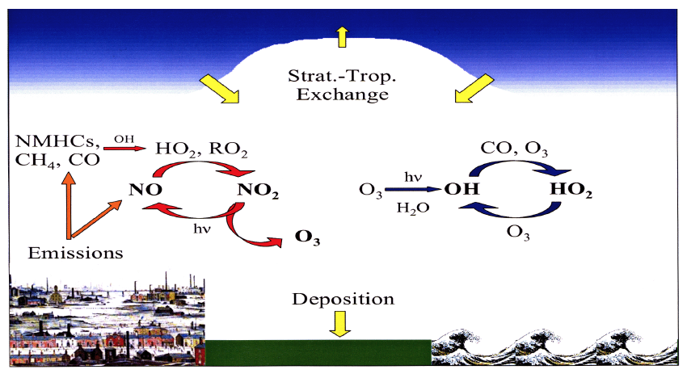
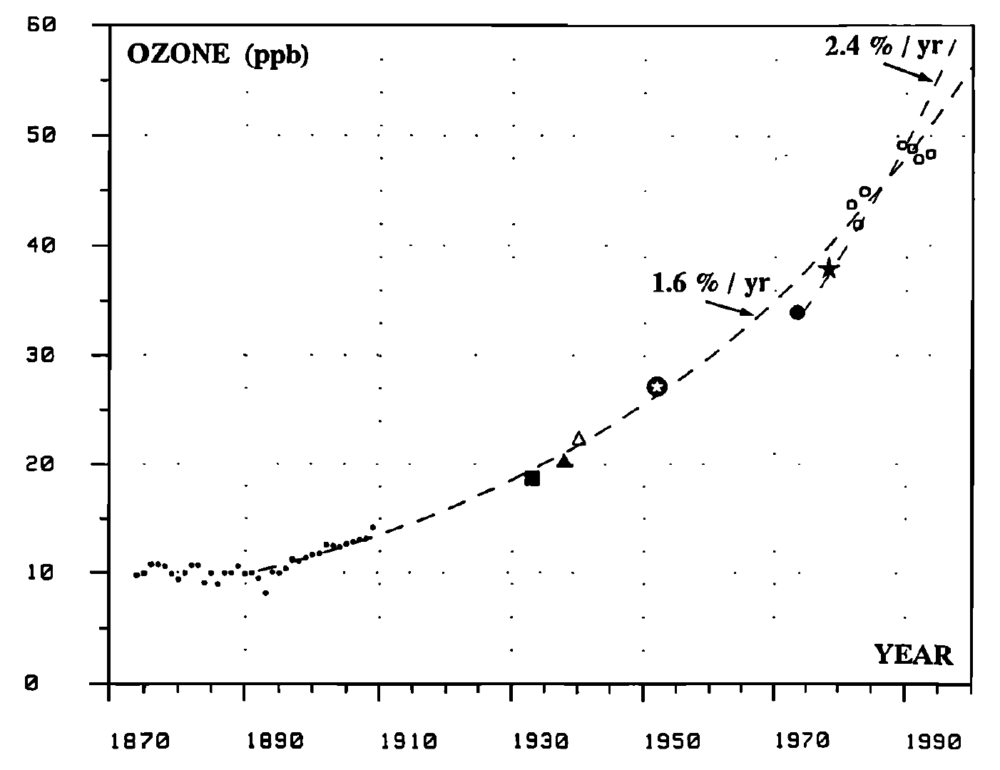
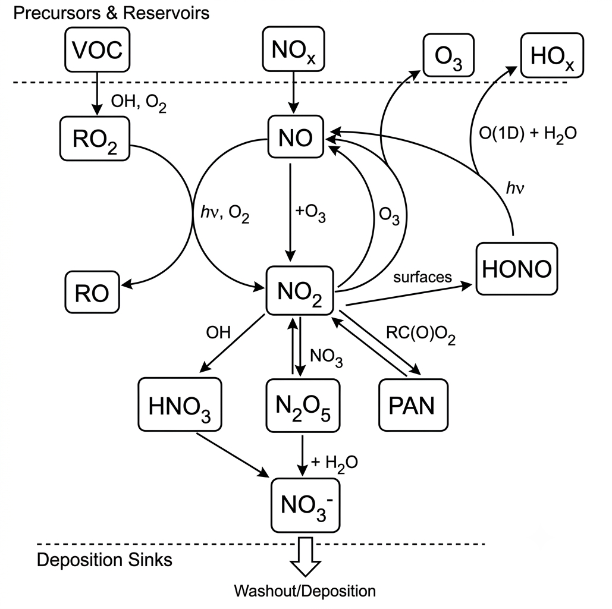
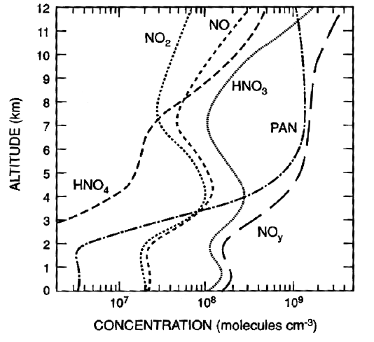

# Module 9 · The Tropospheric Ozone Budget, Carbonyl Formation and NOx Reservoirs

> **Learning aims**
> By the end of this module you should be able to:
> 1. Describe the main terms in the global tropospheric ozone budget (stratospheric input, chemical production/loss, surface deposition) and explain why the net budget is so sensitive to the large gross chemical terms.
> 2. Describe how formaldehyde and other carbonyls are formed during NOx-driven VOC oxidation, and their role in recycling HOx.
> 3. Describe the formation, stability and atmospheric role of the main NOx reservoir species: HONO, PAN, organic nitrates, and N₂O₅/NO₃.
> 4. Explain why NO₃ chemistry is particularly important at night.

## 9.1 The budget of tropospheric ozone

The main processes controlling tropospheric O₃ are shown schematically in [Fig 9.1](#fig-9-1). There are four main terms: **transport from the stratosphere** (where the ozone mixing ratio is much higher than in the troposphere — a genuinely important source); **in-situ photochemical production and destruction**; and **deposition at the surface**. These terms approach balance in the annual mean, but are not independent — increased stratospheric flux, or increased photochemical production, might for example lead to additional O₃ deposition. Precursors of photochemical ozone production originate from both anthropogenic and biogenic processes.

[]{#fig-9-1}*Figure 9.1 — Schematic of the processes controlling tropospheric O₃.*

**Table 9.1 — approximate global budget of tropospheric ozone (Tg/year)**

| Stratospheric origin | Photochemical production − loss | Surface loss |
|---|---|---|
| 400 | 800 (4000 − 3200) | −1200 |

Although the chemical production and destruction terms are individually large, their *net* effect is comparable in magnitude to the stratospheric influx and surface deposition. Despite these comparable net terms, photochemical O₃ production and loss are by far the largest gross terms — so any small trend (or error) in either has a disproportionately large impact on the tropospheric ozone burden (about 300 Tg).

O₃ destruction via O(¹D) + H₂O dominates in the tropics and near the surface, where [H₂O] is highest. O₃ surface deposition (expressed as a deposition velocity) depends strongly on surface type and is quite uncertain — some models use a deposition term half the size of others. Deposition to vegetated surfaces is much stronger than to ocean or snow/ice, but the dependence on vegetation type is still not well quantified.

Ozone concentrations in Europe and other industrialised regions increased strongly over roughly the last hundred years ([Fig 9.2](#fig-9-2)), due to increased anthropogenic activity and associated NOx/VOC emissions.

[]{#fig-9-2}*Figure 9.2 — Historical ozone concentrations in Paris since 1870. Annual average concentrations increased by a factor of 5–10 over this period.*

## 9.2 Formation of carbonyl compounds

The reaction of NO with methyl peroxy radicals produces both NO₂ and formaldehyde (R8.15). The fate of this formaldehyde matters both for HOx concentrations and for the rate of VOC oxidation, since formaldehyde is photolysed in the troposphere to liberate HOx:

$$CH_3O_2 + NO \to CH_3O + NO_2$$ &nbsp;&nbsp;(R8.14)

$$CH_3O + O_2 \to HCHO + HO_2$$ &nbsp;&nbsp;(R8.5)

$$HCHO + h\nu \to HCO + H$$ &nbsp;&nbsp;(R8.6)

$$HCO + O_2 \to CO + HO_2$$ &nbsp;&nbsp;(R8.7)

$$H + O_2 \to HO_2$$ &nbsp;&nbsp;(R9.1)

Radicals from R8.5 and R8.7 re-enter the HOx family, which can react further (e.g. R8.1) leading to more O₃ formation. Thus, the presence of NO fundamentally shifts the oxidation process in favour of producing **both** ozone and HOx.

## 9.3 NOx reservoirs

The importance of NOx to tropospheric chemistry is clear from the preceding discussion of its influence on ozone production. It follows that any mechanism removing NOx from the atmosphere, or transporting it from polluted to clean regions, could be highly significant for ozone photochemistry — particularly given how little NO is needed for net ozone production (§8.5).

An overview of the important NOx reservoirs, that comprise NOy in the troposphere, are shown in [Figure 9.3](#fig-9-3). 

We already discussed the role of HNO₃ as an important NOx sink (§8.4) and its ecosystem effects (Module 6, §6.4.3).

**Nitrous acid**, HONO (HNO₂), is mostly formed in heterogeneous reactions from NO₂, and represents a night-time reservoir for both HOx and NOx. HONO is quickly photolysed at sunrise, regenerating NO and OH:

$$HONO + h\nu \to OH + NO$$ &nbsp;&nbsp;(R9.2)

This generates a pulse of OH into the early-morning atmosphere, partly responsible for kick-starting daytime photochemistry (see Module 7, §7.4.1).

[]{#fig-9-3}*Figure 9.3 — Schematic illustration of tropospheric NOx chemistry emphasising the major NOx reservoir molecules.*

### 9.3.1 Formation of the NOx reservoir peroxyacetyl nitrate (PAN)

Peroxyacetyl nitrate (PAN: CH₃C(O)O₂NO₂) forms readily in the troposphere as a degradation product of C₂+ hydrocarbons in the presence of NO₂. For example, OH + acetaldehyde (a typical VOC degradation product) forms acetylperoxy radicals:

$$CH_3CHO + OH \to CH_3CO + H_2O$$ &nbsp;&nbsp;(R9.3)

$$CH_3CO + O_2 + M \to CH_3C(O)O_2 + M$$

which react with NO₂ to form PAN. At ambient temperature, PAN has a relatively high rate of reverse decomposition, maintaining equilibrium with its precursors:

$$CH_3C(O)O_2 + NO_2 \rightleftharpoons CH_3C(O)O_2NO_2$$ &nbsp;&nbsp;(R9.4 / R9.5)

In the presence of NO, the acetylperoxy radical instead decomposes:

$$CH_3C(O)O_2 + NO \to CH_3 + CO_2 + NO_2$$ &nbsp;&nbsp;(R9.6)

(the CH₃ radical is then oxidised to HCHO by the reactions covered earlier in this course). Steady-state analysis gives the net rate constant for PAN decomposition:

$$k = k_{9.5}\left\{1 - \frac{1}{1 + \dfrac{k_{9.6}[NO]}{k_{9.4}[NO_2]}}\right\}$$

The decomposition rate depends on the relative amounts of NO and NO₂, and on temperature — $k_{9.5}$ has a large activation energy: $k_{9.5} = 4.0\times10^{15}\exp\{-108/RT\}$ s⁻¹ (1 atm, $E_a$ in kJ mol⁻¹). In the daytime boundary layer, NO and NO₂ are in photostationary state and PAN's lifetime is a few hours; at night, [NO] → 0 and the decomposition rate falls to zero.

Above the boundary layer, lower temperatures give PAN a much longer lifetime (up to several weeks) — long enough for significant transport to other parts of the atmosphere, where, on reaching warmer regions, it can dissociate, releasing NO₂ and affecting ozone chemistry there.

[]{#fig-9-4}*Figure 9.4 — Modelled concentrations of nitrogen compounds as a function of altitude throughout the troposphere. In the upper troposphere, PAN is the dominant nitrogen species.*

PAN has indeed been detected in significant quantities in parts of the atmosphere remote from direct pollution, implying it affects the global ozone budget.

PAN should not be confused with the **organic nitrates**, RONO₂, formed in small amounts from the RO₂ + NO reaction (R = alkyl, aryl or allyl group). Organic nitrates are thermally stable, removed slowly by photolysis and reaction with OH — these too act as reservoirs for long-range NOx transport.

### 9.3.2 Formation of N₂O₅ from NO₃ — at night — can lead to NOx removal

NO₂ + ozone forms nitrogen pentoxide via the intermediate NO₃ radical:

$$O_3 + NO_2 \to NO_3 + O_2$$ &nbsp;&nbsp;(R9.7)

$$NO_3 + NO_2 + M \rightleftharpoons N_2O_5 + M$$ &nbsp;&nbsp;(R9.8)

N₂O₅ is thermally unstable and decomposes back to NO₃, making R9.8 reversible. NO₃ undergoes very rapid photolysis in visible light:

$$NO_3 + h\nu\ (\lambda<580\ \text{nm}) \to NO_2 + O$$ &nbsp;&nbsp;(R9.9)

$$NO_3 + h\nu\ (\lambda<630\ \text{nm}) \to NO + O_2$$ &nbsp;&nbsp;(R9.10)

so N₂O₅ is not formed in daytime. Night-time steady-state [NO₃] (independent of [NO₂], since production and loss are both proportional to it) is of order 1 pptv — some 30 times [OH]. Under these conditions, oxidation by NO₃ at night may rival OH oxidation for some VOCs (e.g. DMS, isoprene, terpenes).

NO₃ also reacts with NO, rapidly converting back to NO₂:

$$NO_3 + NO \to 2NO_2$$ &nbsp;&nbsp;(R9.11)

which competes with N₂O₅ formation (R9.8) near NO sources.

N₂O₅ can undergo heterogeneous reaction with water on aerosol, cloud or fog droplet surfaces to form HNO₃:

$$N_2O_5 + H_2O_{(surface)} \to 2HNO_3$$ &nbsp;&nbsp;(R9.12)

Formation of N₂O₅ thus sequesters two molecules of NOx into reservoir form, and acts as a sink for tropospheric NOx (since the resulting HNO₃ can be wet- or dry-deposited) — a significant removal process affecting both the nitrogen budget and ozone.

> **Key points — Module 9**
> - Atmospheric methane is oxidised to formaldehyde, then CO, then ultimately CO₂, following reaction with photochemically generated OH. The average CH₄ lifetime is about 7 years.
> - The CH₄/CO oxidation mechanism, via peroxy radicals, leads to loss of tropospheric ozone when only very small [NOx] are present.
> - At higher NOx levels, the NO₂/O₃ photostationary state is perturbed by reaction of peroxy radicals with NO, and net ozone production occurs.
> - HNO₃, HONO, N₂O₅ and PAN are the major NOx sinks and reservoir species.
> - NO₃ drives night-time chemistry.

---

## Try it yourself

Open **[`notebooks/09-nox-reservoirs.ipynb`](../notebooks/09-nox-reservoirs.ipynb)** to:

- Build the global tropospheric ozone budget (Table 9.1) as a simple flux-balance diagram, and explore how sensitive the *net* trend is to small percentage changes in the large gross production/loss terms.
- Implement the PAN steady-state decomposition rate constant formula and explore its dependence on [NO]/[NO₂] and temperature, reproducing the "few hours in the boundary layer, weeks aloft" contrast.
- Model night-time NO₃/N₂O₅ steady state from R9.7–R9.12, and estimate what fraction of NOx gets sequestered as HNO₃ overnight under different [NO] (i.e. R9.11 competition) scenarios.

---

*Next: [Module 10 — Oxidation of Non-Methane Organic Compounds I: Alkanes and Alkenes](10-nmvoc-oxidation-alkanes-alkenes.md)*
