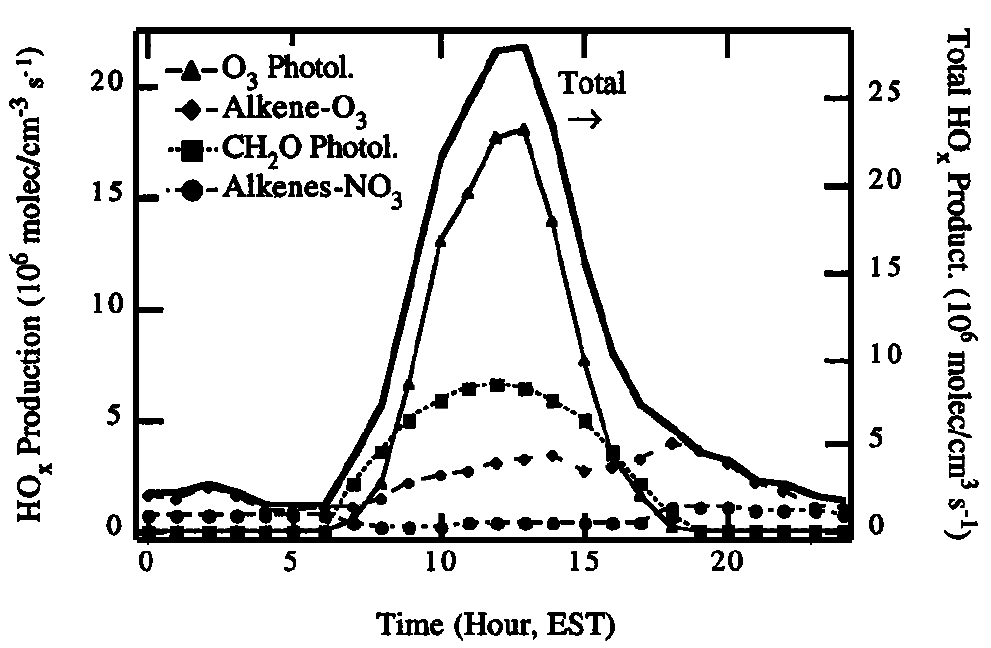

# Module 10 · Oxidation of Non-Methane Organic Compounds I: Alkanes and Alkenes

> **Aims of this module**
> 1. The basic reaction schemes of VOCs with OH.
> 2. Ozonolysis reactions of alkenes.
> 3. (Aromatic oxidation follows in Module 11.)

## 4.0 Introduction

The reactions of larger organic compounds are similar to those of methane discussed in Modules 8–9 — leading, in the presence of sufficient NOx, to the generation of ozone.

**Non-methane volatile organic compounds (NMVOCs)** include, by definition, all gaseous hydrocarbons and partially oxidised hydrocarbons in the atmosphere, but exclude methane, CFCs, CO and CO₂.

There are many anthropogenic and biogenic NMVOC sources, but on a global scale **biogenic, natural sources dominate** — only about 10–20% of NMVOC emissions are anthropogenic (fossil fuel and biomass combustion, agriculture, industry). Over 10,000 NMVOCs have been found in the atmosphere — **but the structure of most of them is unknown!** Urgent work is needed in analytical/experimental atmospheric chemistry to fill this knowledge gap.

Governmental environmental policy (partly aimed at reducing ozone formation) has significantly reduced anthropogenic NMVOC emissions in Europe over recent decades — the opposite trend holds in developing nations like China and India.

## 4.1 The role of NMVOCs in ozone production

Whilst fascinating in their own right, the real reason we care about NMVOCs in the troposphere is that their photo-oxidation can generate ozone and other secondary pollutants harmful to human health and crops. There are countless possible NMVOC structures, but the capacity of different hydrocarbons to produce ozone (and HOx) depends roughly on the number of C–H bonds in the molecule — for example, C₂H₆ oxidation in the presence of NO produces around double the O₃ molecules of CH₄ oxidation to CO₂ (mole/mole basis). Generally, each –CH₂– group oxidised to CO₂ in the presence of NO yields a maximum of **3 O₃ molecules**.

The general mechanism of ozone formation in the presence of VOC and NOx centres on the reactions of organic (RO₂) and inorganic (HO₂) peroxy radicals, which facilitate the interconversion of NO to NO₂ and so enable tropospheric ozone production (as in Modules 8–9).

As NMVOC complexity increases, the reaction mechanism becomes more complicated. In reality, reaction with NO₃, O₃, and even direct photolysis, may also be important initiation steps — the relative importance of each pathway is set by the respective (pseudo-)first-order rate constants.

This module (and Module 11) outlines the oxidation schemes for the most abundant organic compound classes in the troposphere. Based on this you should be able to construct plausible oxidation mechanisms for many different NMVOCs.

## 4.2 Prediction of rate coefficients for initiation of NMVOC oxidation

The first step in NMVOC oxidation is reaction with an oxidant — suitable oxidants include OH, Cl, O₃ and NO₃ (and, to a very small extent, Br). Which dominates depends on both the abundance of the oxidant and the rate constant for its reaction with the specific NMVOC. *Knowledge of these rate constants is vital for evaluating the atmospheric lifetime and degradation mechanisms of organic compounds.*

Rate constants have been measured in the laboratory for many reactions, and patterns of reactivity can be recognised within a given reaction type (e.g. H-abstraction, addition to C=C bonds) related to molecular structure. There are clear trends in rate constants with carbon number for many oxidants, but also significant deviations from these trends — carbon number alone is not ultimately the best predictor of the initiation rate constant.

This nonetheless enables prediction of rate constants for molecules of known structure that are experimentally difficult to measure directly, and similar relationships can help predict products and their yields for reactions with multiple possible pathways.

## 4.3 Oxidation of alkanes

Under tropospheric conditions, alkanes react mostly with OH, and to a minor extent (~10%) with Cl radicals. Both proceed via H-abstraction, generating an **alkyl radical** plus water or HCl respectively. This reaction is generally faster for tertiary H atoms (>CH) than secondary (–CH₂–) or primary (–CH₃) H atoms.

Alkane + OH rate constants are typically $10^{-12}$–$10^{-11}$ cm³ molecule⁻¹ s⁻¹ (increasing slightly with carbon number) — about $10^3$ times faster than CH₄ + OH ($k = 6.2\times10^{-15}$ cm³ molecule⁻¹ s⁻¹). Alkane + Cl rate constants are around $10^{-10}$ cm³ molecule⁻¹ s⁻¹, but tropospheric [Cl] is very low (though uncertain, estimated at $10^2$–$10^5$ molecules cm⁻³), so Cl oxidation doesn't affect the overall alkane lifetime — though these reactions do represent a significant sink for Cl itself.

As with CH₄ oxidation, the alkyl radical reacts with O₂ to form a **peroxy radical**:

$$R + O_2 + M \to RO_2 + M$$ &nbsp;&nbsp;(R4.1)

$k_{4.1}$ is fairly similar across measured R groups, spanning $5\times10^{-12}$–$2\times10^{-11}$ cm³ molecule⁻¹ s⁻¹ (independent of M). Under standard tropospheric conditions, R has a lifetime of order $10^{-8}$ s.

### Fate of RO₂

RO₂ can react with several tropospheric species. Reaction with NO gives two products:

$$RO_2 + NO \to RO + NO_2$$ &nbsp;&nbsp;(R4.2)

$$RO_2 + NO + M \to RONO_2 + M$$ &nbsp;&nbsp;(R4.3)

For most peroxy radicals, R4.2 dominates. For larger radicals, R4.3 becomes increasingly important, with yields up to 30%.

RO₂ can also react with HO₂ to form hydroperoxides:

$$RO_2 + HO_2 \to ROOH + O_2$$ &nbsp;&nbsp;(R4.4)

Reactions between different alkyl peroxy radicals are rather complex, with several observed overall pathways:

$$RO_2 + RO_2 \to 2RO + O_2$$ &nbsp;&nbsp;(R4.5)

$$RO_2 + RO_2 \to ROH + RCHO + O_2$$ &nbsp;&nbsp;(R4.6)

$$RO_2 + RO_2 \to ROOR + O_2$$ &nbsp;&nbsp;(R4.7)

Reaction with NO₃,

$$RO_2 + NO_3 \to RO + NO_2 + O_2$$ &nbsp;&nbsp;(R4.8)

is unimportant during daytime but may become significant at night, when [NO₃] is highest.

Reaction of RO₂ with NO₂ forms peroxynitrates, which are highly unstable at tropospheric temperatures and decompose back to RO₂ + NO₂ — not a significant pathway overall.

Among all RO₂ reactions, reaction with NO is by far dominant in the **polluted** atmosphere. Reactions with HO₂ and other RO₂ matter mainly in the **clean/remote** atmosphere, where NO is in the low-ppt range.

### Auto-oxidation

In recent years, hydrogen atom-shift (H-shift) reactions have attracted much attention, as they can generate highly oxidised compounds bearing multiple hydroperoxy (–OOH) groups. This chemistry requires a sufficiently long carbon chain to enable 5/6-membered-ring transition states, so it's more important for biogenic NMVOC (terpenes, C10; isoprene, C5) than for anthropogenic NMVOC (dominated by C2–C4 compounds). Over the last decade it has become established that these highly functionalised molecules not only form rapidly in the atmosphere but can lead to new aerosol particle formation, influencing clouds and climate. This process of H-shift, followed by O₂ addition and subsequent internal H-shift, is termed **"auto-oxidation"**, since it requires no bimolecular reaction beyond addition of O₂.

### Fate of RO

RO reacts via three channels: reaction with O₂, isomerization, and decomposition. The **isomerization** channel is only possible for compounds with more than 4 carbon atoms (able to form a 6-membered transition state). The O₂ and isomerization channels (where available) are generally more important than decomposition. Reaction of RO with NO and NO₂ to form nitro-compounds/organic nitrates is generally too slow to be significant.

> **Example 4 — the fate of the 2-pentoxy radical in the urban boundary layer**
>
> Using the RO reaction channels above (O₂-addition, isomerization via 6-membered TS, and decomposition), sketch the competing pathways for 2-pentoxy and estimate which dominates in a polluted urban boundary layer, given typical [O₂], [NO] and temperature — see the companion notebook for a quantitative rate-constant comparison.

## 4.4 Oxidation of alkenes

Most alkenes are emitted from biogenic sources — trees (isoprene, terpenes, sesquiterpenes) — with a smaller anthropogenic contribution, particularly for smaller carbon-number alkenes. Besides contributing to the atmosphere's oxidative capacity (they're a direct/primary oxidant sink), alkenes are also important organic aerosol precursors. Over many regions, biogenic hydrocarbons are more abundant than anthropogenic ones.

Alkene oxidation proceeds mostly via **OH-addition** rather than H-abstraction:

$$C_2H_4 + OH \to HOCH_2CH_2$$ &nbsp;&nbsp;(R4.9)

The resulting hydroxy alkyl radical then reacts like the alkyl radical from alkane oxidation (e.g. with O₂ to form a hydroxy peroxy radical, ROHO₂).

**NO₃**, the main night-time oxidant, reacts across the C=C double bond, forming an excited nitro-oxy alkyl radical, which either forms an epoxide or nitro-oxy peroxy radicals (following the RO₂ scheme above). Terpenes — the most abundant atmospheric alkenes — react very rapidly with NO₃ ($k \sim 10^{-12}$–$10^{-10}$ cm³ molecule⁻¹ s⁻¹), so NO₃ oxidation remains important even though [NO₃] rarely exceeds ppt levels.

In contrast to alkanes, alkenes also react significantly with **ozone**. Initial O₃ addition across the C=C bond forms a primary ozonide, which is unstable and decomposes via two pathways to form **Criegee intermediates** (Criegee biradicals). Though postulated over 50 years ago (with first atmospheric rate estimates over 30 years ago), it's only in the last few years that their structure and kinetics have been unambiguously identified.

In the gas phase, the Criegee intermediate is either stabilised or decomposes via various channels — one, via a hydroperoxide intermediate, yields a carbonyl **and OH**. This OH-formation route can be especially important at night, when other major OH sources are inactive.

[]{#fig-4-6}*Figure 4.6 — Calculated rates of HOx generation from various sources at a rural site (Paulson and Orlando, Geophysical Research Letters, 1996).*

The major fate of the *stabilised* Criegee intermediate is believed to be reaction with H₂O, leading to carboxylic acids and hydroxy-hydroperoxides. Other reactions include those with NO₂, SO₂ and organics — the relative importance of these is not fully characterised.

---

## Try it yourself

Open **[`notebooks/10-nmvoc-alkanes-alkenes.ipynb`](../notebooks/10-nmvoc-alkanes-alkenes.ipynb)** to:

- Compare alkane OH- vs. Cl-oxidation lifetimes given realistic [OH] and [Cl] ranges, and confirm Cl oxidation doesn't control the overall alkane lifetime.
- Solve Example 4 (2-pentoxy radical fate) by comparing rate constants for the O₂, isomerization and decomposition channels at representative urban boundary-layer [O₂], [NO], T.
- Estimate O₃ yield per NMVOC carbon atom from the "max 3 O₃ per –CH₂– group" rule, and compare ethane vs. a longer-chain alkane.
- Build a simple RO₂ fate calculator (R4.2–R4.8) and see how the dominant RO₂ loss pathway shifts between polluted and remote-marine [NO] regimes.

---

*Next: [Module 11 — Oxidation of Non-Methane Organic Compounds II: Aromatics and Oxygenated Organics](11-nmvoc-aromatics-oxygenates.md)*
