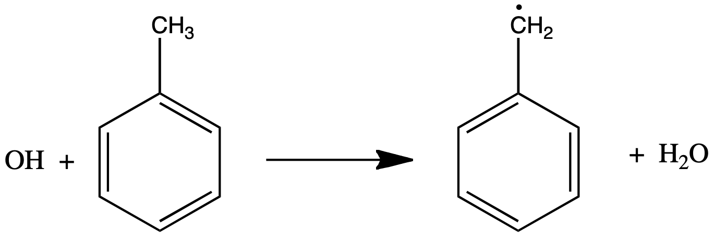
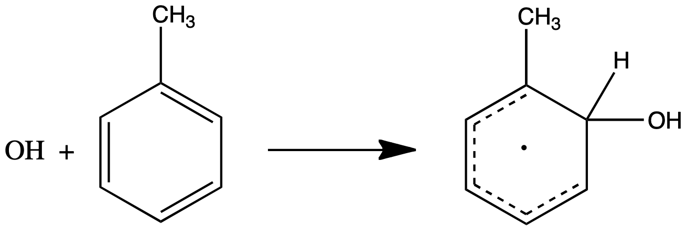
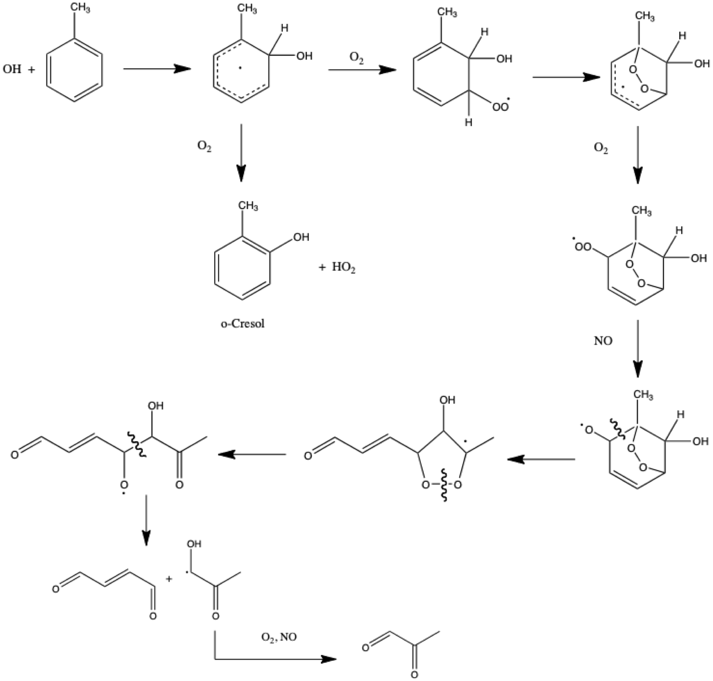

# Module 11 · Oxidation of Non-Methane Organic Compounds II: Aromatics and Oxygenated Organics

> **Aims of this module**
> 3. The oxidation scheme of aromatic compounds (continuing from Module 10).

## 11.1 Oxidation of aromatics

Most aromatics are emitted by anthropogenic processes — motor vehicle emissions, solvent use. They are also the most important anthropogenic organic aerosol precursors. Atmospherically relevant aromatics include benzene, toluene, xylenes and other methylated/ethylated benzene derivatives. **OH is the most important oxidant** for aromatics, with two competing pathways:

**(a) H-abstraction** (yield < 10%). Further reactions follow the alkane pathway, ultimately leading to aldehydes (e.g. benzaldehyde from toluene oxidation) or aromatic nitrates.


[]{#fig-11-1}*Figure 11.1 — Hydrogen atom abstraction in the oxidation of Benzene*


**(b) OH addition to the aromatic ring** (yield > 90%). Further reactions of the resulting OH–aromatic adduct are rather unclear, with many possible pathways proposed. **The oxidation of aromatic compounds in the atmosphere is one of the least understood areas in tropospheric chemistry.**


[]{#fig-11-2}*Figure 11.2 — OH addition in the oxidation of Benzene*

One of the more likely reaction routes (illustrated for toluene) generates mainly small dicarbonyls, like butenedial and methylglyoxal.


[]{#fig-11-3}*Figure 11.3 — OH initiated oxidation mechanism of toluene*

## 11.2 Oxidation of oxygenated organics

The alkane, alkene and aromatic reactions above all yield oxygenated compounds, which react further — ultimately to CO₂, or are removed by wet and dry deposition.

- **Aldehydes** react mostly with OH via abstraction of the weakly bound aldehyde H-atom. Further reactions involve O₂ addition and reaction with NO/NO₂, as described in Module 10.
- **Ketones** react similarly to alkanes, via H-abstraction at the alkyl chain.
- **Alcohols** also react analogously to alkanes (the alcohol O–H bond is stronger than the alkyl C–H bond, so abstraction of the alcohol H is unlikely).
- **Carboxylic acids** also undergo H-abstraction, but the main removal mechanism for most acids is wet and dry deposition.

Aldehydes (especially formaldehyde), ketones, and organic hydroperoxides are also readily photolysed in the troposphere — feeding back into HOx production, as discussed throughout Modules 8–10.

> **Key points — Module 10/11**
> - The OH-oxidation mechanism for many VOCs involves peroxy radicals, and leads, in the presence of NOx, to net production of ozone and HOx.
> - Alkenes react with OH but also efficiently with ozone, forming ozonides and ultimately hydroperoxides and carboxylic acids.
> - Tropospheric oxidation of aromatic compounds is highly complex and only partly understood; small dicarbonyls are abundant oxidation products.
> - Alkenes and aromatics are important biogenic and anthropogenic precursors of organic aerosols, respectively.

```{=latex}
\color{blue}
```
<details style="color: blue;">
<summary><strong>Example 5 — propose a mechanism for the oxidation of 2-methyl-2-butene</strong></summary>

Using the alkene oxidation framework from Module 10 (§10.4) — OH addition across the C=C bond, the competing O₃ + alkene → Criegee pathway, and the general RO₂ fate scheme from §10.3 — sketch a plausible oxidation mechanism for 2-methyl-2-butene, and identify the expected major carbonyl products. The companion notebook sets up the rate-constant comparison needed to judge which initiation pathway (OH vs. O₃ vs. NO₃) dominates under different conditions.

</details>
```{=latex}
\color{black}
```

---

## Try it yourself

Open **[`notebooks/11-aromatics-oxygenates.ipynb`](../notebooks/11-aromatics-oxygenates.ipynb)** to:

- Compare OH-abstraction vs. OH-addition branching for a toluene-like aromatic, and see how the >90%/<10% split shapes the product distribution.
- Solve Example 5 by comparing pseudo-first-order initiation rates ($k_{OH}[OH]$, $k_{O_3}[O_3]$, $k_{NO_3}[NO_3]$) for a representative alkene across day/night and clean/polluted scenarios, to identify which oxidant dominates initiation.
- Build a simple multi-generation oxidation tracker (alkane → alkyl radical → peroxy radical → carbonyl → further oxidation), and estimate how many generations of oxidation are needed to reach CO₂ for a chosen starting NMVOC.
- Wrap up the course: combine Module 10/11's rate-constant machinery with Module 7's OH steady-state calculator to estimate whole-atmosphere NMVOC oxidation lifetimes for a few compounds of your choice, and compare to Table 7.2 (Module 7).

---

*This concludes the Lent term (Lectures 7–12) and the B4 course. See the [course README](../README.md) for the full module list.*
